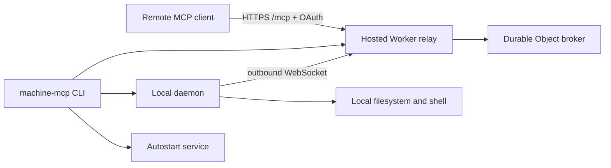

# machine-bridge-mcp

`machine-bridge-mcp` turns your machine into a Remote MCP server through a small hosted relay and a local outbound daemon.

The recommended deployment command is short and stable for autostart:

```zsh
npm install -g machine-bridge-mcp@latest && machine-mcp
```

No-global-install alternative:

```zsh
npx machine-bridge-mcp@latest
```

Source checkout:

```zsh
./mbm          # macOS/Linux
.\mbm.cmd      # Windows cmd
```

## What it does on first run

1. Asks for a workspace path. Press Enter to use the current directory.
2. Remembers that workspace for later runs.
3. Generates a stable MCP connection password and daemon secret.
4. Checks `wrangler whoami`; if needed, opens `wrangler login`.
5. Deploys the hosted Worker relay with `wrangler deploy --secrets-file`.
6. Installs login autostart for the local daemon.
7. Starts the local daemon and prints:

```text
MCP Server URL: https://<worker>.<account>.workers.dev/mcp
MCP connection password: mcp_password_...
```

Keep the foreground process running for the current session. The installed autostart entry keeps the daemon available after future logins.

## Re-select workspace

```zsh
machine-mcp workspace set
```

Or provide it directly:

```zsh
machine-mcp workspace set /path/to/new/default
```

Show the remembered workspace:

```zsh
machine-mcp workspace show
```

## Autostart service

Supported platforms:

- macOS: user LaunchAgent
- Linux: `systemd --user` with best-effort `loginctl enable-linger`
- Windows: Scheduled Task at logon

Commands:

```zsh
machine-mcp service status
machine-mcp service install
machine-mcp service start
machine-mcp service stop
machine-mcp service uninstall
```

`start` installs autostart by default. Skip that behavior with:

```zsh
machine-mcp --no-autostart
```

Autostart runs the daemon with `--daemon-only --no-print-credentials`, so service logs do not contain the MCP connection password. If you start with `--no-write`, `--no-exec`, or `--full-env`, those policy flags are preserved in the autostart entry.

## Secrets rotation

```zsh
machine-mcp rotate-secrets
machine-mcp
```

`rotate-secrets` creates a new MCP connection password, daemon secret, and OAuth token version. The next deploy rejects previously issued OAuth access tokens.

## Uninstall

Delete known deployed Worker(s), remove autostart entries, and remove local state:

```zsh
machine-mcp uninstall
```

Non-interactive:

```zsh
machine-mcp uninstall --yes
```

Keep the deployed Worker but remove local state/autostart:

```zsh
machine-mcp uninstall --keep-worker
```

If installed globally, remove the npm package afterwards:

```zsh
npm uninstall -g machine-bridge-mcp
```

## Defaults and permissions

This project optimizes for easy use with official Remote MCP clients:

- `write_file` is enabled by default.
- `exec_command` is enabled by default.
- Absolute paths are allowed.
- Parent-directory paths such as `../other-project/file.ts` are allowed.
- Sensitive-looking files such as `.env`, private keys, token files, and dot-directories are not hidden by default.
- Relative paths use the selected workspace as cwd.
- Shell commands run with a minimal environment by default; use `--full-env` to pass the parent process environment.

Narrower session:

```zsh
machine-mcp --no-write --no-exec
```

## MCP tools

- `server_info`
- `project_overview`
- `list_roots`
- `list_dir`
- `list_files`
- `read_file`
- `write_file`
- `search_text`
- `git_status`
- `git_diff`
- `exec_command`

## State and logs

Default state roots:

- macOS/Linux: `~/.local/state/machine-bridge-mcp`
- Linux with `XDG_STATE_HOME`: `$XDG_STATE_HOME/machine-bridge-mcp`
- Windows: `%APPDATA%\machine-bridge-mcp`

State contains the MCP password and daemon secret. Status/doctor output redacts secrets. The normal foreground `start` command prints the MCP password because users need to paste it into their MCP client.

Override state root:

```zsh
machine-mcp --state-dir /path/to/state
```

## Architecture



Why this architecture:

- No inbound local port is exposed to the internet.
- No local tunnel process is required.
- The public MCP URL is stable after deployment.
- The Worker stores OAuth client/code/token metadata and relays tool calls.
- The local daemon is the only process touching files or executing commands.
- Autostart keeps the daemon alive across logins without requiring MCP clients to change URLs.

## Development

```zsh
npm install
npm run check
```

`npm run check` generates Worker runtime types, type-checks the Worker, checks local JS syntax, and runs daemon self-tests.

Worker build dry-run:

```zsh
npx wrangler deploy --dry-run
```
