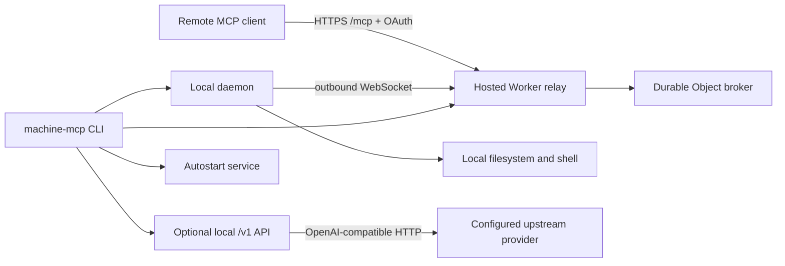

# machine-bridge-mcp

`machine-bridge-mcp` turns your machine into a Remote MCP server through a small hosted relay and a local outbound daemon.

The recommended deployment command is short and stable for autostart:

```zsh
npm install -g machine-bridge-mcp@latest && machine-mcp
```

No-global-install alternative:

```zsh
npx machine-bridge-mcp@latest
```

Source checkout:

```zsh
./mbm          # macOS/Linux
.\mbm.cmd      # Windows cmd
```

## What it does on first run

1. Asks for a workspace path. Press Enter to use the current directory.
2. Remembers that workspace for later runs.
3. Generates a stable MCP connection password and daemon secret.
4. Checks `wrangler whoami`; if needed, opens `wrangler login`.
5. Deploys the hosted Worker relay with `wrangler deploy --secrets-file`.
6. Installs login autostart for the local daemon.
7. Starts the local daemon and prints:

```text
MCP Server URL: https://<worker>.<account>.workers.dev/mcp
MCP connection password: mcp_password_...
```

Keep the foreground process running for the current session. The installed autostart entry keeps the daemon available after future logins.

The command is safe to run repeatedly:

```zsh
npm install -g machine-bridge-mcp@latest && machine-mcp
```

On repeat runs, the CLI reuses existing state and secrets unless you request rotation, skips Worker redeploys when the deployed Worker is healthy and unchanged, refreshes the autostart entry, stops any currently loaded autostart daemon before starting the foreground daemon, and refuses to start a second daemon for the same workspace if another foreground instance is already running.

## Local OpenAI-compatible API provider

`machine-bridge-mcp` can also expose a local OpenAI-compatible API provider for desktop AI clients such as Cherry Studio, Chatbox, Continue, or other apps that accept an OpenAI-style base URL and API key.

Start only the local API service:

```zsh
machine-mcp api
```

Or run it together with the Remote MCP daemon:

```zsh
machine-mcp start --api
```

The CLI prints client settings like:

```text
API Base URL: http://127.0.0.1:8765/v1
API key: local_api_key_...
Client type: OpenAI-compatible
```

Use these values in the local AI client:

- Base URL: `http://127.0.0.1:8765/v1`
- API key: the `local_api_key_...` printed by the CLI
- Model: the model shown by `GET /v1/models` or your configured `--api-model`

If port `8765` conflicts with another local app, choose a different port explicitly:

```zsh
machine-mcp api --api-port 8766
machine-mcp start --api --api-port 8766
```

`--port` is also accepted on the `api` command:

```zsh
machine-mcp api --port 8766
```

By default, the local API binds to `127.0.0.1` and does not start unless you run `machine-mcp api` or pass `--api`. It stores a per-workspace local API key in the same owner-only state profile used by the MCP credentials. Rotate it with:

```zsh
machine-mcp api --rotate-api-key
```

Configure an upstream OpenAI-compatible provider:

```zsh
machine-mcp api \
  --api-upstream-url https://api.openai.com/v1 \
  --api-upstream-key "$OPENAI_API_KEY" \
  --api-model gpt-4.1
```

Environment variables are also supported: `MBM_API_HOST`, `MBM_API_PORT`, `MBM_API_KEY`, `MBM_API_UPSTREAM_URL`, `MBM_API_UPSTREAM_KEY`, `MBM_API_MODEL`, plus common OpenAI names such as `OPENAI_API_KEY`, `OPENAI_BASE_URL`, and `OPENAI_MODEL`.

Supported local API routes:

- `GET /health` without authentication
- `GET /v1/models` with `Authorization: Bearer <local_api_key>` or `x-api-key`
- `POST /v1/chat/completions`
- `POST /v1/responses`
- `POST /v1/embeddings`
- `POST /v1/completions`

Model-producing routes proxy to the configured upstream provider. If no upstream key is configured, the API still starts and `/v1/models` works, but generation endpoints return a clear `503 upstream_not_configured` error. Logs record route, status, latency, and safe configuration metadata; request and response bodies and API keys are not logged.


## Re-select workspace

```zsh
machine-mcp workspace set
```

Or provide it directly:

```zsh
machine-mcp workspace set /path/to/new/default
```

Show the remembered workspace:

```zsh
machine-mcp workspace show
```

## Autostart service

Supported platforms:

- macOS: user LaunchAgent
- Linux: `systemd --user` with best-effort `loginctl enable-linger`
- Windows: Scheduled Task at logon

Commands:

```zsh
machine-mcp service status
machine-mcp service install
machine-mcp service start
machine-mcp service stop
machine-mcp service uninstall
```

`start` installs autostart by default. Skip that behavior with:

```zsh
machine-mcp --no-autostart
```

Autostart runs the daemon with `--daemon-only --no-print-credentials`, so service logs do not contain the MCP connection password. If you start with `--no-write`, `--no-exec`, or `--full-env`, those policy flags are preserved in the autostart entry. macOS/Linux service definitions restart only on process failure; a normal duplicate-instance exit is not treated as a crash loop.

## Secrets rotation

```zsh
machine-mcp rotate-secrets
machine-mcp
```

`rotate-secrets` creates a new MCP connection password, daemon secret, and OAuth token version. The next deploy rejects previously issued OAuth access tokens.

## Uninstall

Delete known deployed Worker(s), remove autostart entries, and remove local state:

```zsh
machine-mcp uninstall
```

Non-interactive:

```zsh
machine-mcp uninstall --yes
```

Keep the deployed Worker but remove local state/autostart:

```zsh
machine-mcp uninstall --keep-worker
```

If installed globally, remove the npm package afterwards:

```zsh
npm uninstall -g machine-bridge-mcp
```

## Defaults and permissions

This project optimizes for easy use with official Remote MCP clients:

- `write_file` is enabled by default.
- `exec_command` is enabled by default.
- Absolute paths are allowed.
- Parent-directory paths such as `../other-project/file.ts` are allowed.
- Sensitive-looking files such as `.env`, private keys, token files, and dot-directories are not hidden by default.
- Relative paths use the selected workspace as cwd.
- Shell commands run with a minimal environment by default; use `--full-env` to pass the parent process environment.

Narrower session:

```zsh
machine-mcp --no-write --no-exec
```

## MCP tools

- `server_info`
- `project_overview`
- `list_roots`
- `list_dir`
- `list_files`
- `read_file`
- `write_file`
- `search_text`
- `git_status`
- `git_diff`
- `exec_command`

## State and logs

Default state roots:

- macOS/Linux: `~/.local/state/machine-bridge-mcp`
- Linux with `XDG_STATE_HOME`: `$XDG_STATE_HOME/machine-bridge-mcp`
- Windows: `%APPDATA%\machine-bridge-mcp`

State contains the MCP password, daemon secret, and local API key when the API provider has been started. Status/doctor output redacts secrets. The normal foreground `start` command prints the MCP password because users need to paste it into their MCP client; `api` prints the local API key for the same reason. Use `--no-print-credentials` to redact console credentials. State files, temporary Worker secret files, lock files, and log directories are created under the user state root with owner-only permissions where the platform supports POSIX modes.

The Worker rejects browser requests with an `Origin` header unless the origin is the Worker itself or a loopback HTTP origin. To allow additional browser-based MCP clients, set `MBM_ALLOWED_ORIGINS` to a comma-separated list of exact origins in `wrangler.jsonc` or Cloudflare Worker settings.

Override state root:

```zsh
machine-mcp --state-dir /path/to/state
```

## Architecture



Why this architecture:

- No inbound local port is exposed to the internet.
- No local tunnel process is required.
- The public MCP URL is stable after deployment.
- The Worker stores OAuth client/code/token metadata and relays tool calls.
- The local daemon is the only process touching files or executing commands.
- The optional local `/v1` API binds to loopback by default and starts only when requested.
- Autostart keeps the daemon alive across logins without requiring MCP clients to change URLs.

## Development

```zsh
npm install
npm run check
```

`npm run check` generates Worker runtime types, type-checks the Worker, checks local JS syntax, and runs daemon self-tests.

Worker build dry-run:

```zsh
npx wrangler deploy --dry-run
```
