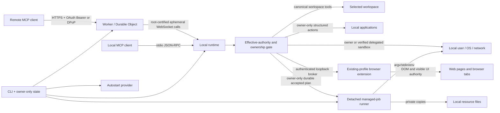

# Architecture

For a compact component map, read [System overview](OVERVIEW.md). Security assumptions, attacker models, non-goals, and residual risks are defined in [Threat model](THREAT_MODEL.md).

## Design goal

The system separates three questions that are often conflated:

1. **Who may request a tool?** Remote OAuth or local process ownership.
2. **Which tools exist?** The selected local policy profile.
3. **What authority does a tool have?** Canonical workspace boundaries for direct filesystem tools and local-user authority for processes.

No transport is treated as a sandbox. Both transports invoke the same local runtime.

## Components

### Shared protocol metadata and tool catalog

`src/shared/server-metadata.json` is the single source of truth for server identity, the sole current MCP protocol version, and host instructions. `src/shared/tool-catalog.json` is the single source of truth for tool names, descriptions, input schemas, annotations, and policy availability. The Worker and local runtime import both directly. Catalog tests reject metadata drift, duplicate names, unknown availability classes, open schemas, missing annotations, profile drift, and second hand-maintained Worker definitions.

### CLI and state layer

The CLI canonicalizes workspaces, resolves policy profiles, maintains per-workspace state and credentials, serializes startup/deploy/rotation with process-identity locks, deploys the Worker, installs optional platform-native autostart, and starts either remote daemon or stdio mode.
On a first interactive Windows start, workspace selection remains explicit but offers `%USERPROFILE%\MachineBridge` as a dedicated default; accepting it creates and remembers the folder instead of inheriting the shell current directory. Non-Windows interactive starts retain the current-directory default, and explicit `--workspace` paths remain strict existing-path inputs.

A canonical workspace receives an independent profile, Worker name, secret set, resource registry, managed-job directory, daemon/startup locks, and state file. State schema version 6 records named accounts, policy origin/revision, and local resource metadata in addition to the capability fields. `exclusive-file.mjs` owns complete-before-visible exclusive claims and flushed atomic replacement. `process-identity.mjs` owns PID liveness, process start-time comparison, bounded command-line inspection, and PID-reuse classification. `service-lifecycle.mjs` owns the fail-closed stop-daemons-before-remove state machine shared by service removal and full uninstall.

### Local runtime

`LocalRuntime` is the transport-independent local tool orchestrator. It owns the shared authorization/execution pipeline, manager construction, mutation serialization, cancellation, and the narrow delegation surface used by stdio and relay transports. Domain behavior remains in focused services:

- `workspace-file-service.mjs` and `git-service.mjs` own canonical filesystem/Git operations;
- `process-contract.mjs` owns argv shape/size validation; `process-tree-signal.mjs`, `process-tree-supervisor.mjs`, `process-tree-snapshot.mjs`, and `process-tree-ownership.mjs` separate cross-platform signaling, asynchronous escalation, bounded process-group observation, and PID/start-time ownership; `process-execution.mjs` and `process-sessions.mjs` own one-shot and interactive execution; and `process-tracker.mjs` retains active and draining process ownership until close;
- `shared/tool-call-capacity.mjs` defines the control-tool set and generic admission algebra; local `call-capacity.mjs` and Worker `pending-call-capacity.ts` apply it independently, while `runtime-reporting.mjs` builds privacy-aware runtime and project snapshots;
- `runtime-diagnostics.mjs` owns fixed local probes and their stable interpretation, while `runtime-diagnostic-state.mjs` projects privacy-safe control-plane state for remote diagnosis;
- `runtime-capabilities.mjs` composes agent, application, browser, and effective-policy-filtered routing results, while `execution-routing.mjs` owns bounded set-level route scoring, ambiguity, fallbacks, and advisory tool projection;
- `runtime-tool-handlers.mjs` owns catalog-to-handler registration;
- `runtime-relay.mjs` owns relay construction and inbound envelope normalization, while `relay-call-recovery.mjs` owns the bounded disconnect grace, result queue, authoritative resumed-call reconciliation, replay, and expiry cleanup;
- `runtime-paths.mjs` owns runtime-directory creation, containment checks, and error-path redaction;
- `runtime-resource-service.mjs` owns registered-resource lookup, bounded binary/UTF-8 reads for browser/application injection, and SSH-resource registration/result projection;
- `security-audit-log.mjs` owns only the bounded main-thread queue and cached initializing/health projection; `security-audit-worker.mjs`, `security-audit-storage.mjs`, `security-audit-dispatch.mjs`, and `security-audit-warning.mjs` isolate startup verification, all disk/hash work, batch persistence, privacy projection, and warning suppression from result delivery;
- `managed-job-lock.mjs`, `managed-job-runner.mjs`, `managed-job-storage.mjs`, and `managed-job-projection.mjs` separate transition ownership, detached runner identity, private persistence/diagnostics, and public result shaping from the managed-job lifecycle;
- `browser-request-registry.mjs`, `browser-broker-routes.mjs`, `browser-broker-server.mjs`, and `browser-bridge-http.mjs` separate direct request ownership, runtime-client proxy routing, authenticated loopback WebSocket upgrades/listening, and loopback HTTP handling from broker startup and extension handover;
- managed jobs, local resources, application automation, and browser automation remain separate managers.

Architecture tests cap the orchestration module and each extracted service independently and reject a return of low-level process, patch, diagnostic, capability-scoring, heartbeat-policy, or audit-storage logic to `LocalRuntime`. `RelayConnection` owns remote WebSocket transport, `hello_ack` authentication, end-to-end `relay_probe`/`ready_ack` readiness, reconnect backoff, outage logging, and a monotonically increasing in-memory transport generation. `RelayHeartbeatMonitor` separately owns liveness timing, local event-loop-lag detection, recovery grace, and heartbeat diagnostics, so delayed local scheduling is not conflated with remote silence. The generation still protects the pre-ready probe and prevents arbitrary use of a stale socket. Ordinary tool calls additionally bind to an ephemeral identifier generated once per local daemon process. If a ready socket drops, the Worker detaches its pending calls for at most the shared two-minute reconnect grace; only a replacement socket that presents the same daemon-process identifier and completes the full readiness probe can reclaim them. The local runtime keeps those calls alive and queues completed results during the same bounded interval, then replays them after readiness. A different process instance, an explicit cancellation, or grace expiry cannot receive those results. Stdio mode invokes `LocalRuntime` directly without that adapter.

The control plane has explicit availability budgets at both admission layers. The Worker admits thirty ordinary pending daemon calls and reserves two additional slots for `diagnose_runtime`/`list_roots`; its transient Promise registry and durable stream store merge per-tool counts under one serialized admission gate. The local runtime independently admits fourteen ordinary tools and reserves two control slots; the total ceilings remain thirty-two and sixteen. A timed-out or cancelled process call settles at the protocol boundary before operating-system cleanup necessarily completes, so `process-tracker.mjs` keeps that process under a draining call until `close` and reports pending escalation supervision. Neither process ownership inspection nor security-audit persistence performs synchronous process creation or disk `fsync` on the daemon event loop.

`daemon-process.mjs` owns workspace-daemon inspection and takeover. It distinguishes platform service state from the lock-owning Node process, validates PID and process-start identity, canonicalizes workspace/state paths before comparison, parses bounded process command lines without executing them, and accepts lock-backed `--daemon-only` recovery processes that omit repeated path flags. Stop/takeover sends `SIGTERM` only to a verified same-workspace service daemon. If it remains alive after the grace period, the code revalidates PID, process-start identity, command line, entrypoint, daemon mode, workspace, and state root before sending `SIGKILL`; a foreground, replaced-PID, or otherwise unverifiable process remains untouched. CLI orchestration never treats a missing launchd/systemd job as proof that the process exited.

`service-owner.mjs` is the machine-global identity ledger for the one launchd/systemd/Task Scheduler definition. Its owner-only record binds the canonical workspace, state root, exact runtime entrypoint, and package version. Installation is a pending-to-committed transaction: once provider mutation begins, failure remains pending because the code cannot prove that the external service manager made no partial change. `service-runtime.mjs` loads only a committed owner, verifies provider state, starts or restarts the provider, and waits for the matching daemon lock to publish its token-protected startup-readiness checkpoint. That checkpoint is written once, after device authentication, relay probing, and `ready_ack`; PID stability or a provider `active` flag is not equivalent evidence. Missing, corrupt, pending, mismatched, or unready ownership fails closed.

All machine-global service writers share a fixed per-user machine-service lock independent of workspace and custom state roots. The lock and service-owner ledger live in a dedicated control root (`machine-bridge-mcp-control`), while ordinary workspace/profile state uses `machine-bridge-mcp`; XDG and Windows APPDATA preserve the same sibling separation. The control root is never a default state root or candidate-runtime root. Paths that also need a workspace startup lock acquire machine-service first and startup second. Foreground startup releases the machine lock after provider takeover and daemon ownership are established, before entering the long-lived runtime; activation retains it through candidate verification, definition commit, service launch, and background readiness. Service-spawned `--daemon-only` children do not reacquire the parent transaction lock. This ordering prevents cross-workspace service-definition races, state/control namespace collision, and machine/startup lock cycles.

### Agent context and capability resolver

`AgentContextManager` discovers the nearest Git/workspace scope, applies the user configuration and hierarchical `.machine-bridge/agent.json` files, selects built-in/user/root-to-target instructions, discovers bounded filesystem skills, and resolves registered commands. `agent-context-projection.mjs` owns capability fingerprints, privacy-aware public projections, bounded skill summaries, command rendering, and effective-instruction rendering. `agent-skill-discovery.mjs` owns bounded skill-root traversal, symlink containment, metadata parsing, warnings, and file inventory; `agent-text-file.mjs` owns no-follow bounded UTF-8 reads. Filesystem/config discovery no longer maintains those output and skill-scanning mechanics inline. `agent-contract.mjs` is the strict checked-JavaScript boundary for configuration shape, registered-command normalization, encoded-size limits, and configured-path containment; the manager does not maintain a second parser. `project-package.mjs` owns no-follow package metadata parsing, package-manager selection (including fail-closed conflicting-lockfile handling), script-name normalization, bounded workflow-intent aliases, and automatic `package.*` command construction so instruction rendering and command execution do not duplicate package parsing. `default-instructions.mjs` supplies a versioned in-package working-agreement block and derives a small virtual project-context block from root filenames and bounded metadata. It reads package script names but not bodies, does not inspect dependency values or source contents, executes nothing, and writes no user/repository files. A global `model_instructions_file` is a separate user-designated session source and cannot be overridden by a project.

`session_bootstrap` is requested during both stdio and remote MCP initialization. The Worker delegates this read to the connected daemon with a short bounded timeout; failure falls back to static server instructions rather than blocking initialization indefinitely. `resolve_task_capabilities` performs a fresh deterministic scan, rebuilds automatic project facts, ranks skills, commands, and policy-visible tools, then scores compatible execution surfaces as sets rather than independent names. Registered commands, Bash/direct argv, process sessions, managed jobs, files/Git, browser, applications, protected resources, and diagnostics remain distinct routes with explicit fallbacks. The routing envelope is schema-versioned; scores are deterministic relative ranks within one response, not probabilities or stable cross-version values. Routing is advisory and never narrows the effective policy; `exec_command` remains available as the general shell escape hatch.

Application and browser discovery uses the request's effective account/daemon policy intersection, not the daemon ceiling. A restricted account therefore cannot receive local application inventory or browser/shell recommendations it could not invoke. Installed application inventory uses a short bounded cache. `CapabilityObserver` records only counts, timestamps, source flags, match counts, recommended tool names, primary route, ambiguity class, score gap, and a runtime-keyed task fingerprint; it stores no task text.

The MCP catalog remains static: local skills and commands do not become dynamically named tools. This avoids stale host catalog caches and keeps Worker/stdio schema parity. Progressive disclosure separates discovery, instruction loading, routing advice, and execution authority. The refresh fingerprint binds the target/scope, configuration paths, instruction source/precedence/content identity, skill source identity, and complete registered-command definition. Returning it as `known_refresh_fingerprint` permits the server to omit unchanged static context while still rescanning and recomputing task-specific matches. It is not authorization, a conversation identifier, or permission to reuse stale tool results.

See [Session instructions, skills, commands, and capability discovery](AGENT_CONTEXT.md).

### Application automation manager

`AppAutomationManager` owns installed-application discovery, OS launching, and structured UI automation. macOS inspection/actions execute fixed JXA implementation code through `osascript` and expose only typed selectors/actions. The caller cannot provide script source. OS Accessibility/TCC remains an independent boundary.

### Browser extension and machine broker

`BrowserBridgeManager` owns only connection orchestration for the loopback HTTP/WebSocket broker, owner/client failover, routed requests, cancellation, extension replacement, and start/stop generation control. Every asynchronous startup boundary rechecks the generation so a listener or upstream socket cannot appear after `stop()` has invalidated that start. `browser-operation-service.mjs` owns MCP-facing browser argument normalization, resource-backed values/uploads, form semantics, screenshot conversion, and status presentation. Extension version/capability parsing lives in the strict checked `browser-extension-protocol.mjs`; pairing files and local HTML/Host/Origin helpers live in `browser-pairing-store.mjs`. The first runtime for the machine-level state root becomes broker owner; additional workspaces and stdio runtimes authenticate to `/runtime` and proxy through the same extension socket. This preserves one extension pairing while allowing multiple local MCP runtimes.

The packaged Manifest V3 extension runs in the user's existing Chromium profile. Its service worker is limited to pairing, transport, acknowledged protocol readiness, cancellation, bounded request lifecycle, and response routing. It independently caps active operations at 32 even though the local broker enforces the same ceiling. Fixed `browser-error-boundary.js` maps only an allowlist of actionable messages to the remote protocol; unclassified Chrome, DevTools, page, selector, URL, path, and account-shaped exception text becomes the fixed `browser operation failed` result. Fixed `browser-operations.js` owns tab lifecycle, aggregate frame/source budgets, waits, screenshots, and input-backend selection; successful trusted-input fallback reports a fixed reason rather than the local debugger exception. Fixed `page-automation.js` is injected into selected frames for snapshot-version-2 semantics, stable refs, bounded DOM/text traversal, actionability checks, open-Shadow-DOM traversal, structured DOM operations, multi-field forms, and resource-backed file inputs. Fixed `devtools-input.js` exposes only bounded mouse, keyboard, and text sequences through the Chromium debugger API; callers cannot select CDP methods. Trusted sessions attach for one action and detach in `finally`; DOM fallback is allowed only before any DevTools Input dispatch, preventing duplicate side effects after an ambiguous command failure. Protocol 3 requires bidirectional `hello`/`hello_ack` plus exact packaged-version and capability equality; pairing state and replacement are committed only after validation, so an invalid candidate cannot displace or overwrite the working configuration. The broker validates loopback hostnames, canonical extension IDs, matching pairing/broker ports, bearer subprotocols, message sizes, concurrency, and deadlines. Pairing material is owner-only and omitted from MCP/log output.

See [Local application and browser automation](LOCAL_AUTOMATION.md).

### Managed job runner

`ManagedJobManager` persists bounded per-workspace job envelopes below the owner-only profile directory. `start_job` validates the complete plan, snapshots referenced resource metadata/hashes, writes an owner-only plan/status, and launches `job-runner.mjs` as a detached process with runner-level logs redirected to owner-only files. `stage_job` performs the same acceptance validation but writes a non-running `staged` envelope; it remains non-running; execution requires a separate trusted `start_job` request or an explicit local `job submit` plan.

The runner:

- materializes registered resources as private `0600` copies after hash verification;
- materializes bounded job-scoped temporary files;
- substitutes resource/temp/runtime/workspace placeholders;
- executes ordered argv steps with bounded output and timeout/process-tree termination;
- polls an owner-only cancellation marker, terminates the current child tree, and keeps the runner alive for finally steps;
- attempts ordered finally steps after success, failure, timeout, or cancellation;
- removes private runtime copies;
- writes bounded redacted results and terminal status;
- deletes the full execution plan and runner PID file after terminal commit.

Running managed jobs do not belong to an MCP socket or daemon call ID and snapshot the accepted environment mode/resources. Later profile changes govern new direct submissions; accepted running jobs require explicit cancellation. Staged plans launch no process and have no terminal promotion path. Daemon disconnect/replacement does not terminate them. Dead runner PIDs are detected on the next daemon or local job-CLI start; stale private runtime data is removed and the finally phase is retried in recovery mode. Recovery deliberately reruns all finally steps, so cleanup must be idempotent.

Local resource registrations remain in owner-only state and are reloaded for every new job. MCP-visible resource inventory includes aliases and validation status but never source paths, hashes, or contents.

### Canonical policy contracts

Policy revision 5 is loaded from one shared JSON contract by both local and Worker policy evaluators. Tool advertisement and execution authorization use catalog availability classes; managers receive the same authorizer instead of reimplementing profile conditionals. Read-only job/resource inspection is `always`, job cancellation is write-gated, and starting a persistent job requires `write+direct-exec`.

Named profiles are normalized to their complete capability sets. In particular, `full` always means write enabled, shell execution, unrestricted paths, complete parent environment, absolute-path display, and every catalog tool. CLI flags that alter an individual capability deliberately change the profile identity to `custom`. Policy revision 5 defines the only accepted persisted policy shape. Named profiles are normalized to their canonical capability sets, and persisted data from another revision is rejected rather than interpreted. Compound availability requirements come from the shared contract.

Remote authority has a separate final layer. After the Worker intersects account role with daemon policy, the local runtime independently rebuilds authority from account ID, account version, OAuth client ID, refresh-family ID, and role. `OperationAuthorizer` classifies normalized effects and enforces hard invariants: generic path-based tools cannot target control-plane roots; sensitive and persistence targets, browser and application control, data export, credential operations, and persistent-plan creation are owner-only; external paths and process execution remain inside the effective policy. Classification produces audit metadata, not an approval or privilege-escalation workflow. Every patch destination is canonicalized through the execution resolver before classification. Long-lived processes, output sessions, and jobs retain the creating principal binding. Legacy lease storage remains only for local migration cleanup and is not consulted by runtime authorization. See [LOCAL_AUTHORIZATION.md](LOCAL_AUTHORIZATION.md).

The full-only `generate_ssh_key_resource` operation is implemented locally. The Worker only filters and relays its shared catalog definition. Local generation uses `ssh-keygen`, verifies public/private correspondence, registers the private file through the same owner-only state transaction as the CLI, and rolls back a newly created pair if state persistence fails.

`full-test` constructs a local runtime with canonical full policy and executes real operations in disposable directories. It is an acceptance test for the local implementation, not a probe that changes remote systems or bypasses host policy.

### Stdio MCP server

The stdio server implements newline-delimited JSON-RPC over stdin/stdout. It negotiates supported MCP versions, advertises policy-filtered tools, returns text plus structured content, supports native image content, maps cancellation notifications to runtime call IDs, and sends level-filtered logs only to stderr.

### Cloudflare Worker and Durable Object

Public `/healthz`, `/`, discovery metadata, CORS preflight, and unknown-path 404s are answered by the outer Worker without Durable Object requests. Only an exact stateful route allowlist passes a burst guard and reaches one named Durable Object. It owns:

- OAuth clients, authorization codes, hashed access-token records, an independently versioned hashed refresh-token store, and throttling metadata;
- one active end-to-end-verified daemon WebSocket plus bounded candidate and probing sockets;
- policy/tool metadata attached to the active socket;
- a bounded in-memory map for JSON-only daemon calls whose initiating request still owns the terminal Promise;
- one short FIFO admission gate that computes the combined 32-call ceiling across the in-memory and persistent paths;
- a bounded in-memory pending-call index for active modern request-scoped HTTP streams; no modern terminal Promise or result is retained after the initiating stream event;
- a bounded persistent index for legacy streamed daemon-call ownership, opaque connection generation, request correlation, result-transform metadata, and monotonic operation/reconnect deadlines;
- bounded legacy resumable MCP delivery metadata and terminal responses for recently disconnected legacy SSE clients.

`BridgeRoom` owns stateful routing, MCP authorization/dispatch, daemon WebSocket lifecycle, cancellation, and composition of the extracted state machines. `worker-entry.ts` owns outer-Worker static routing, stateful admission, protocol-era-aware SSE proxy selection, and privacy-safe gateway failures; `worker-static-routes.ts` and `worker-metadata.ts` own stateless public responses; `worker-edge-guard.ts` owns the burst guard and quota classification. The outer Worker applies a two-level stateful burst guard before Durable Object routing: a high-capacity route/Worker bucket preserves aggregate abuse resistance, while a lower route/subject bucket isolates authenticated credentials or anonymous network identities through internal truncated SHA-256 keys. Raw credentials and addresses are never stored in application logs or returned by diagnostics; the hash is an opaque bucketing key, not a claim of cryptographic anonymity for low-entropy network addresses. Limiter failure is fail-open and never logs the key material. Both outer and Durable Object `/mcp` boundaries validate the actual Origin. `mcp-http-contract.ts` owns modern per-request metadata, strict dual-media `Accept`, and mirrored-header validation, including `MCP-Protocol-Version`, `Mcp-Method`, `Mcp-Name`, and schema-declared `Mcp-Param-*`. `mcp-tool-call-input.ts` is the shared role-visible name/raw-argument/schema gate used by modern and legacy dispatch before side effects. `mcp-modern-controller.ts` owns modern request dispatch, while `mcp-modern-stream.ts` owns direct request/subscription SSE framing without event IDs or replay. `mcp-modern-proxy.ts` forwards exactly one modern Durable Object response, emits bounded keepalive comments, releases the internal reader on every terminal path, and maps public stream closure to a credential-free stream-scoped private cancel control; it has no prepare/subscribe phase or result registry. `mcp-stream-proxy.ts` routes modern direct streams and translates only legacy recovery descriptors. Every caller-supplied internal control header is stripped at the public boundary.

The legacy adapter remains isolated behind the same entrypoint. `mcp-stream-subscription.ts`, `mcp-stream-channel.ts`, `mcp-resumption-http.ts`, `mcp-resumption.ts`, `mcp-resumption-records.ts`, `mcp-resumption-index.ts`, `mcp-pending-call-store.ts`, `mcp-pending-call-records.ts`, `mcp-request-fingerprint.ts`, and `durable-stream-calls.ts` own the MCP `2025-11-25` signed-session, persistent-call, recovery-GET, and `Last-Event-ID` contract. Active request identity includes a canonical argument fingerprint, so a lost prepare response can be retried and reattached without repeating side effects. Up to four internal delivery subscribers may coexist and receive the same terminal result; subscriber admission is serialized, excess receivers are retryable, and closing one public reader releases only that delivery socket. `runtime-alarm.ts` and `runtime-alarm-storage.ts` own earliest-deadline projection and coalesced alarm writes. `daemon-sockets.ts` owns socket role transitions, while `daemon-socket-attachment.ts` owns bounded attachment decoding. `mcp-jsonrpc.ts` owns JSON-RPC shape validation and result/error/tool-result projection. `mcp-session.ts` is legacy-only. `websocket-protocol.ts` owns record validation plus best-effort send/close/rejection helpers. `OAuthController` owns OAuth-store pruning, registration throttling, authorization submission, account-admin routing, token exchange, access-token verification, and the serialization queue for OAuth mutations. Worker-internal TypeScript imports use explicit `.ts` specifiers and JSON import attributes, so the same modules are directly executable under the pinned Node runtime and bundled by Wrangler.

Modern MCP `2026-07-28` requests are independent. The Worker validates Origin, authenticates the direct request, checks body metadata and mirrored HTTP headers, intersects the tool with the account-visible catalog, and validates raw arguments before dispatch. OAuth token plus JSON-RPC request ID is deliberately not a global request key: two clients sharing one token may reuse the same ID concurrently. A modern streamed call remains owned by its initiating response stream and the ordinary bounded pending-call index. The outer response has no SSE event ID; public request abort, response-body cancellation, or failed keepalive delivery sends one random internal stream capability that removes the pending call and aborts the daemon operation. Public requests cannot supply that capability because internal headers are stripped, and the cancel control is processed before OAuth without forwarding Authorization or DPoP. There is no modern descriptor subscription, cross-event terminal Promise, or persisted replay result.

Legacy MCP `2025-11-25` requests use the compatibility adapter. It issues a signed `Mcp-Session-Id` and treats token + signed session + typed JSON-RPC ID as a bounded idempotency and cancellation domain. Tool name plus a canonical argument fingerprint is persisted before daemon dispatch. During the two-minute recovery window, an identical signed-session POST reattaches to the active or terminal stream; the same ID with changed arguments is rejected because prior side effects may have started. The outer Worker emits legacy sequence-zero/sequence-one event IDs; authenticated `GET /mcp` with the original session and `Last-Event-ID` may recover the terminal response. At most 64 legacy records and 1.5 MiB of terminal JSON per record are retained for two minutes. A client that intentionally starts a new legacy operation must use a fresh typed request ID until the prior recovery record expires or sequence one is explicitly acknowledged, which atomically removes the replay record. Sessionless legacy requests intentionally remain independent because token-wide IDs are not a safe client identity; such clients have no POST idempotency guarantee, and the outer Worker does not automatically retry an ambiguous sessionless prepare. They should establish a signed session before side-effecting calls. A signed-session prepare protected by DPoP receives a fresh internal `retry_*` identifier generated after public headers are sanitized. Its proof JTI and retry identifier are atomically bound in Durable Object storage. At most four internal authorization attempts with the same binding are accepted, but a different outer request, a direct client replay, an invalid internal identifier, or inconsistent nonce/binding state is rejected. A Durable Object restart may rediscover a persisted legacy call; this recovery machinery is never consulted by the modern dispatcher.

The shared tool catalog is executable protocol data rather than documentation only. `tool-argument-validation.mjs` compiles the supported JSON Schema 2020-12 subset at process/module initialization, rejects unsupported dialects or keywords instead of silently weakening them, refuses automatic network `$ref` dereference, and bounds schema depth, node count, pattern length, issue count, and total runtime validation steps. Array elements and each own object property consume work; object traversal does not allocate an unbounded key array before checking the budget. The open JSON portions of modern metadata, capabilities/extensions, and subscription filters use a separate 4,096-node/32-level/bounded-key structural walk, and resource subscription lists are count/length bounded. Worker validation prevents invalid remote calls from reaching the daemon or legacy durable state; local validation remains a second boundary for stdio, relay, and direct runtime entrypoints. Validation diagnostics contain only JSON Pointer instance path, keyword, and constraint text—never the rejected value or an unbounded caller-supplied identifier.

### Daemon device authentication

The local daemon uses a long-term P-256 device root to certify a 24-hour ephemeral session key. Worker deployment receives only the root public JWK. The default provider on every platform is an owner-only portable private JWK. macOS can instead use non-exportable Secure Enclave material only when `MBM_MACOS_TRUST_BROKER` identifies an app-like broker whose Apple signature, Team ID, canonical non-symlink executable path with no group/other write access, provisioning-backed Keychain capability, and actual create/delete key probe all validate. The enrolled state binds that broker identity, Keychain tag, and public key. One root signature at daemon startup certifies the in-memory session key. Every WebSocket attempt then carries a short-lived preflight signed by the session key and bound to Worker origin, package version, nonce, timestamp, and the root certificate. The nonce is consumed once through bounded Durable Object state. After upgrade, the Worker issues a fresh challenge and accepts tools only after a second session signature binds the challenge, origin, package version, daemon instance ID, and timestamp. Reconnects reuse the in-memory key without touching the root. End-to-end readiness still requires an ordinary relay probe before a verified candidate replaces the incumbent.

The primary OAuth store separates trusted client registrations and named accounts from authorization codes and access-token records. A separate versioned Durable Object key owns refresh-token families, consumed-token markers, and family revocation. A `client_id` identifies an MCP application and redirect URIs; account records identify the authorized human or service identity. Codes and tokens bind client ID, account ID, account version, role, scope, resource, deployment token version, family identity, and expiration where applicable. Only hashes of bearer tokens are persisted. Access tokens last fifteen minutes; refresh tokens rotate and expire after fourteen idle days or thirty absolute family days. An identity-equivalent retry may reproduce the same deployment-keyed HMAC replacement pair at most twice inside a 30-second concurrency window without extending its expiration; retry-budget exhaustion is throttled, while reuse after that window revokes the complete family, including active access tokens. The Worker carries account, client, and refresh-family identity with every relayed call so long-lived runtime objects cannot cross principals. One bridge-specific Durable Object and one local runtime remain the normal topology for a workspace/trust domain; see [MULTI_ACCOUNT.md](MULTI_ACCOUNT.md).

The daemon attachment deliberately omits workspace path/name/hash and process ID. Explicit authenticated tools may return workspace metadata according to local path-display policy.

### Autostart layer

The service layer emits launchd, systemd-user, or Windows Scheduled Task definitions. Worker/account credentials are not embedded in service definitions; the daemon loads owner-only state. The exact policy is stored in owner-only state. An allowlisted `service-environment.json` separately persists only network-proxy and custom-CA variables needed by a background daemon, because shell-session environment is not inherited reliably by login managers; values are loaded only for `--daemon-only`, never logged, and status exposes key names only. launchd/systemd definitions contain the workspace/state-root selectors, `warn` plus JSON log settings, and a sanitized absolute-only PATH captured at installation so background `full` mode can resolve the same developer tools without accepting relative PATH entries. The current Node and package bin are explicit; all nested npm run-script prefixes and inactive candidate-runtime entries are removed so the service definition does not depend on whether installation was invoked from an npm lifecycle or a prior candidate daemon.

The Windows adapter owns a short private restart launcher because Task Scheduler's `/TR` action is substantially smaller than the Windows process command-line limit and the full installed Node/CLI/workspace argv can exceed it. The scheduled action therefore contains only the launcher path. The launcher performs the full quoted invocation, redirects to service logs, and restarts only nonzero exits. A fixed PowerShell object query supplies language-independent `Ready`/`Running` state; provider installation is not equated with process activity. The trigger is least-privilege current-user logon, not boot-time `SYSTEM` execution.

The platform adapters normalize launchd, systemd, and Windows Scheduled Task operations to one `{ok, provider}` result contract. `service-runtime.mjs` owns committed-owner/provider orchestration, while `service-runtime-convergence.mjs` owns daemon readiness and replacement evidence. Start may return idempotently for an already-ready owner; restart may not, and an active restart requires provider evidence plus a different ready daemon PID. Removal is not a provider-specific sequence: `service-lifecycle.mjs` first stops the provider, then every verified workspace daemon in scope, and only then removes the definition. A failed stop or unverifiable process prevents definition/state deletion.

The autostart provider name is machine-global, but daemon locks are state/workspace-scoped. Foreground startup therefore does not stop the provider merely because a Machine Bridge service exists. It first verifies that the current state's daemon lock identifies a live `service` process whose command line matches the same canonical workspace and state root. Only that proven owner may trigger provider stop; isolated installs, another workspace, another state root, and foreground locks leave the existing service untouched.

## Trust boundaries

Remote OAuth binds each code, access token, and refresh token to a named Machine Bridge account, account version, and role, so accounts are independent application-level authorization principals. The Worker intersects that role with the connected daemon policy, and the local runtime enforces the relayed authorization again. This distinction is not operating-system tenancy: every account still reaches one daemon, workspace, browser profile, and OS user authority. Local stdio access relies on the local process and configuration boundary. A connector host can independently present a smaller tool subset to a session; this post-relay filtering is outside the protocol state visible to Machine Bridge. Canonical resolution limits direct filesystem tools. Processes retain local-user authority and can escape workspace constraints through their own code or system calls.

## Remote request lifecycle

1. The MCP client discovers protected-resource and authorization-server metadata.
2. It dynamically registers bounded redirect metadata. Per-source throttling counts only registrations that have not yet completed authorization, while a separate global cap bounds all retained clients.
3. The Worker validates authorization parameters before displaying a password form.
4. The user verifies client name and redirect URI and enters a Machine Bridge account name and password.
5. The Worker creates a five-minute code bound to client, redirect, resource, normalized scope, and PKCE challenge.
6. A valid verifier exchanges the one-time code for an expiring access token and refresh token; only their hashes are stored. A refresh request is bound to the original public client, account, scope, resource, account version/role, deployment token version, and optional DPoP key. Rotation derives one replacement pair from the consumed token and the private deployment token version, then permits at most two identity-equivalent responses with that exact pair during a 30-second concurrency window; over-budget retries are throttled, and replay after the window revokes the family.
7. A modern MCP client sends `server/discover` or another request with MCP `2026-07-28` metadata on every call. It receives no protocol session; request and cancellation ownership are scoped to that individual request or response stream, so separate clients may reuse the same typed JSON-RPC ID even with one OAuth token. A legacy MCP `2025-11-25` client selects the compatibility adapter by opening with `initialize`; only that path receives a signed `Mcp-Session-Id` and session-scoped cancellation/recovery. Modern discovery returns static bounded guidance, while `session_bootstrap` explicitly refreshes local instructions and project context. Legacy initialization may request the same bounded bootstrap material; failure degrades to static instructions and increments the bounded `session_bootstrap_failed` counter.
8. A new daemon first authenticates as a bounded `probing` socket. The Worker sends a random `relay_probe` over the daemon control plane; the local runtime returns the matching control result, and only that result produces `ready_ack`, promotion to the active daemon, and safe replacement of an incumbent connection. This readiness exchange is below MCP and has no protocol-session identity.
9. `tools/list` is a stable package-and-account-role discovery catalog and declares `listChanged: false`; a brief relay interruption does not mutate it. `server_info.authorization.effective_tools` is the live daemon/account intersection and is the authority diagnostic.
10. A modern `tools/call` receives a random relay call ID only after role-visible name and raw arguments pass the shared schema gate. A JSON response remains in the initiating Durable Object event. If the Worker selects SSE, the outer Worker assigns a random private stream capability, makes one authenticated direct Durable Object request, and forwards the non-resumable response stream. If the public stream closes, a second credential-free internal request presents only that capability; it is handled before OAuth/DPoP and can cancel only the matching active call. No modern descriptor, terminal-result registry, recovery GET, event ID, or `Last-Event-ID` state exists. A legacy streamed call validates first, then binds OAuth token + signed session + typed JSON-RPC ID, commits bounded durable call/recovery state before daemon dispatch, and returns a descriptor that the outer Worker turns into the sequence-zero/sequence-one resumable stream.
11. The local runtime validates policy and arguments, executes the tool, and produces a bounded JSON-serializable result. It retains the daemon-to-Worker terminal envelope after WebSocket queueing and replays it until the Worker returns `tool_result_ack`; queue acceptance is not durable delivery. This relay acknowledgement contract is independent of the public MCP era. Closing a modern HTTP response cancels its pending call through the private stream control. Closing a legacy response leaves the bounded operation recoverable; only legacy `notifications/cancelled`, a deadline, or reconnect-grace expiry cancels it.
12. The Durable Object accepts a result only from the registered WebSocket generation. A transient modern call settles its in-memory pending record and current HTTP response; a legacy streamed call settles the generation-checked durable terminal store. If the daemon socket drops, both call classes may detach below the MCP transport for the bounded same-daemon reconnect interval. The same daemon-process identifier may reclaim them only after a fresh readiness probe; a new daemon process cannot. A stale socket result or close event cannot settle or detach a rebound call. Modern public HTTP recovery is still impossible: if that response stream is gone, its call is cancelled rather than exposed through replay.
13. Daemon delivery is at-least-once until `tool_result_ack`. The generation guard, idempotent already-terminal handling, and authoritative `resume_calls` set make duplicate delivery converge without reviving removed calls. Modern response closure and legacy explicit cancellation remove their respective pending ownership before a late result can be delivered. On readiness handover, the runtime cancels active calls and queued results absent from `resume_calls` before accepting `ready_ack`.
14. A tool deadline cancels only that operation and never infers daemon death from tool duration. The independent daemon-liveness alarm owns socket invalidation. If same-instance readiness does not return before the grace deadline, the Worker rejects the detached request and the local runtime cancels ordinary calls, terminates their process trees, and discards queued results. A newly started daemon has a different instance identifier and cannot inherit prior calls.
15. `start_job` is different: after durable acceptance, the detached runner is no longer bound to an MCP response stream or daemon socket. Later cancellation uses `cancel_job` or the local CLI.

Modern HTTP JSON-RPC IDs are scoped to each request or response stream and are not used as a token-wide duplicate key, so independent clients may reuse the same typed ID. Legacy HTTP idempotency, replay, and cancellation are scoped to OAuth token + signed MCP session + typed JSON-RPC ID for the bounded recovery lifetime; intentional new work uses a fresh ID during that interval. Stdio has one process-local in-flight ID index because all requests share one explicit transport channel.

## Stdio request lifecycle

1. The local client launches `machine-mcp stdio` with a workspace and profile.
2. Modern MCP `2026-07-28` requests carry version and client capabilities in every request `_meta` and require no initialization handshake. A legacy MCP `2025-11-25` client opens with `initialize`; only that adapter returns initialization instructions. `session_bootstrap` remains an explicit tool in both eras.
3. Tool discovery is generated from the same catalog and policy used by remote mode.
4. Each call receives an internal random call ID used only for cancellation and process tracking.
5. Input is parsed as incrementally bounded newline-delimited JSON-RPC, so an oversized line is discarded before unbounded buffering and the next line can still be processed. Results are emitted as JSON-RPC on stdout; logs remain on stderr.
6. Duplicate in-flight request IDs are rejected, and `tools/call` requires a non-null request ID so write or execution calls cannot run as unacknowledged JSON-RPC notifications.
7. Closing stdin cancels pending calls, terminates ordinary active processes/process sessions, and removes the transport runtime directory. Previously accepted managed jobs continue in their persistent per-workspace job directories.

## Filesystem resolution and privacy

The workspace is canonicalized and compared with targets through consistent platform-native/async `realpath` representations. Existing targets must remain inside the workspace unless the active policy is unrestricted. New targets walk to the nearest existing ancestor, validate its canonical path, and reconstruct the destination below that canonical ancestor.

Path behavior is profile-dependent. The default `full` profile permits unrestricted direct filesystem paths and returns absolute paths. The `agent`, `edit`, and `review` profiles enforce canonical workspace containment and return workspace-relative paths. Error strings redact canonical and common platform-alias forms of workspace, runtime, and home paths whenever absolute path display is disabled. Access scope and path display are independent: unrestricted access with path display disabled returns relative workspace paths and opaque external-path identifiers.

Symbolic-link destinations and non-regular write targets are rejected. Write paths always canonicalize their nearest existing ancestor, including under `full`, so transaction classification and execution agree on the real destination while unrestricted-path authority remains intact. Patch move destinations are included in that classification. Existing bounded reads add final-component `O_NOFOLLOW` where supported. Recursive walkers do not follow symbolic-link directories. Because portable Node.js lacks descriptor-relative `openat` traversal for every operation, parent-directory replacement by hostile same-user code remains an external-isolation concern.

## Mutation model

All bridge mutations are serialized in one runtime queue.

### Whole-file write

A same-directory temporary file is created with restrictive permissions. Existing mode is preserved when replacing a regular file. Expected hashes are rechecked immediately before commit. Create-only uses a hard-link commit that fails atomically if the destination appeared concurrently.

### Exact edit

The current UTF-8 content is hashed. The old fragment must exist and, unless `replace_all` is set, occur exactly once. The resulting file is bounded and committed only if the original hash is unchanged.

### Patch transaction

The patch parser accepts a strict Begin/End envelope with add, update, move, and delete operations. It rejects malformed hunks, absent or ambiguous context, duplicate textual paths, and different paths that resolve to the same filesystem location.

Before commit, all sources and targets are resolved and validated, updated content is computed, and temporary files are staged. Source hashes and destination absence are rechecked. Existing sources are renamed to backups, staged files are committed, and any failure rolls back committed operations in reverse order. Backups are deleted only after full success.

This is a process-level transaction, not a filesystem-wide atomic transaction across multiple directories. Sudden power loss can still interrupt a multi-file commit; retained backup/temp naming makes recovery identifiable.

## Process model

`run_process` and process sessions use argv arrays and do not invoke a shell. `exec_command` invokes the platform shell and is available only in `shell` mode. Both inherit local-user OS authority.

Fixed implementation-owned metadata commands are not routed through that arbitrary-process capability. Project-root detection and read-only Git status/diff/log/show use code-constructed argv, no shell, a minimal isolated environment, bounded output/deadlines, and the same cancellation/process-tree accounting. The caller cannot choose the executable or inject a command string. Request-effective path visibility and role filtering still apply to the returned data.

The default `full` profile passes the complete parent environment. Isolated environment mode, used by the narrower named profiles unless overridden, creates private runtime HOME, temporary, and cache directories and passes only a small set of path/locale/platform variables. It reduces accidental credential inheritance but cannot prevent explicit access to known filesystem paths, credential stores, network services, or other user resources.

`execution-limits.mjs` is the shared source for local tool-call concurrency, one-shot process timeout/stdin/output limits, and process-session count/stdin/output/retention limits. `diagnose_runtime.runtime.execution_guardrails` reports those enforced limits remotely, while local stdio `server_info.runtime.execution_guardrails` exposes the same contract together with explicit `not-enforced` values for CPU quota, memory quota, and network isolation. Public one-shot commands inline at most 32 KiB per stream. When either stream exceeds that preview, the runtime keeps up to 1 MiB per stream in a closed in-memory process session for thirty minutes and returns an `output_session_id`; `read_process` then reads monotonic byte-offset pages. The oldest exited session is evicted before an active session is refused, so continuation retention is explicitly best effort rather than durable. The continuation stores command basename and cwd metadata but not argv or shell text. It is memory-only and disappears on runtime stop or daemon replacement.

Large object results use `structuredContent` as the authoritative representation. The human text mirror is complete only below the shared 16 KiB projection threshold; above it, both local stdio and the Worker return the same compact byte-count/field summary instead of serializing the object a second time. `process-result-projection.mjs`, `process-output-stream.mjs`, and the shared result projector keep lifecycle, byte retention, and MCP presentation as separate boundaries.

Startup-lock waits, daemon takeover, process-session reads, managed-job recovery handoff, browser/page waits, application-cache freshness, and in-memory duration metrics use monotonic elapsed time, so wall-clock correction cannot extend or prematurely terminate their configured duration. Persisted timestamps and retention/credential expiry continue to use wall time. Process sessions retain bounded byte buffers with monotonic offsets, accept bounded stdin, support short output/exit waits, and are capped per runtime. Valid UTF-8 is returned as text; byte slices that are not valid UTF-8 also include lossless base64 data. Head/tail previews trim incomplete UTF-8 boundary code points instead of introducing replacement characters. Session IDs are random. Running sessions are killed on runtime stop or non-recoverable daemon replacement; a transient same-process relay disconnect enters bounded recovery instead of being treated as cancellation.

Child processes run in a separate process group where supported. Timeout, explicit cancellation, reconnect-grace expiry, runtime shutdown, and non-recoverable replacement send termination to process trees, with a referenced forced-escalation timer that remains alive even when the direct child exits before a resistant descendant. The exported defaults are a two-second graceful interval and a three-second monotonic ownership-verification budget; lifecycle tests derive their observation deadline from those constants rather than duplicating an exact wall-clock boundary. POSIX ownership is captured before `SIGTERM`, refreshed immediately afterward to include descendants created near the timeout boundary, and revalidated before `SIGKILL` by PID, process start time, and process-group ID. If a full process-table snapshot is unavailable, each captured PID is queried directly; the complete full-table plus targeted fallback decision shares that one three-second monotonic budget, so descendant count cannot multiply its requested worst-case latency. Every synchronous `ps` deadline uses `SIGKILL`, because the Node default `SIGTERM` timeout can remain blocked when the helper does not terminate. An empty ownership snapshot, ambiguous identity, changed start timestamp, or PID reuse fails closed before forced escalation. Child execution prefers the ordinary `close` event so stdout and stderr drain completely; after an observed `exit`, a one-second fallback destroys only residual stdio handles and settles exactly once if libuv never emits `close`. Windows uses tree-aware task termination.

Managed jobs use the same argv/environment primitives but a different lifecycle. Each job is capped at 16 main and 16 finally steps, 50 retained jobs, 64 registered resources, 8 MiB of referenced resource bytes, 512 KiB of temporary-file content, and bounded per-step output. They are non-interactive. Resource paths/stdin/environment are injected only inside the runner. Exact resource output redaction is defense in depth; discard capture is the strong option when a command may echo credentials.

## Worker deployment convergence

Worker deployment is an explicit evidence state machine owned by `worker-deployment.mjs`. Wrangler upload is the authoritative remote write. Public `/healthz` is a subsequent read used to verify Worker identity and package version; it is not a transaction commit signal for the upload and does not attest the active device-authentication secret. After a successful Wrangler result, local state atomically records the detected `workers.dev` URL, MCP URL, content/secret fingerprint, deployed package version, and timestamp before health verification begins. If verification is ambiguous, the next start compares the same fingerprint and performs a read-only verification rather than repeating the remote write. Owner-authorized candidate activation adds the missing end-to-end evidence: device preflight, signed challenge authentication, and readiness probing. An explicit authentication rejection after current-version health permits one same-name redeployment with the unchanged selected identity; ordinary timeout, proxy, TLS, network, and temporary health failures do not.

`worker-health.mjs` owns bounded health I/O: exact HTTPS `workers.dev` origin and Worker-name validation, environment-proxy selection, request timeout, redirect rejection, response-size limit, JSON/identity/version validation, and coarse error classification. `network-proxy.mjs` is shared by remote HTTP health probes and WebSocket relay construction so both paths honor `HTTP_PROXY`, `HTTPS_PROXY`, and `NO_PROXY` without exposing proxy details. Local browser-broker health uses `loopback-health.mjs`, which accepts only canonical `http://127.0.0.1:<port>/healthz`, disables agent reuse, bounds the response, and deliberately bypasses environment proxies. Definitive stale evidence is retried for propagation and then permits a same-name redeploy; timeout, TLS, network, proxy, and temporary server failure remain ambiguous and fail without upload.

Worker-name mutation is a separate identity transition. Existing state rejects a different name unless the caller also supplies the explicit force option. An authorized transition clears the current URL/fingerprint and appends the prior validated name to bounded uninstall inventory. This prevents a health-retry workaround from silently becoming a new remote resource while preserving cleanup of intentional replacements.

## Daemon reconnect and replacement

The local `RelayConnection` treats proxy selection, transport construction, WebSocket open, authentication, end-to-end readiness, and outage recovery as separate states. The shared proxy module maps WebSocket targets to standard HTTP(S) environment-proxy resolution, honors `NO_PROXY`, rejects non-HTTP(S) proxy schemes, and creates the proxy agent without exposing its URL or credentials. Invalid proxy configuration is a fatal configuration error rather than a retryable outage.

A connection-attempt deadline terminates sockets stuck in `CONNECTING`. After open, the daemon sends `hello`; `hello_ack` establishes an authenticated relay generation and starts heartbeats, but does not resolve startup or advertise readiness. The Worker then sends a random `relay_probe`. Its result must traverse the local runtime dispatcher and `sendForSession` on that generation before `ready_ack` marks the connection usable. The daemon rejects ordinary tool calls before that state and rejects a premature readiness acknowledgement without locally recorded probe delivery. Independent handshake and readiness deadlines terminate candidates that authenticate but cannot return results. Once ready, application heartbeats require inbound activity; a silent half-open socket is terminated and reconnected. Worker error codes `daemon_transport_error` and `daemon_liveness_timeout` are connection-recovery signals, not protocol incompatibility: they terminate only the current socket, run normal disconnect cleanup, and enter bounded reconnect. The same classification is applied to the close frame if the preceding error frame is lost. Failure to send `hello`, or failure to deliver a readiness-probe result because its socket/session ended, follows the same transport-recovery path rather than being promoted to authentication or protocol failure. Unknown Worker errors, authentication rejection, malformed readiness sequencing, and identity/version mismatch remain fatal. Outage reminders run on their own exponential-backoff timer rather than depending on another transport callback.

Reconnect uses bounded exponential backoff with jitter. Brief self-healing interruptions are debug-only. An unresolved outage is promoted to a rate-limited warning after a grace period, and recovery produces one summary. Raw close codes and reason strings remain debug-only.

The Worker stores socket transitions in `DaemonSocketRegistry`: `candidate` before hello, `probing` after authentication, `daemon` only after the end-to-end result probe, and `expired` after terminal failure. Durable Object alarms enforce separate hello, readiness, and steady-state liveness deadlines across hibernation. A healthy incumbent remains active while a replacement is probed; a malformed, silent, incompatible, or identity-mismatched replacement is closed without displacing it. Only a verified candidate receives `ready_ack` and then replaces the old socket. Ready daemons stay live only while inbound traffic refreshes `lastSeenAt`; silent half-open or hibernation-restored sockets are reclaimed instead of advertising `daemon.connected` while tool calls time out.

Each daemon process generates a random bounded `instance_id` at startup and includes it in every reconnect hello. Each accepted WebSocket additionally receives a random `connection_id` generation stored in its hibernation attachment. JSON-only pending calls retain an in-memory socket reference; streamed calls persist the opaque generation instead. On an unexpected socket loss, only calls owned by that generation are detached and the shared two-minute relay contract bounds recovery. During verified same-instance handover, the Worker transfers both already-detached and still-attached calls to the replacement generation before closing the incumbent. A delayed close or result from the incumbent fails the generation check and cannot mutate the rebound record. If replacement acknowledgement fails, ownership is restored to the still-open same-instance incumbent. Another process cannot inherit or resolve these calls. The local runtime mirrors that state machine by preserving active calls and completed-result envelopes until relay readiness returns. Before `ready_ack`, the Worker sends the exact IDs that still have remote waiters; the runtime cancels everything else and only then replays retained results through the verified socket. Grace expiry restores the terminal behavior: reject remote waiters, cancel local ordinary calls, terminate process trees, and discard undeliverable results. The shared execution envelope remains independent of reconnect grace. Worker operation countdown is paused while detached or transferred and resumed with its remaining budget, so handover cannot reset the normal timeout. The active stream record expiry is extended to cover each new reconnect deadline, remaining operation budget, and terminal replay window; repeated successful reconnect cycles cannot outlive and delete their own ownership record. JavaScript timers remain only the low-latency owner for JSON-only calls. Streamed operation and reconnect deadlines live in the durable call record, the earliest deadline is projected onto one Durable Object alarm, and every HTTP or WebSocket event performs a compensating overdue scan. A transient alarm-storage failure is observable but does not turn an already-dispatched operation into a false terminal failure; the next event scan remains the bounded recovery path. This does not make calls durable across daemon-process restart or machine failure; managed jobs remain the separate durable mechanism.

## Persistence

Local state and global config are owner-only, versioned, and size-bounded. Shared persistence primitives write a complete private temporary file, `fsync` it, and either hard-link it for an exclusive claim or atomically replace the destination. POSIX private-directory setup is descriptor-first and fail-closed; browser pairing reuses this boundary even when an existing state root was created with permissive modes. Machine-level browser pairing state is owner-only and shared across workspace runtimes through the local broker; its bearer token is not part of workspace state responses. `worker-secret-file.mjs` owns the complete ephemeral Worker deployment-secret lifecycle, including process-start-bound names, exact file identity, stale-owner classification, and cleanup-error propagation. State, managed-job manager, detached runner, browser pairing, and service definitions share the same flushed atomic-replacement primitive. Only classified transient Windows sharing failures are retried, using a bounded thirty-two-attempt exponential schedule with jitter; the implementation never deletes the destination as a retry fallback, so readers are not intentionally exposed to a missing-file interval.

Process locks contain purpose, workspace, ownership token, lock time, and process start time. Stale removal rechecks device/inode/size/mtime and token so an old observer cannot delete a replacement lock. Recent malformed claims receive a grace period. Startup/state operations wait a bounded interval; daemon and runner identity remain process-lifetime locks. Managed-job transition and recovery locks use the same ownership/snapshot principles and support an atomic runner handoff.

Only successfully read but syntactically invalid JSON is moved to a bounded `.corrupt-*` backup. Permission, type, symbolic-link, size, encoding, and I/O failures propagate. A state root must be disjoint from its selected workspace. Resource paths are omitted from redacted status output. A custom root is initialized only when empty and must contain the current state marker on subsequent use. Valid state from another schema is rejected; syntactically invalid JSON is isolated as a bounded corrupt backup and rebuilt as current empty state.

Active managed jobs persist an owner-only plan, status, runner process identity, and bounded runner diagnostics. Terminal jobs delete the full plan and retain only bounded status/redacted results for up to seven days. This balances crash cleanup with minimization of scripts, stdin, argv, environment overrides, and resource source paths.

Removal first acquires a state-root maintenance lock that blocks new profile/state claims and state-backed operations from already constructed managed-job/browser managers, then stops the platform service and all known verified workspace daemons. It then validates the state marker, canonical target, known contents, active or unreadable locks, filesystem root/home/current/package/workspace/source exclusions, managed jobs, and Worker deletion outcome before recursive deletion. Any unresolved phase retains definitions and state.

OAuth metadata is pruned on access. Expired authorization codes, access tokens, refresh tokens, old throttling records, and inactive clients without active credentials are removed. Account disablement, role or password changes, removal, and deployment-wide token-version rotation make both token classes unusable; stale refresh records are deleted when the refresh store is next read. Source identities are deployment-keyed HMAC values, not stored source addresses or reversible unsalted hashes.

Browser-origin handling separates CORS response sharing from protocol authentication. Preflight succeeds only for the Worker's own origin, a fixed first-party set for ChatGPT (`https://chatgpt.com`, `https://chat.openai.com`) and Grok (`https://grok.com`, `https://x.com`), or optional exact comma-separated additions from `MBM_ALLOWED_ORIGINS`; wildcard and `null` origins are not granted CORS access. Actual requests are routed without using `Origin` as an authentication boundary, and `Access-Control-Allow-Origin` is added only when that exact predicate passes. This permits OAuth top-level navigation and form submission from opaque or client-specific containers while exact redirect/resource binding, PKCE, account credentials, short-lived bearer tokens, signed administration requests, and the daemon device identity enforce authority. The authorization document's `form-action` policy is generated only after request validation and contains `'self'` plus the exact origin of that validated redirect URI. If that validated origin is Microsoft `consent.azure-apim.net`, the policy also admits `https://*.consent.azure-apim.net` and the exact `https://copilotstudio.microsoft.com` origin; Power Platform receives the authorization code at its global consent endpoint, redirects to a regional endpoint, and then returns to Copilot Studio, while Chromium applies `form-action` across the complete redirect chain. No other callback receives either exception. This allows successful callback navigation without opening form submission to unrelated origins. Hosted Claude remote connectors originate from Anthropic infrastructure and Copilot Studio uses Power Platform connectivity, so their server-to-server requests do not require browser CORS entries; adding those brands to the browser allowlist would expand response sharing without enabling either integration.

## Observability

Public health exposes only server identity and version. Authenticated `server_info` exposes bounded runtime status, managed-job counts, resource alias names without paths or values, relay route state without endpoint details, authenticated/probing/ready socket counts, end-to-end readiness evidence, local execution guardrails, explicit OS-enforcement gaps, and privacy-preserving capability-routing evidence. It separates the daemon capability ceiling from the authenticated account authority: `daemon.policy`/`daemon.tools` retain the pre-role ceiling, while `authorization.effective_policy`/`authorization.effective_tools` and the top-level `tools` report the role-intersected authority before any host-side filtering. It explicitly reports that the host-exposed subset is unknown to the server. The canonical MCP catalog advertises one foreground timeout contract of 1–85 seconds with tool-specific 30- or 60-second defaults, and the Worker rejects larger values before any daemon message is sent. `foreground-timeout.mjs` is the shared source for those defaults and limits; `process-foreground-timeout.mjs` applies them again at the local relay execution boundary so omitted values and registered-command manifests cannot outlive the Worker response. Owner-local registered commands may still use their explicit local manifest timeout. Longer remote work uses process sessions or managed jobs rather than a synchronous foreground response. `diagnose_runtime` runs fixed local probes, explicitly reports that its own request reached the daemon, and on macOS projects the default route into a coarse VPN/TUN interception class without returning interface or endpoint data.

Foreground logging defaults to `info`; autostart uses `warn`. Authenticated readiness, persistent degradation, and recovery are user-visible state transitions. Brief relay interruptions, raw transport close details, retry timing, and all per-tool starts/successes/failures/cancellations/durations are debug-only. Unexpected local and Worker infrastructure errors are reduced to classes. Messages, strings, arrays, object depth/key counts, and serialized fields are bounded.

Cloudflare sampling is size control rather than an audit log. The project intentionally does not claim complete forensic logging. See [LOGGING.md](LOGGING.md).

## Release integrity

Repository-local checks cannot prove the ordinary deployed path. `local-release-acceptance.mjs` builds the exact tarball and promotion-content digest. The owner executes `release:candidate:activate`, which installs the tarball under the private state root and invokes the extracted `runtime-activation` state machine. The transaction acquires the machine-service lock before the workspace startup lock, rejects foreground or unverifiable ownership before provider mutation, authenticates the candidate daemon through the real Worker, and proves relay readiness before writing the service definition. Installation commits a machine-global owner record for the exact workspace, state root, entrypoint, and version. The login-service handoff succeeds only when that owner's daemon lock publishes the post-`ready_ack` readiness checkpoint; provider-active state alone cannot satisfy acceptance. A first explicit device-authentication rejection triggers one same-name, same-identity repair deployment and bounded candidate retry. If remote preparation has already advanced the deployment and activation still fails, cleanup installs and starts the compatible candidate service rather than restoring an incompatible previous runtime. Before remote transition, an older service is considered restored only when the same version and entrypoint reappear as a verified service daemon. The activation wrapper has no outer transaction-wide `SIGKILL`; each deployment, network, relay, service-manager, and convergence stage owns its bounded deadline so cleanup cannot be bypassed. Fault-injection tests cover lock ordering/release, pre-mutation foreground refusal, owner transaction failure, missing/corrupt/pending owner state, readiness failure, authentication repair and exhaustion, compatible-service recovery, legacy identity restoration, cleanup aggregation, failed service start, and convergence timeout.

Accepted prereleases use explicit npm/GitHub channels and a registry-verified activation record. `release-soak.mjs` enforces elapsed major/minor/patch observation windows. `promotion-digest.mjs` hashes the npm package inventory, file modes, and bytes while normalizing only synchronized version metadata; stable release is blocked if any functional packaged content differs. Guarded push, portable CI acceptance, GitHub source release, npm publication, and stable publication all validate the relevant acceptance/soak evidence. GitHub tag/Release mutation additionally requires an explicit confirmation flag and real owner TTYs before any fetch or verification, then holds a process-identity publication lock at the common Git state path so linked worktrees share the same owner. Release commands require `HEAD === origin/main` and never push `main` implicitly.

Cross-platform evidence remains independent. `scripts/github-release.mjs` queries CI, CodeQL, Governance, and Scorecard for the exact `origin/main` commit and requires the newest push-triggered run for each workflow to be completed with `success` before it creates or verifies a version tag, GitHub Release, or package asset. Pull-request runs, older successful runs, pending runs, and successful runs for another SHA do not satisfy the gate. The workflow selection policy is isolated in `scripts/release-ci.mjs` and tested independently.

Third-party workflow actions are pinned to immutable commit SHAs. Dependabot groups GitHub Action updates into one reviewed PR so coupled action families cannot drift across versions. `architecture:test` rejects movable action tags, split update policy, loss of local acceptance verification, or removal of the reachable-history package-audit step.

### Recovery and delivery boundaries

The relay connection owns transport lifecycle, while `relay-diagnostics.mjs` owns the bounded public snapshot and outage/recovery fields. Application proxy selection is intentionally separated from the operating-system network path. Reconnect backoff is bounded at fifteen seconds; heartbeat and Worker liveness remain independent checks.

Owner-state mutations use a shared process-identity lock primitive with separate lock files per concern. Security-audit writes, legacy authorization cleanup, daemon/startup ownership, and managed-job transition/recovery are visible to state inventory so uninstall cannot race an active mutation. Workspace trust-state recovery requires a complete canonical envelope before its recovery marker is removed.

Managed-job terminal persistence is an ordered recoverable protocol, not a collection of ignored cleanup calls. Browser broker storage, HTTP/Origin validation, route state, and extension identity are separate modules. Broker internals are not exposed as mutable public aliases; only bounded counts are projected.

## Explicit non-goals

- operating-system sandboxing of arbitrary executables;
- preventing an authorized client from requesting data available to enabled tools;
- automatically deciding which local files are sensitive or overriding MCP-host/platform safety policy;
- surviving daemon restart with process sessions (managed jobs are the separate durable mechanism);
- guaranteed finally cleanup across permanent power, disk, credential, network, or endpoint-security failure;
- bypassing MCP-host, connector, operating-system, or endpoint-security policy;
- PTY/terminal emulation;
- model-level prompt-injection prevention or semantic validation of browser/application actions;
- universal desktop UI automation beyond the implemented OS Accessibility backend;
- scripting browser-internal/enterprise-blocked pages or inaccessible cross-origin frames;
- operating-system or browser-profile isolation between mutually distrustful account principals in one Worker/daemon deployment; named accounts provide Worker/local authorization and targeted revocation, but all authorized roles still converge on one local OS user and workspace trust domain.
