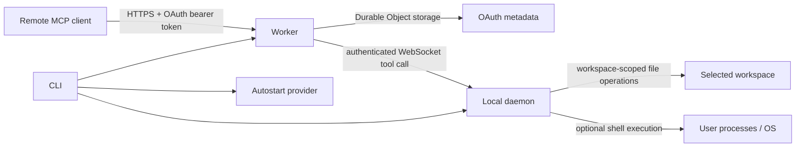

# Architecture

## Components

### CLI

The CLI selects a canonical workspace, manages per-workspace state and secrets, serializes startup/deploy/rotation work with a startup lock, deploys the Worker, installs an optional login service, acquires the daemon lock, and starts the daemon. Worker deployment is content-hashed; a hash is persisted only after the expected Worker version passes health checks.

### Cloudflare Worker and Durable Object

All requests for one deployed Worker route to a named Durable Object. OAuth metadata mutations are serialized through an explicit in-object critical section so concurrent registration, authorization, token exchange, and token verification cannot overwrite one another. The object owns:

- OAuth client, authorization-code, access-token, and throttling metadata;
- the active daemon WebSocket and a minimal attachment containing connection time, enabled tools, and policy booleans;
- the bounded in-memory map of pending daemon calls.

The daemon attachment deliberately omits the local workspace name, path hash, and process ID.

The Worker authenticates MCP HTTP requests and converts `tools/call` requests into daemon WebSocket messages. It does not have local filesystem or process access.

### Local daemon

The daemon validates that the Worker endpoint is a credential-free HTTPS origin, then creates an outbound authenticated WebSocket. It advertises only tools enabled by policy, validates every incoming call envelope, resolves filesystem paths, executes local operations, and returns bounded results.

### Autostart provider

The service layer emits platform-native definitions for launchd, systemd user services, or Windows Scheduled Tasks. It stores no credential in the service definition; the daemon loads credentials from owner-only local state.

## Trust boundaries

The OAuth boundary determines which remote client may call tools. The daemon policy determines which tools exist. The workspace path resolver determines the default filesystem boundary. Shell execution is intentionally outside the filesystem-tool sandbox and inherits the local user's authority.

## Request lifecycle

1. The MCP client discovers OAuth and protected-resource metadata.
2. It dynamically registers bounded redirect metadata.
3. The authorization request is validated before a password form is shown.
4. The user verifies the client and redirect URI and supplies the connection password.
5. A five-minute authorization code bound to client, redirect, resource, scope, and PKCE challenge is created.
6. A valid verifier exchanges the code for a hashed, expiring access-token record.
7. An authenticated `tools/call` is assigned a random call ID and bound to the current daemon socket.
8. The daemon validates the envelope, executes the enabled tool, and returns a bounded result.
9. The Durable Object accepts the result only from the same socket that received the call.

Browser requests are same-origin unless an exact origin is configured. Configured origins receive bounded CORS preflight and response headers; loopback OAuth callback permission is evaluated separately and never acts as a browser-origin wildcard.

## Filesystem resolution

The workspace is canonicalized at daemon construction. Existing read/list/search/Git targets are canonicalized with `realpath`; the canonical result must remain inside the workspace unless unrestricted mode is explicit. New write targets walk to the nearest existing ancestor and validate that ancestor, preventing a missing-path write through an escaping symbolic-link directory.

Writes use a same-directory temporary file and rename, preserving the existing mode when replacing a regular file. Bridge Git commands disable repository-configured external diff, text conversion, and filesystem-monitor hooks to avoid executing repository-local helpers during status/diff inspection. Symbolic-link destinations and non-regular targets are rejected.

## Reconnect and replacement

The daemon sends heartbeats and reconnects after a close using bounded exponential backoff with jitter. The handshake advertises only enabled tools and policy; it does not transmit a workspace path/name/hash or stable daemon identifier. Closing the current relay socket terminates active child processes so disconnected callers cannot leave long-running commands behind. The Worker permits one active daemon and closes older sockets when a replacement connects. Pending calls retain their originating socket reference. Closing an old socket rejects only calls assigned to that socket and cannot affect calls sent to the replacement. Active child processes associated with a lost/replaced connection receive termination with forced escalation when needed.

## Limits

Limits are defense-in-depth and are intentionally below platform maxima:

- Worker MCP body: configurable, default 8 MiB, hard cap 16 MiB.
- OAuth body: 64 KiB.
- Local WebSocket message: 8 MiB.
- `write_file` content: 5 MiB.
- `exec_command` command text: 64 KiB.
- Direct directory results: 10,000 entries and 4 MiB of path metadata.
- Recursive walks: 200,000 visited entries; path-list results are capped at 4 MiB.
- Captured process output: 512 KiB per stream by default.
- Local simultaneous tool calls: 16.
- Worker pending daemon calls: 32.
- Command timeout: 1-600 seconds.
- Dynamic clients, redirect URIs, codes, tokens, failed login identities, and per-client records: bounded constants in Worker source.

## Persistence

The local state schema is versioned. A custom state root is adopted only when empty or when it contains a recognizable legacy layout; legacy text markers are migrated, and removal validates the marker, contents, canonical path, active locks, and workspace/source-tree exclusions. JSON state and global config are written to owner-only temporary files, flushed, and atomically renamed. A malformed state file is renamed to a bounded corrupt backup before a clean state object is reconstructed. State roots carry an owner-only marker; uninstall validates the target and refuses dangerous or unrecognized recursive deletion.

OAuth metadata is pruned on access. Expired codes and tokens, old throttling records, and inactive clients without active credentials are removed.

Cross-origin browser access is denied unless the exact origin is configured; allowed origins receive bounded preflight and response headers. Same-origin requests remain allowed.

## Observability and privacy

Public health output contains only server identity and version. Worker observability uses a 10% head-sampling rate. Live daemon details are available through the authenticated `server_info` tool. Local structured logging redacts sensitive key names and known credential formats, bounds nested values, handles cycles, and escapes control characters. Doctor output does not echo Wrangler account identity when authentication succeeds.

Service logs are owner-only where supported and are tail-trimmed before daemon startup. Cloudflare observability sampling defaults to 10% rather than retaining every invocation. This is size control, not an audit log. The project deliberately does not log file contents, command strings, OAuth passwords, access tokens, or daemon secrets as structured operational events.

## Removed local API

The experimental local OpenAI-compatible `/v1` API and MCP sampling proxy were removed. They introduced a second local request surface and depended on client-side sampling behavior that was not a reliable backend contract. The supported interface is the authenticated Remote MCP endpoint.
