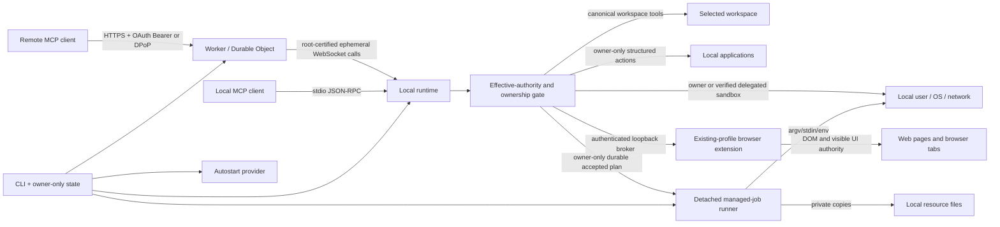

# Architecture

For a compact component map, read [System overview](OVERVIEW.md). Security assumptions, attacker models, non-goals, and residual risks are defined in [Threat model](THREAT_MODEL.md).

## Design goal

The system separates three questions that are often conflated:

1. **Who may request a tool?** Remote OAuth or local process ownership.
2. **Which tools exist?** The selected local policy profile.
3. **What authority does a tool have?** Canonical workspace boundaries for direct filesystem tools and local-user authority for processes.

No transport is treated as a sandbox. Both transports invoke the same local runtime.

## Components

### Shared protocol metadata and tool catalog

`src/shared/server-metadata.json` is the single source of truth for server identity, the sole current MCP protocol version, and host instructions. `src/shared/tool-catalog.json` is the single source of truth for tool names, descriptions, input schemas, annotations, and policy availability. The Worker and local runtime import both directly. Catalog tests reject metadata drift, duplicate names, unknown availability classes, open schemas, missing annotations, profile drift, and second hand-maintained Worker definitions.

### CLI and state layer

The CLI canonicalizes workspaces, resolves policy profiles, maintains per-workspace state and credentials, serializes startup/deploy/rotation with process-identity locks, deploys the Worker, installs optional platform-native autostart, and starts either remote daemon or stdio mode.
On a first interactive Windows start, workspace selection remains explicit but offers `%USERPROFILE%\MachineBridge` as a dedicated default; accepting it creates and remembers the folder instead of inheriting the shell current directory. Non-Windows interactive starts retain the current-directory default, and explicit `--workspace` paths remain strict existing-path inputs.

A canonical workspace receives an independent profile, Worker name, secret set, resource registry, managed-job directory, daemon/startup locks, and state file. State schema version 6 records named accounts, policy origin/revision, and local resource metadata in addition to the capability fields. `exclusive-file.mjs` owns complete-before-visible exclusive claims and flushed atomic replacement; pre-commit cleanup faults retain the primary cause, while a cleanup fault after an exclusive target is already committed is surfaced as fixed non-serialized cleanup evidence rather than converting the committed write into a false failure. `filesystem-identity.mjs` is the shared exact filesystem-generation boundary: default security-sensitive observations use BigInt device/inode/change-time stats, same-inode reuse with a changed generation is rejected, and unsafe Number identities fail closed. `process-identity.mjs` owns PID liveness, process start-time comparison, bounded command-line inspection, and PID-reuse classification. `service-lifecycle.mjs` owns the fail-closed stop-daemons-before-remove state machine shared by service removal and full uninstall.

### Local runtime

`LocalRuntime` is the transport-independent local tool orchestrator. It owns the shared authorization/execution pipeline, manager construction, cancellation, and the narrow delegation surface used by stdio and relay transports. Domain behavior remains in focused services:

- `workspace-file-service.mjs` and `git-service.mjs` own canonical filesystem/Git operations; `file-mutation-coordinator.mjs` supplies the shared resolved-path conflict identity and serializes only conflicting paths, registers every path in a multi-file transaction before waiting, and holds those reservations until the filesystem callback settles. `workspace-file-transaction.mjs` owns flushed staging, no-overwrite target publication, whole-file compare-and-swap, patch rollback, and cleanup causality. A late patch target becomes `conflict/target_appeared`; a rollback failure after any user-file commit is a public non-retryable `patch_recovery_incomplete` settlement directing the caller to inspect affected paths, while staging-only cleanup failure remains an internal cleanup error and post-commit artifact cleanup remains a warning rather than a false rollback claim;
- `process-contract.mjs` owns argv shape/size validation; `process-tree-signal.mjs`, `process-tree-supervisor.mjs`, `process-tree-snapshot.mjs`, and `process-tree-ownership.mjs` separate cross-platform signaling, asynchronous escalation, bounded process-group observation, and PID/start-time ownership; `process-execution.mjs` and `process-sessions.mjs` own one-shot and interactive execution; `process-nonreplayable-settlement.mjs` maps fixed internal UI-launch/native-input helpers from definite pre-spawn failure to non-retryable unknown settlement after process start; and `process-tracker.mjs` retains active and draining process ownership until close;
- `shared/tool-call-capacity.mjs` defines the control-tool set and generic admission algebra; local `call-capacity.mjs` and Worker `pending-call-capacity.ts` apply it independently, while `runtime-reporting.mjs` builds privacy-aware runtime and project snapshots;
- `runtime-diagnostics.mjs` owns fixed local probes and their stable interpretation, while `runtime-diagnostic-state.mjs` projects privacy-safe control-plane state for remote diagnosis;
- `runtime-capabilities.mjs` composes agent, application, browser, and effective-policy-filtered routing results, while `execution-routing.mjs` owns bounded set-level route scoring, ambiguity, fallbacks, and advisory tool projection;
- `runtime-tool-handlers.mjs` owns catalog-to-handler registration;
- `runtime-relay.mjs` owns relay construction and inbound envelope normalization, while `relay-call-recovery.mjs` owns the bounded disconnect grace, result queue, authoritative resumed-call reconciliation, same-daemon redelivery, and expiry cleanup;
- `runtime-paths.mjs` owns runtime-directory creation, containment checks, and error-path redaction;
- `runtime-resource-service.mjs` owns registered-resource lookup, bounded binary/UTF-8 reads for browser/application injection, and SSH-resource registration/result projection;
- `security-audit-log.mjs` owns only the bounded main-thread queue and cached initializing/health projection; `security-audit-worker.mjs`, `security-audit-storage.mjs`, `security-audit-dispatch.mjs`, and `security-audit-warning.mjs` isolate startup verification, all disk/hash work, batch persistence, privacy projection, and warning suppression from result delivery;
- `managed-job-lock.mjs`, `managed-job-runner.mjs`, `managed-job-storage.mjs`, and `managed-job-projection.mjs` separate transition ownership, detached runner identity, private persistence/diagnostics, and public result shaping from the managed-job lifecycle;
- `browser-request-registry.mjs`, `browser-broker-routes.mjs`, `browser-broker-server.mjs`, and `browser-bridge-http.mjs` separate direct request ownership, runtime-client proxy routing, authenticated loopback WebSocket upgrades/listening, and loopback HTTP handling from broker startup and extension handover;
- managed jobs, local resources, application automation, browser automation, and snapshot-bound Computer Use remain separate managers.

Architecture tests cap the orchestration module and each extracted service independently and reject a return of low-level process, patch, diagnostic, capability-scoring, heartbeat-policy, or audit-storage logic to `LocalRuntime`. `RelayConnection` owns remote WebSocket transport, `hello_ack` authentication, end-to-end `relay_probe`/`ready_ack` readiness, reconnect backoff, outage logging, and a monotonically increasing in-memory transport generation. `RelayHeartbeatMonitor` separately owns liveness timing, local event-loop-lag detection, recovery grace, and heartbeat diagnostics, so delayed local scheduling is not conflated with remote silence. The generation still protects the pre-ready probe and prevents arbitrary use of a stale socket. Ordinary tool calls additionally bind to an ephemeral identifier generated once per local daemon process. If a ready socket drops, the Worker detaches its pending calls for at most the shared two-minute reconnect grace; only a replacement socket that presents the same daemon-process identifier and completes the full readiness probe can reclaim them. The local runtime keeps those calls alive and queues completed results during the same bounded interval, then replays them after readiness. A different process instance, an explicit cancellation, or grace expiry cannot receive those results. Stdio mode invokes `LocalRuntime` directly without that adapter.

The control plane has explicit availability budgets at both admission layers. The Worker admits thirty ordinary pending daemon calls and reserves two additional slots for `diagnose_runtime`/`list_roots`; one serialized admission gate and the transient pending-call registry enforce that per-tool capacity. There is no second durable MCP call pool to merge into the accounting. The local runtime independently admits fourteen ordinary tools and reserves two control slots; the total ceilings remain thirty-two and sixteen. A timed-out or cancelled process call settles at the protocol boundary before operating-system cleanup necessarily completes, so `process-tracker.mjs` keeps that process under a draining call until `close` and reports pending escalation supervision. Neither process ownership inspection nor security-audit persistence performs synchronous process creation or disk `fsync` on the daemon event loop.

`daemon-process.mjs` owns workspace-daemon inspection and takeover. It distinguishes platform service state from the lock-owning Node process, validates PID and process-start identity, canonicalizes workspace/state paths before comparison, parses bounded process command lines without executing them, and accepts lock-backed `--daemon-only` recovery processes that omit repeated path flags. Stop/takeover sends `SIGTERM` only to a verified same-workspace service daemon. If it remains alive after the grace period, the code revalidates PID, process-start identity, command line, entrypoint, daemon mode, workspace, and state root before sending `SIGKILL`; a foreground, replaced-PID, or otherwise unverifiable process remains untouched. CLI orchestration never treats a missing launchd/systemd job as proof that the process exited.

`service-owner.mjs` is the machine-global identity ledger for the one launchd/systemd/Task Scheduler definition. Its owner-only record binds the canonical workspace, state root, exact runtime entrypoint, and package version. Installation is a pending-to-committed transaction: once provider mutation begins, failure remains pending because the code cannot prove that the external service manager made no partial change. `service-runtime.mjs` loads only a committed owner, verifies provider state, starts or restarts the provider, and waits for the matching daemon lock to publish its token-protected startup-readiness checkpoint. That checkpoint is written once, after device authentication, relay probing, and `ready_ack`; PID stability or a provider `active` flag is not equivalent evidence. Missing, corrupt, pending, mismatched, or unready ownership fails closed.

All machine-global service writers share a fixed per-user machine-service lock independent of workspace and custom state roots. The lock and service-owner ledger live in a dedicated control root (`machine-bridge-mcp-control`), while ordinary workspace/profile state uses `machine-bridge-mcp`; XDG and Windows APPDATA preserve the same sibling separation. The control root is never a default state root or candidate-runtime root. Paths that also need a workspace startup lock acquire machine-service first and startup second. Foreground startup releases the machine lock after provider takeover and daemon ownership are established, before entering the long-lived runtime; activation retains it through candidate verification, definition commit, service launch, and background readiness. Service-spawned `--daemon-only` children do not reacquire the parent transaction lock. This ordering prevents cross-workspace service-definition races, state/control namespace collision, and machine/startup lock cycles.

### Agent context and capability resolver

`AgentContextManager` discovers the nearest Git/workspace scope, applies authority-permitted user configuration plus hierarchical `.machine-bridge/agent.json` files, selects built-in/user/root-to-target instructions, discovers bounded filesystem skills, and resolves registered commands. Remote non-owner accounts confined to the workspace do not read the machine owner's user-global agent config or `model_instructions_file`; local machine-user calls retain those global preferences, and broader remote authority may use them only when the effective path policy permits that scope. `agent-context-projection.mjs` owns capability fingerprints, privacy-aware public projections, bounded skill summaries, command rendering, and effective-instruction rendering. `agent-skill-discovery.mjs` owns bounded skill-root traversal, symlink containment, metadata parsing, warnings, and file inventory; `agent-text-file.mjs` owns no-follow bounded UTF-8 reads. Filesystem/config discovery no longer maintains those output and skill-scanning mechanics inline. `agent-contract.mjs` is the strict checked-JavaScript boundary for configuration shape, registered-command normalization, encoded-size limits, and configured-path containment; the manager does not maintain a second parser. `project-package.mjs` owns no-follow package metadata parsing, package-manager selection (including fail-closed conflicting-lockfile handling), script-name normalization, bounded workflow-intent aliases, and automatic `package.*` command construction so instruction rendering and command execution do not duplicate package parsing. Its optional project-metadata reader opens first with no-follow semantics and then compares path and descriptor identity through the shared lossless BigInt filesystem-identity boundary before consuming bytes; unsupported or unavailable optional metadata may be omitted conservatively because discovery does not authorize or mutate state. `default-instructions.mjs` supplies a versioned in-package working-agreement block and derives a small virtual project-context block from root filenames and bounded metadata. It reads package script names but not bodies, does not inspect dependency values or source contents, executes nothing, and writes no user/repository files. A global `model_instructions_file` is a separate user-designated local/authorized session source and cannot be overridden by a project.

MCP `2026-07-28` `server/discover` returns static bounded guidance and leaves `session_bootstrap` as an explicit refresh tool; there is no initialization-time daemon bootstrap path. `resolve_task_capabilities` performs a fresh deterministic scan, rebuilds automatic project facts, ranks skills, commands, and policy-visible tools, then scores compatible execution surfaces as sets rather than independent names. Registered commands, Bash/direct argv, process sessions, managed jobs, files/Git, browser, applications, protected resources, and diagnostics remain distinct routes with explicit fallbacks. The routing envelope is schema-versioned; scores are deterministic relative ranks within one response, not probabilities or stable cross-version values. Routing is advisory and never narrows the effective policy; `exec_command` remains available as the general shell escape hatch.

Application and browser discovery uses the request's effective account/daemon policy intersection, not the daemon ceiling. A restricted account therefore cannot receive local application inventory or browser/shell recommendations it could not invoke. Installed application inventory uses a short bounded cache. `CapabilityObserver` records only counts, timestamps, source flags, match counts, recommended tool names, primary route, ambiguity class, score gap, and a runtime-keyed task fingerprint; it stores no task text.

The MCP catalog remains static: local skills and commands do not become dynamically named tools. This avoids stale host catalog caches and keeps Worker/stdio schema parity. Progressive disclosure separates discovery, instruction loading, routing advice, and execution authority. The refresh fingerprint binds the target/scope, configuration paths, instruction source/precedence/content identity, skill source identity, and complete registered-command definition. Returning it as `known_refresh_fingerprint` permits the server to omit unchanged static context while still rescanning and recomputing task-specific matches. It is not authorization, a conversation identifier, or permission to reuse stale tool results.

See [Session instructions, skills, commands, and capability discovery](AGENT_CONTEXT.md).

### Application automation manager

`AppAutomationManager` owns installed-application discovery, OS launching, structured Accessibility automation, bounded window screenshot capture, exact private value readback for verification, and the fixed macOS native-input adapter. The Node orchestration boundary remains in `app-automation.mjs`, while the fixed macOS Accessibility program lives in `app-automation-macos-jxa.mjs`; macOS inspection/actions execute that package-owned JXA through `osascript` and expose only typed selectors/actions. Snapshot-bound application authority pairs the PID with the public libproc process-birth generation and, when visual/window evidence exists, the exact observed owner-window binding. Exact resource-backed values retained for post-write verification use the manager monotonic clock rather than wall time and are removed on one-shot consumption, explicit cleanup, capacity eviction, or the 60-second fallback TTL. Unknown post-spawn application mutations preserve structured `side_effects_started`, `termination_requested`, and `effect_settlement` metadata when the fixed process boundary supplied it. The caller cannot provide script source. OS Accessibility, Automation, and Screen Recording/TCC remain independent boundaries. The experimental background visual backend is opt-in and is not loaded merely because application automation is available.

### Snapshot-bound Computer Use

`ComputerUseManager` composes the existing browser and application managers rather than replacing them. `computer-use-arguments.mjs` owns request normalization and cross-field validation, leaving `computer-use.mjs` focused on snapshot authority, preflight, dispatch, and effect settlement. `computer-use-snapshot-store.mjs` owns the bounded 64-entry one-shot/LRU authority state separately from the orchestration kernel; snapshot TTL and application verification duration both use monotonic time, so wall-clock correction cannot create or destroy mutation authority. `computer_observe` publishes a process-local, ten-minute snapshot containing public semantic evidence plus private target bindings; `computer_act` requires that exact snapshot, performs read-only preflight, atomically consumes its mutation authority before backend handoff, dispatches at most once, then captures post-state and reports `dispatch_status` separately from `effect_status`. Browser refs are document/frame scoped and can use high-confidence private backend-node bindings; application refs are snapshot scoped and re-resolve against process-generation and owner-window evidence. Unknown mutation outcomes are never same-action retry authority; callers continue from the returned post snapshot or observe again. Computer Use core/observation/recovery/snapshot modules and their browser/native adapters are explicit architecture-boundary modules with line budgets rather than an exception to the dependency-direction rules.

Native MCP image content and structured state share the ordinary 7 MiB tool-result boundary. `computer-use-result-budget.mjs` performs the budget check before an observation snapshot ID is published. If a screenshot alone would exceed the result budget, the image and pixel-action authority are omitted while the still-valid semantic snapshot and private identity evidence are retained. Post-action results apply the same rule after mutation: screenshot content is dropped first and settlement/diff/continuation are recomputed; if the remaining full post projection is still too large, a compact non-retryable settlement retains dispatch/effect status, `post_snapshot_id`, continuation/retry guidance, and bounded errors rather than replacing an already-issued mutation with a generic size failure.

### Browser extension and machine broker

`BrowserBridgeManager` owns only connection orchestration for the loopback HTTP/WebSocket broker, owner/client failover, routed requests, cancellation, extension replacement, and start/stop generation control. Every asynchronous startup boundary rechecks the generation so a listener or upstream socket cannot appear after `stop()` has invalidated that start. `browser-operation-service.mjs` owns MCP-facing browser argument normalization, resource-backed values/uploads, form semantics, screenshot conversion, and status presentation. Extension version/capability parsing lives in the strict checked `browser-extension-protocol.mjs`; pairing files and local HTML/Host/Origin helpers live in `browser-pairing-store.mjs`. The first runtime for the machine-level state root becomes broker owner; additional workspaces and stdio runtimes authenticate to `/runtime` and proxy through the same extension socket. This preserves one extension pairing while allowing multiple local MCP runtimes.

The packaged Manifest V3 extension runs in the user's existing Chromium profile. Its service worker is limited to pairing, transport, acknowledged protocol readiness, cancellation, bounded request lifecycle, and response routing. It independently caps active operations at 32 even though the local broker enforces the same ceiling. Fixed `browser-error-boundary.js` maps only an allowlist of actionable messages to the remote protocol; unclassified Chrome, DevTools, page, selector, URL, path, and account-shaped exception text becomes the fixed `browser operation failed` result. Fixed `browser-operations.js` owns tab lifecycle, aggregate frame/source budgets, waits, screenshots, Computer Use observation dispatch, and input-backend selection; `devtools-session.js` serializes same-tab debugger ownership and independently bounds debugger attach, each CDP command, and detach cleanup so one non-settling Chrome promise cannot retain the tab queue past its settlement budget. `devtools-observation.js` captures bounded Accessibility/DOMSnapshot/layout/screenshot evidence and treats a session timeout as a failed CDP capture that can fall back to semantic observation; `devtools-input.js` exposes only fixed trusted mouse, drag, wheel, keyboard, and text sequences, and a command timeout after Input dispatch remains non-fallback-safe/unknown. Callers cannot select CDP methods. Fixed `page-automation.js` is injected into selected frames for snapshot-version-3 semantics, per-document epochs, stable refs, bounded DOM/text traversal, actionability checks, open-Shadow-DOM traversal, structured DOM operations, multi-field forms, and resource-backed file inputs. Browser mutation classification has one source in `browser-extension-protocol.mjs`; once a mutating request has been handed to the extension transport, `browser-request-settlement.mjs` maps timeout, disconnect, malformed response, send uncertainty, or a completed mutation whose oversized/unserializable result cannot be delivered to fixed non-retryable unknown settlement while preserving structured side-effect/cancellation evidence. The local MCP and extension response paths are both pinned to the same 7 MiB result ceiling by an architecture guard, so cross-runtime size drift cannot silently change that settlement boundary. Pre-send failures and read-only failures retain their ordinary definite/retryable semantics. Protocol 3 requires bidirectional `hello`/`hello_ack` plus exact packaged-version and capability equality; pairing state and replacement are committed only after validation, so an invalid candidate cannot displace or overwrite the working configuration. The broker validates loopback hostnames, canonical extension IDs, matching pairing/broker ports, one-time role-bound HMAC WebSocket proofs, message sizes, concurrency, and deadlines. Long-lived extension/runtime tokens remain owner-only HMAC keys and are never placed in WebSocket subprotocols. Clients first fetch a five-second challenge through an internal-header loopback endpoint, authenticate the broker's server proof, then present a one-time client proof; the broker consumes it once. Public pairing status and the long-lived broker `/pair` document are permanently token-free. An explicit pair action first binds an OS-assigned one-shot loopback listener owned by the current Machine Bridge process, then opens that temporary page with a 30-second bootstrap only in the URL fragment. The temporary listener serves exactly one pairing page and then closes (or expires after 30 seconds), so a process occupying the long-lived broker port cannot redirect the bootstrap. The `document_start` content script removes the fragment before page scripts run and keeps it only in the extension isolated world. The fragment secret is never sent in the HTTP request; instead it authenticates a bounded `/pair-auth` exchange. The broker derives the same secret from the owner-only extension token, proves possession first, consumes the matching client proof once, and only then releases the long-lived extension token to the extension. Manual repair reuses the isolated-world bootstrap through extension messaging rather than reading credentials from page DOM. Pairing material is omitted from MCP/log output.

See [Local application and browser automation](LOCAL_AUTOMATION.md).

### Managed job runner

`ManagedJobManager` persists bounded per-workspace job envelopes below the owner-only profile directory. Managed-job active and terminal lifecycle classifications have one shared source in `managed-job-terminal.mjs`; manager reconciliation, retention, detached-runner fatal settlement, and production full-access diagnostics consume that source instead of maintaining parallel status lists. `start_job` validates the complete plan, snapshots referenced resource metadata/hashes, writes an owner-only plan/status, and launches `job-runner.mjs` as a detached process with runner-level logs redirected to owner-only files. `stage_job` performs the same acceptance validation but writes a non-running, review-only `staged` envelope; staged records have no promotion/approval execution path, so execution requires a separate trusted `start_job` request or an explicit local `job submit` plan. `managed-job-retention.mjs` owns staged expiry timing, seven-day terminal retention, and the 50-record capacity policy; `managed-job-terminal-maintenance.mjs` owns post-settlement evidence validation and artifact scrubbing; `managed-job-directory-generation.mjs` binds whole-directory retirement to the exact filesystem generation that retention inspected. Retirement first revalidates the full observed generation, atomically renames that directory to an internal `retired_job_*` name carrying its device/inode identity, revalidates the moved object, and only then recursively deletes it. The retirement namespace deliberately does not match the public `MANAGED_JOB_ID` grammar, so list/read/lock scans cannot reinterpret internal cleanup state as an ordinary job. A crash after rename therefore leaves recognizable state rather than an anonymous orphan: a later maintenance pass reclaims it only when the encoded generation still matches, while a type mismatch, generation mismatch, or unreadable retired entry is projected into active-state inventory as a privacy-bounded `retired_managed_job`/`unreadable` blocker without exposing the internal filename or filesystem identity. Before destructive terminal cleanup, status/result must describe the same directory job ID, terminal state, and `finished_at` generation; the degraded `result_persisted=false` form must carry an explicit terminal-record error class. Corrupt terminal evidence is therefore retained as unreadable state and also blocks state removal instead of authorizing plan/runtime scrubbing or capacity eviction. Expiry is a real per-job state transition: it acquires `transition.lock`, re-reads the staged state, and commits through the same result-first terminal persistence path as cancellation/runner settlement. Seven-day retention is measured from terminal `finished_at`, not an older directory mtime. Admission may evict only safely removable terminal records and never active, staged, unreadable, generation-replaced, or unreclaimed retired state merely to make room; every recognized retired entry still counts toward the same hard retained-state capacity until safely removed. Cross-process create transactions serialize through an owner-identity-checked root `capacity.lock` across prune/recheck and status publication, and state inventory treats a live capacity lock as an uninstall blocker.

The runner:

- materializes registered resources as private `0600` copies after hash verification;
- materializes bounded job-scoped temporary files;
- substitutes resource/temp/runtime/workspace placeholders;
- executes ordered argv steps with bounded output and timeout/process-tree termination;
- polls an owner-only cancellation marker, terminates the current child tree, and keeps the runner alive for finally steps;
- attempts ordered finally steps after success, failure, timeout, or cancellation;
- removes private runtime copies;
- writes bounded redacted results and terminal status;
- deletes the full execution plan and runner PID file after terminal commit.

Running managed jobs do not belong to an MCP socket or daemon call ID and snapshot the accepted environment mode/resources. Later profile changes govern new direct submissions; accepted running jobs require explicit cancellation. Staged plans launch no process and have no terminal promotion path. Daemon disconnect/replacement does not terminate them. Dead runner PIDs are detected on the next daemon or local job-CLI start; stale private runtime data is removed and the finally phase is retried in recovery mode. Recovery deliberately reruns all finally steps, so cleanup must be idempotent.

Local resource registrations remain in owner-only state and are reloaded for every new job. MCP-visible resource inventory includes aliases and validation status but never source paths, hashes, or contents.

### Canonical policy contracts

Policy revision 5 is loaded from one shared JSON contract by both local and Worker policy evaluators. Tool advertisement and execution authorization use catalog availability classes; managers receive the same authorizer instead of reimplementing profile conditionals. Read-only job/resource inspection is `always`, job cancellation is write-gated, and starting a persistent job requires `write+direct-exec`.

Named profiles are normalized to their complete capability sets. In particular, `full` always means write enabled, shell execution, unrestricted paths, complete parent environment, absolute-path display, and every catalog tool. CLI flags that alter an individual capability deliberately change the profile identity to `custom`. Policy revision 5 defines the only accepted persisted policy shape. Named profiles are normalized to their canonical capability sets, and persisted data from another revision is rejected rather than interpreted. Compound availability requirements come from the shared contract.

Remote authority has a separate final layer. After the Worker intersects account role with daemon policy, the local runtime independently rebuilds authority from account ID, account version, OAuth client ID, refresh-family ID, and role. `OperationAuthorizer` classifies normalized effects and enforces hard invariants: generic path-based tools cannot target control-plane roots; sensitive and persistence targets, browser and application control, data export, credential operations, and persistent-plan creation are owner-only; external paths and process execution remain inside the effective policy. Classification produces audit metadata, not an approval or privilege-escalation workflow. Before a classified operation can be rejected by a role ceiling or protected-root check, the request context receives only the coarse risk category, normalized scopes, and runtime-keyed HMAC target fingerprint with `allowed: false`; the outer audit middleware can therefore preserve deny-path evidence without persisting the path, argv, resource name, or raw target hash. Successful authorization replaces that attempted projection with `allowed: true`. Every patch destination is canonicalized through the execution resolver before classification. Long-lived processes, output sessions, and jobs retain the creating principal binding. Obsolete lease storage remains only for one-way local migration cleanup and is not consulted by runtime authorization. See [LOCAL_AUTHORIZATION.md](LOCAL_AUTHORIZATION.md).

The full-only `generate_ssh_key_resource` operation is implemented locally. The Worker only filters and relays its shared catalog definition. Local generation uses `ssh-keygen`, verifies public/private correspondence, registers the private file through the same owner-only state transaction as the CLI, and rolls back a newly created pair if state persistence fails.

`full-test` constructs a local runtime with canonical full policy and executes real operations in disposable directories. It is an acceptance test for the local implementation, not a probe that changes remote systems or bypasses host policy.

### Stdio MCP server

The stdio server implements newline-delimited JSON-RPC over stdin/stdout. Each executable request must carry the single supported MCP `2026-07-28` metadata contract; there is no initialize-time version negotiation or protocol session. It advertises policy-filtered tools through current discovery/list results, returns text plus structured content, supports native image content, maps current stdio cancellation notifications to runtime call IDs, and sends process diagnostics only to stderr.

### Cloudflare Worker and Durable Object

Public `/healthz`, `/`, discovery metadata, CORS preflight, and unknown-path 404s are answered by the outer Worker without Durable Object requests. Only an exact stateful route allowlist passes a burst guard and reaches one named Durable Object. It owns:

- OAuth clients, authorization codes, hashed access-token records, an independently versioned hashed refresh-token store, and throttling metadata;
- one active end-to-end-verified daemon WebSocket plus bounded candidate and probing sockets;
- policy/tool metadata attached to the active socket;
- a bounded in-memory map for daemon calls whose initiating request or response stream still owns settlement;
- one short FIFO pending-registration gate plus a bounded pre-dispatch daemon-ready waiter set; both use the same 30 ordinary + 2 reserved-control capacity algebra, and waiter admission folds current pending usage into that shared ceiling before accepting another disconnected new call.

`BridgeRoom` owns stateful routing, MCP authorization/dispatch, daemon WebSocket lifecycle, cancellation, and composition of the extracted state machines. `worker-entry.ts` owns outer-Worker static routing, stateful admission, current request-scoped SSE proxying, and privacy-safe gateway failures; `worker-static-routes.ts` and `worker-metadata.ts` own stateless public responses; `worker-edge-guard.ts` owns the burst guard and quota classification. The outer Worker applies a two-level stateful burst guard before Durable Object routing: a high-capacity route/Worker bucket preserves aggregate abuse resistance, while a lower route/subject bucket isolates authenticated credentials or anonymous network identities through internal truncated SHA-256 keys. Raw credentials and addresses are never stored in application logs or returned by diagnostics; the hash is an opaque bucketing key, not a claim of cryptographic anonymity for low-entropy network addresses. Limiter failure is fail-open and never logs key material. Both outer and Durable Object `/mcp` boundaries validate the actual Origin.

`mcp-http-contract.ts` owns MCP `2026-07-28` request metadata, strict media-type/`Accept` validation, and mirrored-header validation, including `MCP-Protocol-Version`, `Mcp-Method`, `Mcp-Name`, and schema-declared `Mcp-Param-*`. `mcp-tool-call-input.ts` is the shared role-visible name/raw-argument/schema gate before side effects. `mcp-controller.ts` owns request dispatch. Because this server advertises no change notifications, `subscriptions/listen` validates and bounds the current filter, acknowledges the empty supported subset, emits the correlated graceful-completion result, and closes immediately rather than constructing persistent subscription state or inventing a capacity failure. `mcp-response-stream.ts` owns those finite subscription frames plus direct tool-response SSE framing without event IDs or replay. `mcp-response-proxy.ts` forwards exactly one Durable Object response, emits bounded keepalive comments, releases the internal reader on every terminal path, and maps public response-stream closure to a credential-free stream-scoped private cancel control. `mcp-stream-proxy-contract.ts` contains only the private `direct`/`cancel` control shape and strips caller-supplied internal headers at the public boundary. There is no long-lived subscription registry, prepare/subscribe delivery phase, result registry, protocol session, recovery GET, `Last-Event-ID`, cross-event terminal Promise, or persisted MCP replay result.

MCP `2026-07-28` requests are independent. The Worker validates Origin, authenticates the request, checks body metadata and mirrored HTTP headers, intersects the tool with the account-visible catalog, and validates raw arguments before dispatch. OAuth token plus JSON-RPC request ID is deliberately not a global request key: two requests sharing one token may reuse the same ID concurrently. A streamed call remains owned by its initiating response stream and the ordinary bounded pending-call index. Public abort, response-body cancellation, or failed keepalive delivery sends one random internal stream capability that removes the matching pending call and requests daemon cancellation. Public requests cannot supply that capability because internal headers are stripped, and the control request forwards neither Authorization nor DPoP.

Daemon reconnect continuity remains separate from MCP delivery semantics. If the same verified daemon instance reconnects within the bounded 120-second relay grace period, an already-dispatched transient pending call may be rebound to the replacement socket because the daemon itself retains execution ownership; no HTTP/session replay record is created. A new call that arrives while no verified daemon socket is ready has a separate pre-dispatch recovery path: `daemon-ready-waiters.ts` may wait at most ten seconds and never longer than that call's own execution budget, while its admission combines already-detached pending calls and other waiters under the same 30 ordinary + 2 reserved-control ceiling. `daemon-ready-dispatch.ts` assigns zero recovery delay when a verified daemon is already available and samples monotonic time only after entering the recovery path. `daemon-recovery-budget.ts` deducts that measured recovery interval before dispatch while preserving the five-second Worker settlement margin; if recovery consumes the execution window, the call fails retryably without extending the hosted foreground envelope. Owner `server_info.worker.pending_calls` preserves `active` as the already-dispatched count and separately reports pre-dispatch waiters plus combined ordinary/reserved capacity usage; delegated accounts retain the activity-hidden projection. Late results after a request has already cancelled or timed out are acknowledged only so the daemon can release its recovery queue. Results arriving from a superseded socket are rejected without acknowledgement. A hibernated socket attachment missing current liveness fields fails closed and reconnects instead of being interpreted through an old attachment schema.

`runtime-alarm.ts` and `runtime-alarm-storage.ts` own transient request deadlines plus daemon readiness/liveness alarm projection. `daemon-sockets.ts` owns socket role transitions, while `daemon-socket-attachment.ts` owns bounded attachment decoding. `mcp-jsonrpc.ts` owns JSON-RPC shape validation and current result/error/tool-result projection. `websocket-protocol.ts` owns record validation plus best-effort send/close/rejection helpers. `OAuthController` owns OAuth-store pruning, registration throttling, authorization submission, account-admin routing, token exchange, access-token verification, and the serialization queue for OAuth mutations. Worker-internal TypeScript imports use explicit `.ts` specifiers and JSON import attributes, so the same modules are directly executable under the pinned Node runtime and bundled by Wrangler.

The shared tool catalog is executable protocol data rather than documentation only. `tool-argument-validation.mjs` compiles the supported JSON Schema 2020-12 subset at process/module initialization, rejects unsupported dialects or keywords instead of silently weakening them, refuses automatic network `$ref` dereference, and bounds schema depth, node count, pattern length, issue count, and total runtime validation steps. Array elements and each own object property consume work; object traversal does not allocate an unbounded key array before checking the budget. The open JSON portions of request metadata, capabilities/extensions, and subscription filters use a separate 4,096-node/32-level/bounded-key structural walk, and resource subscription lists are count/length bounded. Worker validation prevents invalid remote calls from reaching the daemon; local validation remains a second boundary for stdio, relay, and direct runtime entrypoints. Validation diagnostics contain only JSON Pointer instance path, keyword, and constraint text—never the rejected value or an unbounded caller-supplied identifier.

### Daemon device authentication

The local daemon uses a long-term P-256 device root to certify a 24-hour ephemeral session key. Worker deployment receives only the root public JWK. The default provider on every platform is an owner-only portable private JWK. macOS can instead use non-exportable Secure Enclave material only when `MBM_MACOS_TRUST_BROKER` identifies an app-like broker whose Apple signature, Team ID, canonical non-symlink executable path with no group/other write access, provisioning-backed Keychain capability, and actual create/delete key probe all validate. The source-build development broker cache is separate from that production trust decision: a versioned marker binds both source and compiled-binary SHA-256, and cache reuse additionally requires a regular single-link owner-only executable before signature verification. The enrolled state binds that broker identity, Keychain tag, and public key. One root signature at daemon startup certifies the in-memory session key. Every WebSocket attempt then carries a short-lived preflight signed by the session key and bound to Worker origin, package version, nonce, timestamp, and the root certificate. The nonce is consumed once through bounded Durable Object state. After upgrade, the Worker issues a fresh challenge and accepts tools only after a second session signature binds the challenge, origin, package version, daemon instance ID, and timestamp. Reconnects reuse the in-memory key without touching the root. End-to-end readiness still requires an ordinary relay probe before a verified candidate replaces the incumbent.

The primary OAuth store separates trusted client registrations and named accounts from authorization codes and access-token records. A separate versioned Durable Object key owns refresh-token families, consumed-token markers, and family revocation. A `client_id` identifies an MCP application and redirect URIs; account records identify the authorized human or service identity. Codes and tokens bind client ID, account ID, account version, role, scope, resource, deployment token version, family identity, and expiration where applicable. Only hashes of bearer tokens are persisted. Access tokens last fifteen minutes; refresh tokens rotate and expire after fourteen idle days or thirty absolute family days. An identity-equivalent retry may reproduce the same deployment-keyed HMAC replacement pair at most twice inside a 30-second concurrency window without extending its expiration; retry-budget exhaustion is throttled, while reuse after that window revokes the complete family, including active access tokens. The Worker carries account, client, and refresh-family identity with every relayed call so long-lived runtime objects cannot cross principals. Authority mutations durably queue matching local revocations in the same Worker transaction. The daemon acknowledges a queued revocation only after local pending calls, process sessions, and inspectable managed jobs have all applied it. Every local execution category is attempted even when an earlier category fails, so a failed process-session termination does not postpone cancellation of an independently revocable managed job; any failure still withholds acknowledgement and interrupts that relay generation for prompt replay on reconnect. This internal cancellation bypasses public tool availability only—it still enforces object ownership, state-maintenance, transition-lock, process-termination delivery, and persistence invariants—so later policy narrowing cannot make an older durable job non-revocable. One bridge-specific Durable Object and one local runtime remain the normal topology for a workspace/trust domain; see [MULTI_ACCOUNT.md](MULTI_ACCOUNT.md).

The daemon attachment deliberately omits workspace path/name/hash and process ID. Explicit authenticated tools may return workspace metadata according to local path-display policy.

### Autostart layer

The service layer emits launchd, systemd-user, or Windows Scheduled Task definitions. Worker/account credentials are not embedded in service definitions; the daemon loads owner-only state. The exact policy is stored in owner-only state. An allowlisted `service-environment.json` separately persists only network-proxy and custom-CA variables needed by a background daemon, because shell-session environment is not inherited reliably by login managers; values are loaded only for `--daemon-only`, never logged, and status exposes key names only. launchd/systemd definitions contain the workspace/state-root selectors, `warn` plus JSON log settings, and a sanitized absolute-only PATH captured at installation so background `full` mode can resolve the same developer tools without accepting relative PATH entries. The current Node and package bin are explicit; all nested npm run-script prefixes and inactive candidate-runtime entries are removed so the service definition does not depend on whether installation was invoked from an npm lifecycle or a prior candidate daemon.

The Windows adapter owns a short private restart launcher because Task Scheduler's `/TR` action is substantially smaller than the Windows process command-line limit and the full installed Node/CLI/workspace argv can exceed it. The scheduled action therefore contains only the launcher path. The launcher performs the full quoted invocation, redirects to service logs, and restarts only nonzero exits. A fixed PowerShell object query supplies language-independent `Ready`/`Running` state; provider installation is not equated with process activity. The trigger is least-privilege current-user logon, not boot-time `SYSTEM` execution.

The platform adapters normalize launchd, systemd, and Windows Scheduled Task operations to one `{ok, provider}` result contract. Provider activity is tri-state: only verified active/inactive evidence yields a boolean; unavailable, ambiguous, or transitioning provider state yields `active: null`, and service-runtime mutation refuses it. launchd status is fail closed: `launchctl print` exit 0 is loaded evidence, exit 113 is the explicit missing-service result, and every other nonzero exit is `status_unavailable` rather than inferred absence. A launchd stop/removal is verified only after the service is both inactive and unloaded from the launchd domain; observing a process exit while the service remains registered is not sufficient deletion evidence. systemd treats only recognized `is-active` states as status evidence: `active`, `inactive`, `failed`, and confirmed missing state are actionable, while transition states and installed-but-unknown state remain non-boolean. `service-runtime.mjs` owns committed-owner/provider orchestration, while `service-runtime-convergence.mjs` owns daemon readiness and replacement evidence. Start may return idempotently for an already-ready owner; restart may not, and an active restart requires provider evidence plus a different ready daemon PID. Removal is not a provider-specific sequence: `service-lifecycle.mjs` first stops the provider, then every verified workspace daemon in scope, and only then removes the definition. A failed stop or unverifiable process prevents definition/state deletion.

The autostart provider name is machine-global, but daemon locks are state/workspace-scoped. Foreground startup therefore does not stop the provider merely because a Machine Bridge service exists. It first verifies that the current state's daemon lock identifies a live `service` process whose command line matches the same canonical workspace and state root. Only that proven owner may trigger provider stop; isolated installs, another workspace, another state root, and foreground locks leave the existing service untouched.

Local release-candidate browser integration has one additional release-owned state surface: `release-channels/browser-extension`. Versioned candidate package roots resolve browser setup/status to this stable physical directory rather than their disposable `runtimes/v<version>-<sha>-<nonce>/.../browser-extension` path. Activation publishes exact installed candidate files there only after Worker/background-daemon convergence, replaces ordinary files atomically, commits `manifest.json` last as the extension-version marker, then prunes inactive candidate runtimes and writes activation evidence. Ordinary checkout and global-package runtimes remain package-local, so development code is not silently redirected through release state. This stable directory exists because Chromium persists the source path selected by **Load unpacked**; candidate runtime pruning must never invalidate that source path again.

## Trust boundaries

Remote OAuth binds each code, access token, and refresh token to a named Machine Bridge account, account version, and role, so accounts are independent application-level authorization principals. The Worker intersects that role with the connected daemon policy, and the local runtime enforces the relayed authorization again. This distinction is not operating-system tenancy: every account still reaches one daemon, workspace, browser profile, and OS user authority. Local stdio access relies on the local process and configuration boundary. A connector host can independently present a smaller tool subset to a session; this post-relay filtering is outside the protocol state visible to Machine Bridge. Canonical resolution limits direct filesystem tools. Processes retain local-user authority and can escape workspace constraints through their own code or system calls.

## Remote request lifecycle

1. The MCP client discovers protected-resource and authorization-server metadata.
2. It dynamically registers bounded redirect metadata. Per-source throttling counts only registrations that have not yet completed authorization, while a separate global cap bounds all retained clients.
3. The Worker validates authorization parameters before displaying a password form.
4. The user verifies client name and redirect URI and enters a Machine Bridge account name and password.
5. The Worker creates a five-minute code bound to client, redirect, resource, normalized scope, and PKCE challenge.
6. A valid verifier exchanges the one-time code for an expiring access token and refresh token; only their hashes are stored. A refresh request is bound to the original public client, account, scope, resource, account version/role, deployment token version, and optional DPoP key. Rotation derives one replacement pair from the consumed token and the private deployment token version, then permits at most two identity-equivalent responses with that exact pair during a 30-second concurrency window; over-budget retries are throttled, and replay after the window revokes the family.
7. A native MCP client sends `server/discover` or another request with MCP `2026-07-28` metadata on every call. It receives no protocol session; request and cancellation ownership are scoped to that individual request or response stream, so separate clients may reuse the same typed JSON-RPC ID even with one OAuth token. Discovery returns static bounded guidance, while `session_bootstrap` explicitly refreshes authority-permitted local/project instructions and context. Remote HTTP clients on the declared `2025-06-18`/`2025-11-25` initialization compatibility dates may call only `initialize`, `notifications/initialized`, `ping`, `tools/list`, and `tools/call`; the last two route through the same current controller and the adapter retains no session/replay identity. Other removed initialization/session markers are rejected with bounded upgrade guidance before tool dispatch.
8. A new daemon first authenticates as a bounded `probing` socket. The Worker sends a random `relay_probe` over the daemon control plane; the local runtime returns the matching control result, and only that result produces `ready_ack`, promotion to the active daemon, and safe replacement of an incumbent connection. This readiness exchange is below MCP and has no protocol-session identity.
9. `tools/list` is a stable package-and-account-role discovery catalog and declares `listChanged: false`; a brief relay interruption does not mutate it. `server_info.authorization.effective_tools` is the live daemon/account intersection and is the authority diagnostic.
10. A `tools/call` receives a random relay call ID only after role-visible name and raw arguments pass the shared schema gate. A JSON response remains in the initiating Durable Object event. If the Worker selects SSE, the outer Worker assigns a random private stream capability, makes one authenticated direct Durable Object request, and forwards the non-resumable response stream. If the public stream closes, a second credential-free internal request presents only that capability; it is handled before OAuth/DPoP and can cancel only the matching active call. No descriptor, terminal-result registry, recovery GET, event ID, protocol session, or `Last-Event-ID` state exists.
11. The local runtime validates policy and arguments, executes the tool, and produces a bounded JSON-serializable result. It retains the daemon-to-Worker terminal envelope after WebSocket queueing and replays it until the Worker returns `tool_result_ack`; queue acceptance is not durable delivery. This is relay execution continuity, not MCP replay. Closing an HTTP response cancels its pending call through the private stream control.
12. The Durable Object accepts a result only from the registered WebSocket generation. A transient call settles its in-memory pending record and current HTTP response. If the daemon socket drops, the call may detach below the MCP transport for the bounded same-daemon reconnect interval; the same daemon-process identifier may reclaim it only after a fresh readiness probe, while a new daemon process cannot. A stale socket result or close event cannot settle or detach a rebound call. Public HTTP recovery remains impossible: once the response stream is gone, the call is cancelled rather than exposed through replay.
13. Daemon delivery is at-least-once until `tool_result_ack`. The generation guard and authoritative `resume_calls` set make duplicate relay delivery converge without reviving removed calls. Result handling records three exact dispositions: `committed`, `owner_missing_acknowledged` for a late result whose request owner already settled, and `stale_connection_rejected` for a superseded socket. Late owner-missing results are acknowledged only so the daemon can release its recovery queue; stale-socket results are not acknowledged. On readiness handover, the runtime cancels active calls and queued results absent from `resume_calls` before accepting `ready_ack`.
14. A tool deadline cancels only that operation and never infers daemon death from tool duration. The independent daemon-liveness alarm owns socket invalidation. If same-instance readiness does not return before the grace deadline, the Worker rejects the detached request and the local runtime cancels ordinary calls, terminates their process trees, and discards queued results. A newly started daemon has a different instance identifier and cannot inherit prior calls.
15. `start_job` is different: after durable acceptance, the detached runner is no longer bound to an MCP response stream or daemon socket. Later cancellation uses `cancel_job` or the local CLI.

HTTP JSON-RPC IDs are scoped to each request or response stream and are not used as a token-wide duplicate key, so independent clients may reuse the same typed ID. Stdio has one process-local in-flight ID index because all requests share one explicit transport channel.

## Stdio request lifecycle

1. The local client launches `machine-mcp stdio` with a workspace and profile.
2. MCP `2026-07-28` requests carry version and client capabilities in every request `_meta` and require no initialization handshake. `session_bootstrap` is an explicit context-refresh tool rather than initialization behavior.
3. Tool discovery is generated from the same catalog and policy used by remote mode.
4. Each call receives an internal random call ID used only for cancellation and process tracking.
5. Input is parsed as incrementally bounded newline-delimited JSON-RPC, so an oversized line is discarded before unbounded buffering and the next line can still be processed. Results are emitted as JSON-RPC on stdout; logs remain on stderr.
6. Duplicate in-flight request IDs are rejected, and `tools/call` requires a non-null request ID so write or execution calls cannot run as unacknowledged JSON-RPC notifications.
7. Closing stdin cancels pending calls, terminates ordinary active processes/process sessions, and removes the transport runtime directory. Previously accepted managed jobs continue in their persistent per-workspace job directories.

## Filesystem resolution and privacy

The workspace is canonicalized and compared with targets through consistent platform-native/async `realpath` representations. Existing targets must remain inside the workspace unless the active policy is unrestricted. New targets walk to the nearest existing ancestor, validate its canonical path, and reconstruct the destination below that canonical ancestor.

Path behavior is profile-dependent. The default `full` profile permits unrestricted direct filesystem paths and returns absolute paths. The `agent`, `edit`, and `review` profiles enforce canonical workspace containment and return workspace-relative paths. Error strings redact canonical and common platform-alias forms of workspace, runtime, and home paths whenever absolute path display is disabled. Access scope and path display are independent: unrestricted access with path display disabled returns relative workspace paths and opaque external-path identifiers.

Symbolic-link destinations and non-regular write targets are rejected. Write paths always canonicalize their nearest existing ancestor, including under `full`, so transaction classification and execution agree on the real destination while unrestricted-path authority remains intact. Patch move destinations are included in that classification. Existing bounded reads add final-component `O_NOFOLLOW` where supported. Recursive walkers do not follow symbolic-link directories. Because portable Node.js lacks descriptor-relative `openat` traversal for every operation, parent-directory replacement by hostile same-user code remains an external-isolation concern.

## Mutation model

Filesystem mutations coordinate by already-resolved canonical path rather than one global runtime queue. Operations touching the same canonical path serialize; independent paths may proceed concurrently. A multi-path patch transaction reserves every resolved source and destination before awaiting any prior reservation, so overlapping transactions cannot deadlock through partial reservation while unrelated paths remain independent.

### Whole-file write

A same-directory temporary file is created with restrictive permissions. Existing mode is preserved when replacing a regular file. Expected hashes are rechecked immediately before commit. Create-only uses a hard-link commit that fails atomically if the destination appeared concurrently.

### Exact edit

The current UTF-8 content is hashed. The old fragment must exist and, unless `replace_all` is set, occur exactly once. The resulting file is bounded and committed only if the original hash is unchanged.

### Patch transaction

The patch parser accepts a strict Begin/End envelope with add, update, move, and delete operations. It rejects malformed hunks, absent or ambiguous context, duplicate textual paths, and different paths that resolve to the same filesystem location.

Before commit, all sources and targets are resolved and validated, updated content is computed, and temporary files are staged. Source hashes and destination absence are rechecked. Existing sources are renamed to backups, staged files are committed, and any failure rolls back committed operations in reverse order. Backups are deleted only after full success.

This is a process-level transaction, not a filesystem-wide atomic transaction across multiple directories. Sudden power loss can still interrupt a multi-file commit; retained backup/temp naming makes recovery identifiable.

## Process model

Resource command classification distinguishes local resource cost from semantic sensitivity. Arbitrary shell execution has no blanket zero-resource class: even a read-only-looking payload remains adaptive or is promoted by the normal shell/build classifiers, so PATH resolution, startup profiles, substitutions, wrappers, and later shell segments never need to be proven harmless merely to obtain an admission bypass. Generic zero-resource process exceptions are identity-based in `resource-light-command.mjs` and require a small set of standard absolute executables; PATH-resolved lookalikes do not qualify. The heavy script/package-manager family has one separate control-plane exception because the live OAuth canary must remain runnable while unrelated builds hold machine reservations. That exception bypasses both npm lifecycle execution and mutable checkout code: only exact direct Node argv `node <activated-runtime-package>/scripts/release-oauth-canary.mjs --allow-live-oauth-canary` can become `release-control`. The script operand must be absolute and `resource-release-control-workspace.mjs` canonicalizes it to the running package's own `scripts/release-oauth-canary.mjs`; a workspace-relative or copied canary therefore cannot qualify even when its bytes match. `npm run release:oauth-canary` and `node scripts/release-oauth-canary.mjs ...` remain source/developer entrypoints with ordinary accounting, but prerelease canary provenance rejects them as release evidence because the executing package root must canonicalize to the package root containing activation `runtime_entry`. The lexical Node shape alone is also insufficient. `resource-release-control-executable.mjs` resolves the executable that the child PATH would actually invoke, canonicalizes it, and requires equality with the daemon's own `process.execPath`; a shadowing first Node match therefore fails instead of being skipped. It refuses the light profile when Node/native debugging, profiling, TLS, loader, or resource-startup overrides such as `NODE_OPTIONS`, `NODE_DEBUG`, `NODE_TLS_REJECT_UNAUTHORIZED`, `SSLKEYLOGFILE`, `UV_THREADPOOL_SIZE`, `LD_PRELOAD`, or DYLD injection paths are present, and the canary runner enforces the same environment policy before any live OAuth mutation. The command cwd remains bound to the running package name/version and exact canary source bytes. The packaged canary derives its imports from the activated runtime package but deliberately uses `process.cwd()` as the candidate/evidence data root, so mutable checkout modules are never evaluated under the release-control exemption. The canary itself requires exactly the single live-canary flag, requires empty `process.execArgv`, and rejects alternate state/workspace argv before state access because those identities and Node startup flags are not represented in acceptance evidence. It also calls the existing service-daemon identity verifier and requires a current startup-ready service daemon whose version equals the candidate, whose canonical `entryScript` equals the executing canary package's `bin/machine-mcp.mjs`, and whose canonical Node executable equals the canary's `process.execPath`, and whose private daemon-lock Node runtime version equals `process.versions.node`. That daemon proof applies to stable as well as prerelease candidates; the prerelease activation record remains an additional package-root/hash binding rather than the only code-origin proof. It resolves the npm CLI needed by its explicit `--ignore-scripts` pack dry-run without trusting lifecycle `npm_execpath`; `npm-cli.mjs` uses the running Node installation layout, including the package-manager prefix associated with Homebrew Cellar Node paths, before any general fallback is considered. Shell wrappers, npm/alternate package managers, workspace-owned canary paths, lookalikes, missing/extra argv, and candidate preparation retain ordinary accounting. Thus the exception requires direct-argv identity, activated-runtime code identity, runtime Node identity, startup-environment identity, and runtime-bound workspace identity together. It remains a cooperative accounting invariant, not hostile same-user code authentication, and changes neither release authorization nor OAuth mutation policy.

`run_process` and process sessions use argv arrays and do not invoke a shell. `exec_command` invokes the platform shell and is available only in `shell` mode. Both inherit local-user OS authority. Process ownership is released only by real close/exit settlement, not by a standalone ChildProcess `error` event: one-shot execution, internal fixed executables, and detached managed-job steps latch asynchronous child errors until settlement before untracking or releasing resource leases. A process-session start that fails after spawn likewise retains an internal session/tracker/lease until the child actually closes; its public error is non-retryable and reports whether termination was requested or settlement remains unknown. Forced `kill_process` still returns the bounded request outcome described by its tool contract, but account/family authority revocation is stricter: it does not delete the retained process-session handle or acknowledge the durable revocation until the targeted session has actually closed within the monotonic settlement deadline. Runtime shutdown first puts the call registry into terminal drain mode: new tool calls are rejected, existing calls are cancelled but remain registered until their handler lifecycle `finally` actually finishes, and a stuck handler leaves the runtime in retryable teardown failure instead of being erased from accounting. Only after every handler has settled does the runtime drain tracked one-shot children and then process sessions. This ordering closes the late-spawn window in which a cancelled handler could otherwise register another child after an apparently empty process drain. Any child registered while process drain is active is terminated immediately. An incomplete call/process/session drain moves the lifecycle to non-operational `stop_failed`, which rejects restart but permits another cleanup attempt, so daemon lock release/process exit cannot advertise ownership release while execution settlement is still unknown.

Fixed implementation-owned Git operations are not routed through that arbitrary-process capability. `GitService` owns the filesystem-first repository discovery used by the structured Git tools and `project_overview`: metadata pointers, object stores, alternates, and reference metadata are checked against request-effective path visibility before a Git subprocess starts, and restricted principals additionally reject symbolic-link or special-file descendants in the metadata trees. Structured Git uses code-constructed argv, literal pathspecs, no shell, a minimal isolated environment, bounded output/deadlines, and the same cancellation/process-tree accounting. Repository configuration that redirects local files, executes conversion helpers, or enables lazy object fetching fails closed rather than expanding the structured surface. `git_commit` also refuses merge, rebase, cherry-pick, revert, bisect, and sequencer state before staged-tree plumbing begins, so the narrow single-parent commit path cannot flatten an in-progress history operation; its fixed Git process environment comes from the same exact-value contract that validates internal overrides. The caller cannot choose the executable or inject a command string. Role filtering still applies to returned data and mutation availability; hostile same-UID replacement after inspection remains outside the filesystem-authority guarantee.

The default `full` profile passes the complete parent environment. Isolated environment mode, used by the narrower named profiles unless overridden, creates private runtime HOME, temporary, and cache directories and passes only a small set of path/locale/platform variables. It reduces accidental credential inheritance but cannot prevent explicit access to known filesystem paths, credential stores, network services, or other user resources.

`execution-limits.mjs` is the shared source for local tool-call concurrency, one-shot process timeout/stdin/output limits, and process-session count/stdin/output/retention limits. Remote-owner `diagnose_runtime.runtime.execution_guardrails` reports those enforced limits, while local stdio `server_info.runtime.execution_guardrails` exposes the same contract together with explicit `not-enforced` values for CPU quota, memory quota, and network isolation. Public one-shot commands inline at most 32 KiB per stream. When either stream exceeds that preview, the runtime keeps up to 1 MiB per stream in a closed in-memory process session for thirty minutes and returns an `output_session_id`; `read_process` then reads monotonic byte-offset pages. The oldest exited session is evicted before an active session is refused, so continuation retention is explicitly best effort rather than durable. The continuation stores command basename and cwd metadata but not argv or shell text. It is memory-only and disappears on runtime stop or daemon replacement.

Resource admission is a separate cooperative boundary, not an OS quota. `resource-foreground-wait.mjs` owns the ordinary process-start wait budget: a one-shot foreground call defaults to 20% of its execution timeout with a two-second floor, ten-second ceiling, and never more than the complete execution timeout; process-session startup defaults to ten seconds. `LocalRuntime` leaves this default unconfigured in production so the services actually apply it, while explicit test/diagnostic overrides are validated and capped at thirty minutes. These admission waits occur before process spawn and do not enlarge an outer relay deadline; cancellation propagates through the same coordinator wait. `resource-command-profile.mjs` classifies known light operations, bounded adaptive unknowns, and known CPU/I/O/mixed build families. `resource-script-classification.mjs` classifies only an actually executed shell/Node/Python script operand or package-manager script name, and `resource-shell-analysis.mjs` owns conservative shell token/segment parsing. This lets direct orchestration roots reserve startup capacity before descendant fan-out without letting an unrelated argument such as a test filename or release note impersonate a heavy script. The arbitrary-process zero-resource allowlist is intentionally identity-bound: `resource-light-command.mjs` accepts only a small set of standard absolute executables for constant/output, process-table, uptime, and sleep probes. Bare PATH-resolved names and every arbitrary shell invocation remain adaptive even when their apparent command is cheap, because executable resolution, startup configuration, repository configuration, path behavior, options, helpers, or input size can change the actual work. Caller-controlled Git, filesystem metadata/query commands, lookup helpers, recursive/search/file-stream processors, `find`, application launchers, and script interpreters therefore never receive zero-resource admission from basename alone. Implementation-owned Git/diagnostic probes use their separate fixed-argv/internal boundary and do not depend on this allowlist. `resource-admission.mjs` persists per-user owner-only leases and waiters outside workspace state; ownership is bound to PID plus process-start identity and, where supported, the isolated process group. Releasing the caller-side lease does not delete a bound POSIX reservation while that isolated process group still exists: the persisted lease remains until ordinary pruning observes the group gone, so a detached descendant cannot become unaccounted merely because its direct caller returned. Independent nested process roots retain their own full durable leases for crash recovery, but live accounting does not blindly add an orchestration envelope and every child reservation. `resource-process-ancestry.mjs` samples the live parent graph through `resource-process-ancestry-cache.mjs`; the async cache coalesces concurrent requests and retains a completed snapshot for one second so admission retries do not repeatedly enumerate the complete process table. If ancestry cannot be sampled, accounting falls back to conservative full summation. `resource-lease-accounting.mjs` forms an ephemeral lease forest whose effective vector is the component-wise maximum of a node's own envelope and the sum of its direct lease children. A pending nested request is charged only for the additional vector it contributes to that forest. Same-key contention is exempted only for the request's actual ancestor lease chain; siblings and unrelated roots still serialize.

Live host-pressure observation is deliberately asynchronous. `resource-probe-command.mjs` owns bounded child-probe transport, `resource-host-darwin.mjs` runs Darwin memory, VM, disk, and thermal probes concurrently, and `resource-host-snapshot.mjs` composes those results without blocking the daemon event loop on `ps`, `memory_pressure`, `vm_stat`, `iostat`, or `pmset`. Process-start identity used when binding a spawned lease is also sampled asynchronously before the coordinator file lock is taken. `resource-host-cache.mjs` treats a general host snapshot as fresh for 1.5 seconds while retaining successful I/O evidence for up to five seconds; a stale general sample can therefore refresh cheap CPU/memory/load data without waiting for another one-second `iostat` interval. Timestamps represent sample completion rather than sample start. `resource-admission-policy.mjs` evaluates effective CPU, memory, I/O, disk-reserve, startup-window, and host-pressure values without imposing global serialism. macOS uses memory/pageout/swapout/disk/thermal observations; Linux adds `MemAvailable` and optional PSI avg10 observations through `resource-host-linux.mjs`. The soft free-disk floor is `min(80 GiB, max(8 GiB, 15% of volume))`; the post-reservation hard floor is `min(50 GiB, max(5 GiB, 10% of volume))`. Disk-only hard-red pressure has one narrow self-recovery exception: only an internally classified direct standard absolute deletion executable with the exact small `disk-reclaim` envelope may enter using Yellow capacity limits, and only when `disk_free_headroom_critical` is the sole critical reason. PATH-resolved or shell-composed deletion cannot claim that class, and thermal, memory, PSI, CPU/load, or other Red evidence still blocks it. Diagnostics expose observed busy CPU next to reserved CPU and their ratio as a mismatch signal, not as process attribution. `resource-waiters.mjs` normally skips an older request that does not fit, but a sufficiently aged rank-zero waiter blocked by coordinator-owned project/CPU/I/O/memory capacity can enter a protected drain phase if it is structurally feasible after current leases disappear. Fixed implementation-owned probes bypass this coordinator so diagnostics/recovery remain usable during resource pressure.

The same protocol is intentionally language-neutral: compatible workflow controllers may use the same per-user coordinator root, schema, lease ownership, contention keys, and waiter ordering. This permits Machine Bridge and workflow-bundle to coordinate independent process trees without a new daemon. `resource-project-key.mjs` canonicalizes the existing filesystem path before deriving the v1 project-contention hash, so path aliases such as macOS `/var` versus `/private/var` and symlinked workspace roots cannot create different mutex identities across implementations; Windows additionally normalizes separator form, path case, and extended-path prefixes before hashing. Lease/waiter records contain resource families, numeric reservations, hashes, timestamps, and process ownership but never argv, shell text, or raw project paths. The anonymous `project_hash` is derived from the same canonical project identity as contention and is diagnostic correlation only; it is not authorization or admission authority. The coordinator is fail-closed on malformed persistent authority.

`resource-transaction-lock.mjs` deliberately keeps the beta.60 schema-1 `transaction.lock/owner.json` directory shape for the one supported beta.60-to-beta.61 update boundary. The final-name directory `mkdir` is the cross-version transition mutex. The owner record is written atomically immediately afterwards; a directory missing that record is treated as a possible in-progress acquisition until a bounded incomplete-owner grace expires, not as immediately stale. Normal release and stale recovery bind destructive cleanup to the observed directory inode and, when present, the exact owner token/process generation. An incomplete beta.60 directory with no `owner.json` is reclaimed without rename: the generation and missing owner are rechecked, then an atomic `rmdir` succeeds only while the directory is still empty; if owner publication crashed after creating the atomic writer's `.owner.json.<pid>.<nonce>.tmp` staging file, only that exact single-link shape may be removed after the encoded publisher generation is proved non-current and the staging identity is rechecked. A current publisher is left untouched, arbitrary/multiple/hard-linked ownerless contents fail closed, and the final `rmdir` still lets a late owner publication atomically defeat reclamation. If the old owner finishes publishing in the final race window, the directory is non-empty and remains at canonical `transaction.lock`, preserving the rolling mutex. Token-bearing release/stale cleanup still quarantines by rename and revalidates before recursive removal. That token-bearing path is the deliberate exception to the ordinary no-rollback quarantine rule because beta.60 still depends on the canonical directory name: verification failure restores the observed generation only after rechecking that no replacement lock generation is present, and a deterministic race regression proves an already-present replacement is never overwritten while the observed generation stays quarantined. A fully malicious same-user process can still race the narrow final missing-check-to-rename interval because Node exposes no portable atomic no-replace directory rename across macOS/Linux/Windows; that residual is accepted only for this temporary beta.60 compatibility boundary and must disappear when the beta.60 rolling bridge is removed. Transaction-lock waiting is operation-bounded rather than globally fixed: admission uses only the remaining caller admission budget, capped at 30 seconds, so the bounded foreground admission contract does not silently expand; once a child has spawned, lease bind/release ownership settlement may wait up to 30 seconds so transient coordinator contention cannot turn a live or already-completed child into a false permanent resource failure. Managed-job background admission retains its existing long outer wait and therefore tolerates the same bounded internal contention instead of punching through at the old five-second lock deadline. A transition reader also understands the short-lived regular-file beta.61 transaction-lock generation used before this correction. The generic `owner-state-lock.mjs` remains the complete-before-visible regular-file primitive for domains that do not share this beta.60 directory-wire constraint.

`resource-staging-recovery.mjs` is the narrow exception to the directory's final-name-only rule: it understands only the exact temporary naming emitted by the coordinator's own exclusive/atomic file helpers. Lease/waiter recovery handles a committed two-hard-link alias or a dead-publisher single-link uncommitted replacement after identity/link-count rechecks. A staging inode owned by a still-current publisher is classified as `MBM_RESOURCE_STAGING_BUSY`: `ResourceCoordinator.withLock()` releases the transaction generation and performs at most four five-millisecond retries so an ordinary concurrent complete-before-visible publication can settle, while a staging owner that remains live after that fixed budget still fails closed. Process admission maps the exhausted busy classification to the same retryable resource-unavailable surface as transaction-lock contention instead of exposing an internal error. Transaction-owner recovery separately recognizes only `.owner.json.<pid>.<nonce>.tmp` inside an aged ownerless lock directory, waits for a still-current publisher, and removes only a dead-publisher single-link staging generation before the canonical-directory `rmdir` recheck. It does not ignore or generically delete arbitrary temporary files.

`resource-build-root.mjs` assigns stable per-project build caches only for toolchains with documented controls. Cargo receives `CARGO_TARGET_DIR`; direct SwiftPM receives `--scratch-path`; direct Xcode receives `-derivedDataPath`. The build-cache partition uses the same canonical anonymous project hash as coordinator diagnostics, so symlink and platform path aliases cannot create duplicate cache identities. Compiler job limits are injected only when the caller did not already choose one; they are fan-out hints and startup reservations, not an OS-enforced ceiling on descendants. Shell text is not rewritten to smuggle path flags: a conservative literal `cd` chain may refine the resource project root even when the later executable is generic, so sibling repositories do not inherit a false common-parent contention key. Dynamic, quoted, or otherwise ambiguous directory changes are left unguessed and fall back to the last provable base. `resource-process-priority.mjs` additionally wraps POSIX background heavy roots in `nice +5`; this is work-conserving scheduling preference rather than a quota, so background work may still use idle CPU while yielding more readily to interactive and control-plane work. Ordinary and interactive roots are not reniced.

`resource-wait.mjs` owns coordinator retry timing. An admission or transaction-lock wait is active process work, so its timer remains referenced until completion; cancellation removes the timer and listener, and ordinary timeout completion removes the abort listener. This prevents the event loop from exiting while a caller is still awaiting capacity and bounds listener lifetime during long waits.

The coordinator intentionally does not claim learned per-command resource costs. Current reservations are engineered profiles plus live pressure. Trustworthy historical calibration requires settlement-time process-tree usage (CPU, peak RSS, I/O, descendant scope) rather than duration-only inference; the current Node process boundary does not provide an exact cross-platform equivalent of POSIX `wait4`/`rusage`.

Large object results use `structuredContent` as the authoritative representation. The human text mirror is complete only below the shared 16 KiB projection threshold; above it, both local stdio and the Worker return the same compact byte-count/field summary instead of serializing the object a second time. `process-result-projection.mjs`, `process-output-stream.mjs`, and the shared result projector keep lifecycle, byte retention, and MCP presentation as separate boundaries.

Startup-lock waits, daemon takeover, process-session reads, managed-job recovery handoff, browser/page waits, application-cache freshness, and in-memory duration metrics use monotonic elapsed time, so wall-clock correction cannot extend or prematurely terminate their configured duration. Persisted timestamps and retention/credential expiry continue to use wall time. Process sessions retain bounded byte buffers with monotonic offsets, accept bounded stdin, support short output/exit waits, and are capped per runtime. Valid UTF-8 is returned as text; byte slices that are not valid UTF-8 also include lossless base64 data. Head/tail previews trim incomplete UTF-8 boundary code points instead of introducing replacement characters. Session IDs are random. Running sessions are killed on runtime stop or non-recoverable daemon replacement; a transient same-process relay disconnect enters bounded recovery instead of being treated as cancellation.

Child processes run in a separate process group where supported. Timeout, explicit cancellation, reconnect-grace expiry, runtime shutdown, and non-recoverable replacement send termination to process trees, with a referenced forced-escalation timer that remains alive even when the direct child exits before a resistant descendant. The exported defaults are a two-second graceful interval and a three-second monotonic ownership-verification budget; lifecycle tests derive their observation deadline from those constants rather than duplicating an exact wall-clock boundary. POSIX ownership is captured before `SIGTERM`, refreshed immediately afterward to include descendants created near the timeout boundary, and revalidated before `SIGKILL` by PID, process start time, and process-group ID. If a full process-table snapshot is unavailable, each captured PID is queried directly; the complete full-table plus targeted fallback decision shares that one three-second monotonic budget, so descendant count cannot multiply its requested worst-case latency. Every synchronous `ps` deadline uses `SIGKILL`, because the Node default `SIGTERM` timeout can remain blocked when the helper does not terminate. An empty ownership snapshot, ambiguous identity, changed start timestamp, or PID reuse fails closed before forced escalation. One-shot execution, process sessions, and managed-job steps all attach the same `child-process-settlement.mjs` policy: ordinary `close` is preferred so stdout and stderr drain completely; after an observed `exit`, a one-second fallback destroys only residual stdio handles and settles exactly once if libuv never emits `close`. Tracker/session/resource ownership is released only from that settlement boundary. Windows uses tree-aware task termination.

Managed jobs use the same argv/environment primitives but a different lifecycle. Each job is capped at 16 main and 16 finally steps, 50 retained jobs, 64 registered resources, 8 MiB of referenced resource bytes, 512 KiB of temporary-file content, and bounded per-step output. They are non-interactive. Resource paths/stdin/environment are injected only inside the runner. The detached runner starts before its pid can be published, so `runner.pid` uses an explicit two-phase ownership claim: the parent writes a launch-token-bound `committed:false` record, applies owner-only hardening, and only then atomically replaces it with `committed:true`; the child never executes from an uncommitted claim. Recovery never replays forward business steps: it reconstructs bounded resource/temporary state and runs recovery/finally work only. A reconstruction or cancellation-state failure remains the main recovery error even when every independent finally step succeeds, so the terminal state is `recovery_failed`, never contradictory `recovered` plus `error_class`. Terminal result persistence is result-first and plan/runner artifacts are scrubbed only through the terminal persistence boundary; synchronization lock files remain owned by their lock primitives. Exact resource output redaction is defense in depth; discard capture is the strong option when a command may echo credentials.

## Worker deployment convergence

Worker deployment is an explicit evidence state machine owned by `worker-deployment.mjs`. Wrangler upload is the authoritative remote write. Public `/healthz` is a subsequent read used to verify Worker identity and package version; it is not a transaction commit signal for the upload and does not attest the active device-authentication secret. The v5 deployment fingerprint is an HMAC over individually length-framed protocol marker, Worker name, file count, normalized relative paths, and bytes. Required Worker/shared/config inputs are traversed with `lstat`, and file bytes use bounded descriptor-first no-follow reads with multiple-hard-link rejection; absent, inaccessible, symlinked, special, or identity-changing inputs fail before upload. After a successful Wrangler result, local state atomically records the detected `workers.dev` URL, MCP URL, content/secret fingerprint, deployed package version, and timestamp before health verification begins. If verification is ambiguous, the next start compares the same fingerprint and performs a read-only verification rather than repeating the remote write. Owner-authorized candidate activation adds the missing end-to-end evidence: device preflight, signed challenge authentication, and readiness probing. An explicit authentication rejection after current-version health permits one same-name redeployment with the unchanged selected identity; ordinary timeout, proxy, TLS, network, and temporary health failures do not.

`worker-health.mjs` owns bounded health I/O: exact HTTPS `workers.dev` origin and Worker-name validation, environment-proxy selection, request timeout, redirect rejection, response-size limit, JSON/identity/version validation, and coarse error classification. `network-proxy.mjs` is shared by remote HTTP health probes and WebSocket relay construction so both paths honor `HTTP_PROXY`, `HTTPS_PROXY`, and `NO_PROXY` without exposing proxy details. Local browser-broker health uses `loopback-health.mjs`, which accepts only canonical `http://127.0.0.1:<port>/healthz`, disables agent reuse, bounds the response, and deliberately bypasses environment proxies. Definitive stale evidence is retried for propagation and then permits a same-name redeploy; timeout, TLS, network, proxy, and temporary server failure remain ambiguous and fail without upload.

Worker-name mutation is a separate identity transition. Existing state rejects a different name unless the caller also supplies the explicit force option. An authorized transition clears the current URL/fingerprint and appends the prior validated name to bounded uninstall inventory. This prevents a health-retry workaround from silently becoming a new remote resource while preserving cleanup of intentional replacements.

## Daemon reconnect and replacement

The local `RelayConnection` treats proxy selection, transport construction, WebSocket open, authentication, end-to-end readiness, and outage recovery as separate states. The shared proxy module maps WebSocket targets to standard HTTP(S) environment-proxy resolution, honors `NO_PROXY`, rejects non-HTTP(S) proxy schemes, and creates the proxy agent without exposing its URL or credentials. Invalid proxy configuration is a fatal configuration error rather than a retryable outage.

A connection-attempt deadline terminates sockets stuck in `CONNECTING`. After open, the daemon sends `hello`; `hello_ack` establishes an authenticated relay generation and starts heartbeats, but does not resolve startup or advertise readiness. The Worker then sends a random `relay_probe`. Its result must traverse the local runtime dispatcher and `sendForSession` on that generation before `ready_ack` marks the connection usable. The daemon rejects ordinary tool calls before that state and rejects a premature readiness acknowledgement without locally recorded probe delivery. Independent handshake and readiness deadlines terminate candidates that authenticate but cannot return results. Once ready, application heartbeats require inbound activity; a silent half-open socket is terminated and reconnected. On the Worker, authenticated socket activity refresh is synchronous and `pong` is queued before Durable Object alarm inspection or mutation; heartbeat and terminal-result paths then own one explicit coalesced alarm schedule. Persistent deadline work therefore cannot sit in front of liveness acknowledgement or be scheduled twice through a hidden touch helper. Worker error codes `daemon_transport_error` and `daemon_liveness_timeout` are connection-recovery signals, not protocol incompatibility: they terminate only the current socket, run normal disconnect cleanup, and enter bounded reconnect. The same classification is applied to the close frame if the preceding error frame is lost. Failure to send `hello`, or failure to deliver a readiness-probe result because its socket/session ended, follows the same transport-recovery path rather than being promoted to authentication or protocol failure. Unknown Worker errors, authentication rejection, malformed readiness sequencing, and identity/version mismatch remain fatal. Outage reminders run on their own exponential-backoff timer rather than depending on another transport callback. Each new authenticated hello also carries a schema-versioned, bounded summary of the immediately preceding local reconnect episode. The Worker sanitizes that summary into the probing attachment; promotion to a ready daemon marks the episode recovered, canonicalizes timestamps, and retains only enumerated coarse error classes. Authenticated `server_info.daemon.relay_transport` therefore makes sub-warning-threshold interruptions diagnosable after recovery without claiming that the ready connection is still in outage or promoting every brief close to default logs.

Reconnect uses bounded exponential backoff with jitter. Brief self-healing interruptions are debug-only. An unresolved outage is promoted to a rate-limited warning after a grace period, and recovery produces one summary. Raw close codes and reason strings remain debug-only.

The Worker stores socket transitions in `DaemonSocketRegistry`: `candidate` before hello, `probing` after authentication, `daemon` only after the end-to-end result probe, and `expired` after terminal failure. Durable Object alarms enforce separate hello, readiness, and steady-state liveness deadlines across hibernation. A healthy incumbent remains active while a replacement is probed; a malformed, silent, incompatible, or identity-mismatched replacement is closed without displacing it. Only a verified candidate receives `ready_ack` and then replaces the old socket. Ready daemons stay live only while inbound traffic refreshes `lastSeenAt`; silent half-open or hibernation-restored sockets are reclaimed instead of advertising `daemon.connected` while tool calls time out.

Each daemon process generates a random bounded `instance_id` at startup and includes it in every reconnect hello. Each accepted WebSocket additionally receives a random `connection_id` generation stored in its hibernation attachment. `PendingCallRegistry` is the sole Worker call-ownership authority and is memory-only: records contain the internal call ID, optional request-stream cancellation key, tool name, same-daemon instance identity, current socket ownership, remaining operation budget, and settlement hooks, but not durable protocol-session or replay state. On an unexpected socket loss, only calls owned by that socket are detached and the shared two-minute relay contract bounds same-instance recovery. During verified same-instance handover, matching calls are rebound to the replacement socket; delayed results from another socket fail the ownership check. Another daemon process cannot inherit or resolve them. The local runtime may retain already-dispatched calls and completed-but-unacknowledged result envelopes in memory during the same bounded reconnect window. Before readiness completes it reconciles those call IDs with the Worker, cancels work that no longer has a remote waiter, and redelivers only retained results still owned by the verified connection. Grace expiry rejects remote waiters, cancels local ordinary calls, terminates process trees, and discards undeliverable results. Every pending call keeps its original absolute operation deadline while detached; reconnect time consumes that remaining budget, and rebind recomputes from the same deadline rather than pausing or resetting execution time.

The Durable Object alarm is a runtime wake-up/deadline coordinator, not an MCP result store. It coalesces daemon hello/readiness/liveness deadlines with the next in-memory pending-call deadline when the isolate still owns such calls. It does not enumerate or reconstruct `mcp-stream:*` rows, persist request bodies or results, mint recovery cursors, or provide client-visible resumption. A process/isolate loss therefore does not gain delivery durability from the alarm; work requiring process or machine replacement survival belongs in managed jobs.

## Persistence

Local state and global config are owner-only, versioned, and size-bounded. Security-state discovery treats only `ENOENT` as absence; permission, I/O, wrong-type, symbolic-link, hard-link, and identity failures stop before any empty-state fallback or replacement. Shared persistence primitives write a complete private temporary file, `fsync` it, and either hard-link it for an exclusive claim or atomically replace the destination. POSIX private-directory setup is descriptor-first and fail-closed; browser pairing reuses this boundary even when an existing state root was created with permissive modes. Machine-level browser pairing state is owner-only and shared across workspace runtimes through the local broker; its bearer token is not part of workspace state responses. `worker-secret-file.mjs` owns the complete ephemeral Worker deployment-secret lifecycle, including process-start-bound names, exact file identity, stale-owner classification, and cleanup-error propagation. State, managed-job manager, detached runner, browser pairing, and service definitions share the same flushed atomic-replacement primitive. Only classified transient Windows sharing failures are retried, using a bounded thirty-two-attempt exponential schedule with jitter; the implementation never deletes the destination as a retry fallback, so readers are not intentionally exposed to a missing-file interval.

Process locks contain purpose, workspace, ownership token, lock time, and process start time. Stale removal rechecks device/inode/change-time/size/mtime and token so an old observer cannot delete a replacement lock even if the filesystem has already reused the old inode number. Managed-job directory identity is intentionally different from file-generation identity: child creation/removal changes directory ctime, so POSIX resolution holds an `O_DIRECTORY|O_NOFOLLOW` descriptor through canonical/path rechecks and compares exact device/inode while that descriptor pins the inode against reuse. Recent malformed claims receive a grace period. Startup/state operations wait a bounded interval; daemon and runner identity remain process-lifetime locks. Managed-job transition and recovery locks use the same ownership/snapshot principles and support an atomic runner handoff.

Only successfully read but syntactically invalid JSON is moved to a bounded `.corrupt-*` backup. Permission, type, symbolic-link, size, encoding, and I/O failures propagate. A state root must be disjoint from its selected workspace. Resource paths are omitted from redacted status output. A custom root is initialized only when empty and must contain the current state marker on subsequent use. Valid state from another schema is rejected; syntactically invalid JSON is isolated as a bounded corrupt backup and rebuilt as current empty state.

Active managed jobs persist an owner-only plan, status, runner process identity, and bounded runner diagnostics. A job id resolves only to a canonical real directory contained below the canonical job root; symbolic links, wrong types, and identity changes stop before any status, plan, cancellation, or cleanup access. Cancellation is a flushed atomic owner-only timestamp marker. The runner treats only `ENOENT` as no request and validates marker type, single-link identity, bounded UTF-8, and canonical timestamp before stopping subsequent main steps. Terminal jobs delete the full plan and retain only bounded status/redacted results for up to seven days. This balances crash cleanup with minimization of scripts, stdin, argv, environment overrides, and resource source paths.

Removal first acquires a state-root maintenance lock that blocks new profile/state claims and state-backed operations from already constructed managed-job/browser managers, then stops the platform service and all known verified workspace daemons. Worker-name/job/lock inventory is destructive control evidence: only `ENOENT` means absent; profile/job roots must remain real directories rather than symbolic-link traversal points; every child of the internal `profiles/` namespace must itself be a canonical 24-hex profile directory, with unknown names and wrong types retained as inspection blockers; state files are bounded no-follow reads with path/descriptor identity verification and multiple-hard-link rejection; and a nonzero Wrangler delete exit is always a failure rather than being reclassified from stderr wording. Systemd removal uses parsed provider state plus command exit status: a missing unit file cannot hide an active in-memory service, and an installed definition is retained after any nonzero disable result regardless of stderr wording. The flow then validates the state marker, canonical target, known contents, active or unreadable locks, filesystem root/home/current/package/workspace/source exclusions, managed jobs, and Worker deletion outcome. Removal is also refused when the currently executing Machine Bridge CLI resolves inside the target state root; root and entrypoint are canonicalized through the same potential-path realpath family before containment so Windows ordinary and extended/native drive namespaces cannot bypass that guard. Whole-state removal is generation-bound rather than pathname-only: the exact inspected directory generation is renamed to a reserved sibling `retired_state` namespace, the moved device/inode and complete state-root safety contract are revalidated, and only that moved generation is recursively deleted. A crash after quarantine leaves recognizable residue that a later uninstall may reclaim only when its encoded generation and state marker remain valid; malformed, wrong-type, mismatched, unreadable, or replaced residue blocks cleanup for inspection. Any unresolved phase retains definitions and state.

OAuth metadata is pruned on access. The main Durable Object OAuth store deep-validates every persisted account/client/code/token/throttling key and record at the schema boundary before authorization logic uses it; structurally corrupt schema-1 state therefore fails with a repair-required service error instead of falling through to later coercion or TypeErrors. Invalid account roles retain their explicit quarantine path so the account is disabled and its credentials revoked. Expired authorization codes, access tokens, refresh tokens, old throttling records, and inactive clients without active credentials are removed. Account disablement, role or password changes, removal, and deployment-wide token-version rotation make both token classes unusable; stale refresh records are deleted when the refresh store is next read. Source identities are deployment-keyed HMAC values, not stored source addresses or reversible unsalted hashes.

Browser-origin handling separates CORS response sharing from protocol authentication. Preflight succeeds only for the Worker's own origin, a fixed current first-party set for ChatGPT (`https://chatgpt.com`) and Grok (`https://grok.com`, `https://x.com`), or optional exact comma-separated additions from `MBM_ALLOWED_ORIGINS`; wildcard and `null` origins are not granted CORS access. Actual requests are routed without using `Origin` as an authentication boundary, and `Access-Control-Allow-Origin` is added only when that exact predicate passes. This permits OAuth top-level navigation and form submission from opaque or client-specific containers while exact redirect/resource binding, PKCE, account credentials, short-lived bearer tokens, signed administration requests, and the daemon device identity enforce authority. The authorization document's `form-action` policy is generated only after request validation and contains `'self'` plus the exact origin of that validated redirect URI. If that validated origin is Microsoft `consent.azure-apim.net`, the policy also admits `https://*.consent.azure-apim.net` and the exact `https://copilotstudio.microsoft.com` origin; Power Platform receives the authorization code at its global consent endpoint, redirects to a regional endpoint, and then returns to Copilot Studio, while Chromium applies `form-action` across the complete redirect chain. No other callback receives either exception. This allows successful callback navigation without opening form submission to unrelated origins. Hosted Claude remote connectors originate from Anthropic infrastructure and Copilot Studio uses Power Platform connectivity, so their server-to-server requests do not require browser CORS entries; adding those brands to the browser allowlist would expand response sharing without enabling either integration.

## Observability

Public health exposes only server identity and version. Worker daemon status is projected by `daemon-status.ts`; `BridgeRoom` first reclaims stale sockets and then delegates the pure ready-socket/attachment mapping, keeping Durable Object lifecycle ownership separate from status formatting. The Worker composition-root architecture ceiling is 830 lines. Authenticated `server_info` has an explicit post-authorization projection boundary. The owner account may request the full diagnostic graph, including exact daemon/effective tool membership, bounded Worker and local runtime activity, resource alias names without paths or values, managed-job aggregates, the current daemon connection plus its sanitized preceding-reconnect summary, local execution guardrails, and privacy-preserving capability-routing evidence. A non-owner receives the same effective policy and service-health facts but not cross-principal activity or owner-capability inventory: local resource names/counts are hidden, managed-job/process-session aggregates are principal-filtered, global task/tool/call/process/audit activity is replaced by an explicit `activity_hidden_by_authority` marker, stable device-root key identity is hidden, Worker pending/socket/observability activity is hidden while static capacity is retained, and `daemon.tools` is replaced by its count plus `tools_hidden_by_authority`. `detail: "summary"` is the agent hot path and preserves those hidden/unknown states rather than converting them to false zeroes. Full authority is still computed before projection; compaction never participates in authorization. The daemon policy remains an explicitly labeled pre-role capability ceiling, while `authorization.effective_policy`/`authorization.effective_tools` and the top-level `tools` report the role-intersected authority before any host-side filtering. Local catalog schemas retain their owner-local timeout contract, while the Worker projects reply-safe hosted limits: ordinary daemon tools at 30 seconds and configurable browser/application foreground tools at no more than 45 seconds. Remote `exec_command`, `run_process`, and `run_local_command` use a different contract: their request-scoped budget is only the 10-second durable-job acceptance window, while their one-step detached execution budget is independently capped at 600 seconds. `tool-timeout.ts` therefore derives a short daemon-acceptance deadline plus the distinct five-second Worker-settlement margin instead of passing the command lifetime into the response stream. The daemon validates the original tool, effective principal policy, cwd/argv or registered-command contract, and delegated-process sandbox requirement before committing the job. The resulting internal plan preserves principal ownership, uses interactive resource-admission priority, and carries the delegated-sandbox requirement into the detached runner without granting the owner-only multi-step `start_job` capability. Pending-call reconnect handling preserves the original absolute deadline: detach may wait for the same daemon instance only inside the remaining operation budget and rebind resumes from that absolute deadline rather than pausing time. Owner-local registered commands may still use their explicit local manifest timeout. `start_process` remains available for daemon-lifetime interactive sessions; durable one-step remote work and explicit multi-step managed jobs are observed with short `read_job` calls. Remote `diagnose_runtime` is owner-only because its fixed probes intentionally expose machine-wide control-plane activity; it explicitly reports that its own request reached the daemon and, on macOS, projects the default route into a coarse VPN/TUN interception class without returning interface or endpoint data.

Read-only filesystem fan-out has its own bounded domain helpers. `directory-metadata.mjs` resolves at most 16 independent directory metadata observations concurrently; `workspace-search.mjs` reads at most 16 independent search files concurrently. Both use settled batches but consume results in original enumeration/walk order, so `list_dir` ordering, `search_text` match ordering, `max_files`/`max_matches`, truncation, cancellation, and error visibility remain equivalent to the previous sequential semantics. A prefetched later failure is not allowed to escape after an earlier item has already satisfied the caller's stop condition. Write concurrency remains governed separately by canonical path mutation reservations and transaction commit rules.

`project_overview` has the same post-decision projection rule as `server_info`. The owner full response keeps exact effective/daemon tool arrays, complete capability-routing evidence, and top-level path/size metadata. For non-owner remote accounts the Worker is the final privacy boundary: it recomputes effective authority from the full internal daemon ceiling, then removes daemon-only tool names, absolute workspace/Git/top-level paths, and daemon-global capability-routing activity before returning the result. The daemon tool count and explicit hidden marker remain so absence is not confused with zero capability. `detail: "summary"` then keeps effective/daemon policy and tool counts plus top-level `name/type` inventory while preserving the same hidden activity state and dropping repeated exact tool arrays, account ID, per-entry paths/sizes, and cold explanatory fields. In remote mode the daemon is asked for the full current project state with empty arguments; the Worker attenuates that result before the shared summary projector runs. There is no recovered protocol result on which to reapply this transform. Compact projection therefore cannot weaken or substitute for authorization.

Foreground logging defaults to `info`; autostart uses `warn`. Authenticated readiness, persistent degradation, and recovery are user-visible state transitions. Brief relay interruptions, raw transport close details, retry timing, and all per-tool starts/successes/failures/cancellations/durations remain debug-only in logs; the bounded preceding-reconnect summary is retained in authenticated `server_info` instead. Worker socket invalidation is single-owner: `error`, `close`, heartbeat, readiness, candidate expiry, replacement, and send-failure paths converge on one idempotent expiry and detach transition. Concurrent callbacks share one per-socket cleanup Promise; successful settlement remains cached for that socket, while a failed cleanup receives one immediate retry and then releases the slot for a later lifecycle callback. Only the first claim records disconnected metrics or a WebSocket warning. Transport closure begins before durable cleanup is awaited; alarm ownership remains with the initiating event or alarm coordinator rather than the cleanup primitive. Synchronous stale-socket detection starts expiry immediately but retains the asynchronous detach/storage work with Durable Object `waitUntil`; failures become one bounded error-class event rather than an unhandled Promise rejection. Unexpected local and Worker infrastructure errors are reduced to classes. Messages, strings, arrays, object depth/key counts, and serialized fields are bounded.

Cloudflare sampling is size control rather than an audit log. The project intentionally does not claim complete forensic logging. See [LOGGING.md](LOGGING.md).

## Deployment toolchain isolation

Wrangler and Miniflare are not part of the published runtime dependency graph. Source development retains an exact Wrangler dev dependency, while installed runtimes create a package-owned private toolchain under the owner-only state root from `src/local/wrangler-toolchain/package.json` and its committed lockfile. The directory name binds the Wrangler version and template digest. A process-identity owner lock serializes installation and audit refresh. Before `npm ci`, `hardened-npm.mjs` downloads exact npm 12.0.1, undici 6.28.0, and brace-expansion 5.0.9 registry tarballs with redirect rejection, byte ceilings, and fixed SHA-512 SRI. Each immutable GET uses a referenced 60-second **no-progress** deadline that is refreshed only by response/body progress plus an independent five-minute per-attempt absolute ceiling, and makes at most three attempts with bounded backoff for explicit transient network codes, HTTP 429, and HTTP 5xx. A continuously progressing slow transfer may therefore exceed sixty seconds without restarting from byte zero, while a stalled or indefinitely dribbling peer remains bounded. Redirects, proxy-configuration errors, certificate/policy failures, size violations, and other non-transient failures are not retried. It replaces the stock npm bundle's vulnerable undici/brace-expansion directories and verifies all three package identities plus the npm-reported version. CI and runtime deployment use this same non-global CLI. The runtime then verifies exact toolchain template bytes, dependency-tree validity, Wrangler/undici/sharp versions, a zero-vulnerability production audit, and registry signatures before invoking Wrangler. The audit marker is bounded, contains no path or credential, and expires after 24 hours. Failure leaves the Worker untouched and a later invocation reconstructs the private directory from the same immutable package bytes. Reconstruction occurs only for positively identified integrity corruption; permission, I/O, quota, memory, retry, stale-handle, descriptor, read-only, and timeout failures preserve the existing tree and fail closed. Primary and cleanup errors are aggregated rather than allowing cleanup to replace the causal failure. Candidate installation, registry installation, and npm publication use an ephemeral instance of the same hardened npm rather than the ambient npm bundle. Candidate and registry-package activation use one session-settlement helper: each caller clears its live reference, then preserves the primary failure and aggregates temporary cleanup failure instead of maintaining a divergent cleanup state machine.

## Release integrity

Repository-local checks cannot prove the ordinary deployed path. `local-release-acceptance.mjs` builds, records, and verifies the exact tarball and promotion-content digest through an ephemeral hardened npm session; the guarded first push repeats acceptance/soak verification through the same controlled CLI before remote mutation. The owner executes `release:candidate:activate`, which installs the tarball under the private state root and invokes the extracted `runtime-activation` state machine. The transaction acquires the machine-service lock before the workspace startup lock, rejects foreground or unverifiable ownership before provider mutation, authenticates the candidate daemon through the real Worker, and proves relay readiness before writing the service definition. Installation commits a machine-global owner record for the exact workspace, state root, entrypoint, and version. The login-service handoff succeeds only when that owner's daemon lock publishes the post-`ready_ack` readiness checkpoint; provider-active state alone cannot satisfy acceptance. A first explicit device-authentication rejection triggers exactly one same-name, same-identity repair deployment, followed by ten bounded fresh candidate starts with exponential delay. Timeout, TLS, proxy, health, integrity, and policy failures do not enter that remote-write retry path.

Failure compensation is a separate state machine from normal service start. If remote preparation has already advanced the deployment and activation still fails, cleanup installs the compatible candidate definition and invokes the platform provider directly rather than restoring an incompatible previous runtime or using the strict owned-service helper that stops a provider after an initial readiness miss. Compensation then independently waits for the exact candidate entrypoint/version to appear as a verified service daemon, publish post-`ready_ack` readiness, and match the Worker. A merely loaded/active provider is not recovery evidence. When the foreground candidate never reached readiness, complete compensation remains diagnostic and the original activation failure is returned. When the foreground candidate had already completed readiness, recovered success is still restricted to an explicit allowlist of operational handoff codes: relay authentication rejection, autostart installation failure, or autostart start/persistence failure. Unknown `Error`, `TypeError`, `RangeError`, lock, invariant, and cleanup failures remain nonzero even if the exact service is available. Successful recovery carries only an allowlisted reason plus its reason-owned canonical detail through CLI JSON, owner output, and activation evidence; raw lower-layer exception text remains local causal/debugging state and cannot become recovered-success evidence. Before remote transition, an older service is considered restored only when the same version and entrypoint reappear as a verified service daemon. That transaction-scoped service identity is distinct from the activation record's optional `global_package_rollback_baseline`, which names only the globally installed npm package available for later operator-directed disaster recovery. The current activation record contract is schema 2 only; schema-1 `previous` records are historical evidence and are rejected by current release readers rather than normalized into current authority. The activation wrapper has no outer transaction-wide `SIGKILL`; each deployment, network, relay, service-manager, and convergence stage owns its bounded deadline so cleanup cannot be bypassed. Fault-injection tests cover lock ordering/release, pre-mutation foreground refusal, owner transaction failure, missing/corrupt/pending owner state, readiness failure, authentication repair and exhaustion, compatible-service convergence/non-convergence, legacy identity restoration, primary-plus-cleanup aggregation, failed service start, and convergence timeout. Candidate-wrapper authorization is evaluated before network/setup work, rollback package evidence is read while the temporary npm CLI still exists, install-only uses the disposable foreground prefix, and persistent inactive-runtime pruning accepts only canonical real contained directories. All blocking cleanup finishes before the activation record is written.

Accepted prereleases use explicit npm/GitHub channels and a registry-verified activation record. `release-soak.mjs` enforces elapsed major/minor/patch observation windows. `promotion-digest.mjs` hashes the npm package inventory, file modes, and bytes while normalizing only synchronized version metadata; stable release is blocked if any functional packaged content differs. Guarded push, portable CI acceptance, GitHub source release, npm publication, and stable publication all validate the relevant acceptance/soak evidence. GitHub and npm publication both stage the no-follow, single-link accepted candidate into private temporary storage instead of repacking source. Before upload, npm's dry-run must match accepted name/version/SHA-1/SRI. After any success or failure result from an irreversible upload, bounded reconciliation requires the exact npm version/SHA-1/SRI/dist-tag/publication metadata or GitHub prerelease/final metadata plus REST SHA-256 asset. Exact preexisting objects settle idempotently; unresolved outcomes remain explicitly ambiguous and prohibit blind retry. Published-install and soak checks repeat those identities. GitHub tag/Release mutation additionally requires an explicit confirmation flag and real owner TTYs before any fetch or verification, then holds a process-identity publication lock at the common Git state path so linked worktrees share the same owner. Release/acceptance/soak GitHub control paths resolve trusted absolute git/gh executables rather than npm-modified PATH entries, retain Git HTTP/1.1 stabilization for absolute executables, and hard-bound every network attempt. Release commands require `HEAD === origin/main` and never push `main` implicitly.

Cross-platform evidence is owned by the current repository scripts and GitHub **Workflow Policy Gate**. `.github/scripts/workflow-policy.mjs`, its single-workflow rules module, and its six-workflow semantic contract module implement that gate without shipping governance code in the npm package. The old local `.workflow/` bundle is historical only: current build, validation, release, authorization, and agent-routing code must not depend on it, so it may be removed from a working copy without changing product behavior. Required release commands and action inputs are bound to executable YAML structure; comments, step names, unrelated scalar values, and near-match commands cannot satisfy the contract. `scripts/github-release.mjs` queries CI, CodeQL, Governance, Workflow Policy Gate, and Scorecard for the exact `origin/main` commit and requires the newest push-triggered run for each workflow to be completed with `success` before it creates or verifies a version tag, GitHub Release, or package asset. Pull-request runs, older successful runs, pending runs, and successful runs for another SHA do not satisfy the gate. The workflow selection policy is isolated in `scripts/release-ci.mjs` and tested independently.

Third-party workflow actions are pinned to immutable commit SHAs. Dependabot groups GitHub Action updates into one reviewed PR so coupled action families cannot drift across versions. `architecture:test` rejects movable action tags, split update policy, loss of local acceptance verification, or removal of the reachable-history package-audit step.

### Recovery and delivery boundaries

The relay connection owns transport lifecycle, `relay-connection-classification.mjs` owns close/error classification plus handshake/readiness validation and reconnect backoff, and `relay-diagnostics.mjs` owns the bounded public snapshot and outage/recovery fields. Application proxy selection is intentionally separated from the operating-system network path. Reconnect backoff is bounded at fifteen seconds; heartbeat and Worker liveness remain independent checks.

Exclusive lock publication is itself a two-name hard-link commit: after the complete staging inode is linked at the final lock path and before the private staging alias is removed, `nlink` is transiently two. Process/startup locks, owner-state locks, managed-job transition/recovery locks, browser pairing creation, and managed-job runner claims are the only current consumers allowed to bridge that internal window with the shared fixed multiple-link retry. The retry never turns a persistent multiply-linked ownership file into valid evidence. Runner claims use the same no-follow path-identity/single-link read boundary as other managed-job ownership state.

Owner-state mutations use shared complete-before-visible lock primitives with separate lock files per concern. Process/startup, owner-state, managed-job transition/recovery, and shared owned-JSON removal derive ownership bytes and lossless filesystem generation identity from the same opened descriptor; ownership files reject multiple hard links before stale/release decisions, and known change-time generation must still match at destructive removal. Security-audit writes, obsolete authorization-state migration cleanup, daemon/startup ownership, and managed-job transition/recovery are visible to state inventory so uninstall cannot race an active mutation. Workspace trust-state recovery requires a complete canonical envelope before its recovery marker is removed.

Static package identity is separate from persistence ownership. `package-identity.mjs` is the single local source for package root/name/version and shared application name; CLI, stdio, Worker-deployment helpers, browser identity, shell integration, and trust checks do not reparse the root package manifest independently. State-root/profile/workspace path and hash semantics remain deliberately in `state.mjs`, where platform/environment injection, canonical workspace identity, case-folding, schemas, locks, recovery, and removal share one contract. The unused divergent `state-locations.mjs` experiment was removed; a future extraction is valid only when real consumers migrate and parity tests prove identical path semantics.

State-root retirement is a generation-bound quarantine transaction, not an unguarded pathname recursive deletion. POSIX removal validates the complete observed generation, opens the exact root with `O_NOFOLLOW|O_DIRECTORY`, keeps that descriptor alive across the rename, and requires the retired pathname to match the pinned descriptor both before and after the full moved-root safety traversal. Holding the original inode reference closes immediate inode-reuse ABA without requiring change time to remain stable across rename, and a replacement installed during verification is retained as non-reclaimable quarantine evidence. Windows uses the platform's held-directory replacement semantics and the same pre/post generation contract without the POSIX descriptor primitive. Portable Node.js still lacks an `unlinkat/openat` directory-capability primitive for recursive deletion, so a determined same-user process can race the final identity check and pathname `rm`; that hostile-account residual is governed by the broader same-user threat-model boundary rather than claimed as eliminated here.

SSH-key registration follows the same evidence-before-mutation rule as state/lock cleanup. Existing pairs are cryptographically inspected before permissions are normalized; chmod and rollback are bound to the inspected/generated filesystem generation rather than a pathname. Generated-key publication keeps the staging descriptor open across the hard-link commit, re-observes its generation after the legitimate link-count/ctime change, and removes the source or rolls back the target only while each pathname still resolves to that pinned object. A startup-lock wait may use the pre-lock state only to locate the lock; the registry is reloaded under the lock before any resource entry is changed. Machine-global service writes are serialized at the mutation itself: ordinary foreground startup releases its takeover lock before remote network work, then reacquires a short machine-service lock around the eventual best-effort autostart install. Launchd/systemd definition deletion similarly snapshots the installed definition before provider shutdown and removes only that same single-link generation after stop/disable succeeds. Windows task removal applies the same rule to the state-root launcher file after Task Scheduler confirms the task is absent; a changed/new launcher is retained rather than treated as owned cleanup.

Managed-job file semantics distinguish Machine Bridge-owned control state from user-supplied files. Runner and manager processes legitimately publish/read `status.json` concurrently via atomic replacement, so managed-job JSON reads alone may retry the stable `MBM_IDENTITY_CHANGED` condition up to four times; the final snapshot still requires no-follow path identity and single-link evidence, and exhausted churn remains an error rather than absence. Internal plan/status JSON and transition/recovery locks are no-follow identity-verified reads and reject multiple hard links; explicit external plan/resource inputs remain ordinary bounded no-follow files so legitimate user hard links are not rejected merely because internal ownership state is stricter. Browser resource injection uses the exact bytes returned by the validating resource snapshot; it never validates one open and injects a second open. Browser pairing schema/token validation lives only in `browser-pairing-store.mjs`; CLI status/pairing commands consume a port-only projection and do not parse or return pairing credentials.

Managed-job terminal persistence is an ordered recoverable protocol, not a collection of ignored cleanup calls. Browser broker storage, HTTP/Origin validation, route state, and extension identity are separate modules. Broker internals are not exposed as mutable public aliases; only bounded counts are projected. Browser ownership is elected by the loopback listener plus the persisted runtime credential: a second runtime with the same state root must proxy the existing broker. A contender first authenticates the occupied port by verifying the broker's HMAC server proof without disclosing the runtime token; once that proof succeeds, failure to complete the subsequent one-time-proof WebSocket/hello is treated as an authenticated-but-unready owner and the contender fails/retries rather than advancing to another port and creating a second owner. Different state roots have different credentials and may use adjacent ports without sharing authority.

### Optional cloud scratch execution

Cloud-hosted scratch execution is not part of the owner-machine authority model. The 2026-08-08 review of `cloudflare/computer@8758b51c8891c211dddd1903d2ee2d12a75ac7ff` found useful patterns for Durable Object row-budget benchmarking, capability-bounded Worker runtimes, disabled-by-default outbound networking, and explicit runtime disposal, but the upstream package is still preview/alpha and its container transport documents unresolved connection-authentication, frame/in-flight limits, and process-user boundaries. Machine Bridge therefore does not depend on or delegate authority to Cloudflare Computer today. The pinned upstream exposes a workspace/runtime/backend library rather than an MCP server/client surface, so any future integration must be a Machine Bridge-owned backend adapter, not protocol chaining. A future integration, if adopted, must be a separately named, default-off, non-authoritative scratch workspace/runtime with its own Durable Object namespace and read/write budgets; backend selection must be host-owned, local credentials/state must not be inherited, outbound capabilities must start closed, and the container backend must not be enabled until its authentication and resource-limit contracts are explicit and tested. It must never silently mirror or replace the real owner-machine workspace.

## Explicit non-goals

- operating-system sandboxing of arbitrary executables;
- preventing an authorized client from requesting data available to enabled tools;
- automatically deciding which local files are sensitive or overriding MCP-host/platform safety policy;
- surviving daemon restart with process sessions (managed jobs are the separate durable mechanism);
- guaranteed finally cleanup across permanent power, disk, credential, network, or endpoint-security failure;
- bypassing MCP-host, connector, operating-system, or endpoint-security policy;
- PTY/terminal emulation;
- model-level prompt-injection prevention or semantic validation of browser/application actions;
- universal desktop UI automation beyond the implemented OS Accessibility backend;
- scripting browser-internal/enterprise-blocked pages or inaccessible cross-origin frames;
- operating-system or browser-profile isolation between mutually distrustful account principals in one Worker/daemon deployment; named accounts provide Worker/local authorization and targeted revocation, but all authorized roles still converge on one local OS user and workspace trust domain.

### Request-scoped call ownership

MCP call ownership is transient and request-scoped. `PendingCallRegistry` maintains bounded in-memory maps by internal call ID and, only where response-stream cancellation needs it, by one random internal request key. Admission, settlement, cancellation, reconnect detachment/rebind, and deadline expiry all operate on those maps; no JSON-RPC request ID becomes a cross-client identity and no terminal result is persisted for protocol recovery. Worker observability exposes bounded aggregate pending-call/capacity state, never call IDs, request keys, arguments, results, or account identities. The Durable Object storage layer remains responsible for durable control-plane state such as OAuth and runtime alarms, not MCP delivery history.
