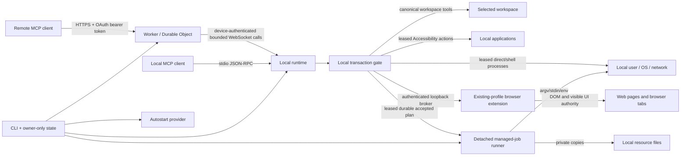

# Architecture

For a compact component map, read [System overview](OVERVIEW.md). Security assumptions, attacker models, non-goals, and residual risks are defined in [Threat model](THREAT_MODEL.md).

## Design goal

The system separates three questions that are often conflated:

1. **Who may request a tool?** Remote OAuth or local process ownership.
2. **Which tools exist?** The selected local policy profile.
3. **What authority does a tool have?** Canonical workspace boundaries for direct filesystem tools and local-user authority for processes.

No transport is treated as a sandbox. Both transports invoke the same local runtime.

## Components

### Shared protocol metadata and tool catalog

`src/shared/server-metadata.json` is the single source of truth for server identity, the sole current MCP protocol version, and host instructions. `src/shared/tool-catalog.json` is the single source of truth for tool names, descriptions, input schemas, annotations, and policy availability. The Worker and local runtime import both directly. Catalog tests reject metadata drift, duplicate names, unknown availability classes, open schemas, missing annotations, profile drift, and second hand-maintained Worker definitions.

### CLI and state layer

The CLI canonicalizes workspaces, resolves policy profiles, maintains per-workspace state and credentials, serializes startup/deploy/rotation with process-identity locks, deploys the Worker, installs optional platform-native autostart, and starts either remote daemon or stdio mode.
On a first interactive Windows start, workspace selection remains explicit but offers `%USERPROFILE%\MachineBridge` as a dedicated default; accepting it creates and remembers the folder instead of inheriting the shell current directory. Non-Windows interactive starts retain the current-directory default, and explicit `--workspace` paths remain strict existing-path inputs.

A canonical workspace receives an independent profile, Worker name, secret set, resource registry, managed-job directory, daemon/startup locks, and state file. State schema version 6 records named accounts, policy origin/revision, and local resource metadata in addition to the capability fields. `exclusive-file.mjs` owns complete-before-visible exclusive claims and flushed atomic replacement. `process-identity.mjs` owns PID liveness, process start-time comparison, bounded command-line inspection, and PID-reuse classification. `service-lifecycle.mjs` owns the fail-closed stop-daemons-before-remove state machine shared by service removal and full uninstall.

### Local runtime

`LocalRuntime` is the transport-independent local tool orchestrator. It owns the shared authorization/execution pipeline, manager construction, mutation serialization, cancellation, and the narrow delegation surface used by stdio and relay transports. Domain behavior remains in focused services:

- `workspace-file-service.mjs` and `git-service.mjs` own canonical filesystem/Git operations;
- `process-contract.mjs` owns argv shape/size validation, `process-tree.mjs` owns cross-platform tree termination, `process-execution.mjs` and `process-sessions.mjs` own one-shot and interactive execution, and `process-tracker.mjs` owns runtime process accounting;
- `runtime-reporting.mjs` builds privacy-aware runtime and project snapshots;
- `runtime-diagnostics.mjs` owns fixed local probes and their stable interpretation;
- `runtime-capabilities.mjs` composes agent, application, and browser capability results;
- `runtime-tool-handlers.mjs` owns catalog-to-handler registration;
- `runtime-relay.mjs` owns relay construction and inbound envelope normalization, while `relay-call-recovery.mjs` owns the bounded disconnect grace, result queue, authoritative resumed-call reconciliation, replay, and expiry cleanup;
- `runtime-paths.mjs` owns runtime-directory creation, containment checks, and error-path redaction;
- `managed-job-lock.mjs`, `managed-job-runner.mjs`, `managed-job-storage.mjs`, and `managed-job-projection.mjs` separate transition ownership, detached runner identity, private persistence/diagnostics, and public result shaping from the managed-job lifecycle;
- `browser-request-registry.mjs`, `browser-broker-routes.mjs`, `browser-broker-server.mjs`, and `browser-bridge-http.mjs` separate direct request ownership, runtime-client proxy routing, authenticated loopback WebSocket upgrades/listening, and loopback HTTP handling from broker startup and extension handover;
- managed jobs, local resources, application automation, and browser automation remain separate managers.

Architecture tests cap the orchestration module and each extracted service independently and reject a return of low-level process, patch, diagnostic, or capability-scoring logic to `LocalRuntime`. `RelayConnection` owns remote WebSocket transport, `hello_ack` authentication, end-to-end `relay_probe`/`ready_ack` readiness, heartbeat liveness, reconnect backoff, outage logging, and a monotonically increasing in-memory transport generation. The generation still protects the pre-ready probe and prevents arbitrary use of a stale socket. Ordinary tool calls additionally bind to an ephemeral identifier generated once per local daemon process. If a ready socket drops, the Worker detaches its pending calls for at most thirty seconds; only a replacement socket that presents the same daemon-process identifier and completes the full readiness probe can reclaim them. The local runtime keeps those calls alive and queues completed results during the same bounded interval, then replays them after readiness. A different process instance, an explicit cancellation, or grace expiry cannot receive those results. Stdio mode invokes `LocalRuntime` directly without that adapter.

`daemon-process.mjs` owns workspace-daemon inspection and takeover. It distinguishes platform service state from the lock-owning Node process, validates PID and process-start identity, canonicalizes workspace/state paths before comparison, parses bounded process command lines without executing them, and accepts lock-backed `--daemon-only` recovery processes that omit repeated path flags. Stop/takeover sends `SIGTERM` only to a verified same-workspace service daemon. If it remains alive after the grace period, the code revalidates PID, process-start identity, command line, entrypoint, daemon mode, workspace, and state root before sending `SIGKILL`; a foreground, replaced-PID, or otherwise unverifiable process remains untouched. CLI orchestration never treats a missing launchd/systemd job as proof that the process exited.

### Agent context and capability resolver

`AgentContextManager` discovers the nearest Git/workspace scope, applies the user configuration and hierarchical `.machine-bridge/agent.json` files, selects built-in/user/root-to-target instructions, discovers bounded filesystem skills, and resolves registered commands. `agent-context-projection.mjs` owns capability fingerprints, privacy-aware public projections, bounded skill summaries, command rendering, and effective-instruction rendering. `agent-skill-discovery.mjs` owns bounded skill-root traversal, symlink containment, metadata parsing, warnings, and file inventory; `agent-text-file.mjs` owns no-follow bounded UTF-8 reads. Filesystem/config discovery no longer maintains those output and skill-scanning mechanics inline. `agent-contract.mjs` is the strict checked-JavaScript boundary for configuration shape, registered-command normalization, encoded-size limits, and configured-path containment; the manager does not maintain a second parser. `project-package.mjs` owns no-follow package metadata parsing, package-manager selection (including fail-closed conflicting-lockfile handling), script-name normalization, bounded workflow-intent aliases, and automatic `package.*` command construction so instruction rendering and command execution do not duplicate package parsing. `default-instructions.mjs` supplies a versioned in-package working-agreement block and derives a small virtual project-context block from root filenames and bounded metadata. It reads package script names but not bodies, does not inspect dependency values or source contents, executes nothing, and writes no user/repository files. A global `model_instructions_file` is a separate user-designated session source and cannot be overridden by a project.

`session_bootstrap` is requested during both stdio and remote MCP initialization. The Worker delegates this read to the connected daemon with a short bounded timeout; failure falls back to static server instructions rather than blocking initialization indefinitely. `resolve_task_capabilities` performs a fresh deterministic scan, rebuilds automatic project facts, and ranks skill/command metadata for the current task. Application and browser capability metadata is added by `LocalRuntime`; installed application inventory uses a short bounded cache. `CapabilityObserver` records only counts, timestamps, source flags, selected metadata, match counts, recommended tool names, and a runtime-keyed task fingerprint so operators can verify routing without creating a task-content log.

The MCP catalog remains static: local skills and commands do not become dynamically named tools. This avoids stale host catalog caches and keeps Worker/stdio schema parity. Progressive disclosure separates discovery, instruction loading, and execution authority. A refresh fingerprint is descriptive rather than a cache-validity guarantee.

See [Session instructions, skills, commands, and capability discovery](AGENT_CONTEXT.md).

### Application automation manager

`AppAutomationManager` owns installed-application discovery, OS launching, and structured UI automation. macOS inspection/actions execute fixed JXA implementation code through `osascript` and expose only typed selectors/actions. The caller cannot provide script source. OS Accessibility/TCC remains an independent boundary.

### Browser extension and machine broker

`BrowserBridgeManager` owns only connection orchestration for the loopback HTTP/WebSocket broker, owner/client failover, routed requests, cancellation, extension replacement, and start/stop generation control. Every asynchronous startup boundary rechecks the generation so a listener or upstream socket cannot appear after `stop()` has invalidated that start. `browser-operation-service.mjs` owns MCP-facing browser argument normalization, resource-backed values/uploads, form semantics, screenshot conversion, and status presentation. Extension version/capability parsing lives in the strict checked `browser-extension-protocol.mjs`; pairing files and local HTML/Host/Origin helpers live in `browser-pairing-store.mjs`. The first runtime for the machine-level state root becomes broker owner; additional workspaces and stdio runtimes authenticate to `/runtime` and proxy through the same extension socket. This preserves one extension pairing while allowing multiple local MCP runtimes.

The packaged Manifest V3 extension runs in the user's existing Chromium profile. Its service worker is limited to pairing, transport, acknowledged protocol readiness, cancellation, and response routing. Fixed `browser-operations.js` owns tab lifecycle, aggregate frame/source budgets, waits, screenshots, and input-backend selection; fixed `page-automation.js` is injected into selected frames for snapshot-version-2 semantics, stable refs, bounded DOM/text traversal, actionability checks, open-Shadow-DOM traversal, structured DOM operations, multi-field forms, and resource-backed file inputs. Fixed `devtools-input.js` exposes only bounded mouse, keyboard, and text sequences through the Chromium debugger API; callers cannot select CDP methods. Trusted sessions attach for one action and detach in `finally`; DOM fallback is allowed only before any DevTools Input dispatch, preventing duplicate side effects after an ambiguous command failure. Protocol 3 requires bidirectional `hello`/`hello_ack` plus exact packaged-version and capability equality; pairing state and replacement are committed only after validation, so an invalid candidate cannot displace or overwrite the working configuration. The broker validates loopback hostnames, canonical extension IDs, matching pairing/broker ports, bearer subprotocols, message sizes, concurrency, and deadlines. Pairing material is owner-only and omitted from MCP/log output.

See [Local application and browser automation](LOCAL_AUTOMATION.md).

### Managed job runner

`ManagedJobManager` persists bounded per-workspace job envelopes below the owner-only profile directory. `start_job` validates the complete plan, snapshots referenced resource metadata/hashes, writes an owner-only plan/status, and launches `job-runner.mjs` as a detached process with runner-level logs redirected to owner-only files. `stage_job` performs the same acceptance validation but writes a non-running `staged` envelope; only local `job approve` transitions it to queued and launches the runner.

The runner:

- materializes registered resources as private `0600` copies after hash verification;
- materializes bounded job-scoped temporary files;
- substitutes resource/temp/runtime/workspace placeholders;
- executes ordered argv steps with bounded output and timeout/process-tree termination;
- polls an owner-only cancellation marker, terminates the current child tree, and keeps the runner alive for finally steps;
- attempts ordered finally steps after success, failure, timeout, or cancellation;
- removes private runtime copies;
- writes bounded redacted results and terminal status;
- deletes the full execution plan and runner PID file after terminal commit.

Running managed jobs do not belong to an MCP socket or daemon call ID and snapshot the accepted environment mode/resources. Later profile changes govern new direct submissions; accepted running jobs require explicit cancellation. Staged plans launch no process and require explicit local approval. Daemon disconnect/replacement does not terminate them. Dead runner PIDs are detected on the next daemon or local job-CLI start; stale private runtime data is removed and the finally phase is retried in recovery mode. Recovery deliberately reruns all finally steps, so cleanup must be idempotent.

Local resource registrations remain in owner-only state and are reloaded for every new job. MCP-visible resource inventory includes aliases and validation status but never source paths, hashes, or contents.

### Canonical policy contracts

Policy revision 5 is loaded from one shared JSON contract by both local and Worker policy evaluators. Tool advertisement and execution authorization use catalog availability classes; managers receive the same authorizer instead of reimplementing profile conditionals. Read-only job/resource inspection is `always`, job cancellation is write-gated, and starting a persistent job requires `write+direct-exec`.

Named profiles are normalized to their complete capability sets. In particular, `full` always means write enabled, shell execution, unrestricted paths, complete parent environment, absolute-path display, and every catalog tool. CLI flags that alter an individual capability deliberately change the profile identity to `custom`. Policy revision 5 defines the only accepted persisted policy shape. Named profiles are normalized to their canonical capability sets, and persisted data from another revision is rejected rather than interpreted. Compound availability requirements come from the shared contract.

Remote authority has a separate final layer. After the Worker intersects account role with daemon policy and the local runtime rechecks that role, `OperationAuthorizer` permits an authenticated owner directly within the daemon policy ceiling. For delegated non-owner accounts it classifies the normalized operation effect. Workspace-contained reads and ordinary edits, project inspection, and non-content browser/application status proceed automatically. Higher-impact delegated effects may require several independent scopes: browser upload combines profile access with data export, application resource input combines application control with data export, and external sensitive paths combine location and sensitivity scopes. Existing account/client-bound leases may satisfy those scopes independently; only missing scopes become a short-lived local pending approval. A `full` lease covers every transaction scope for at most eight hours but does not alter the canonical saved `full` policy. Risk classification is a pure domain module. Lease persistence is a separate owner-only, bounded, atomically replaced state boundary, and an owner-only process-identity lock serializes daemon and CLI mutations so concurrent approval activity cannot lose updates. Every patch destination is canonicalized through the execution resolver before classification. See [LOCAL_AUTHORIZATION.md](LOCAL_AUTHORIZATION.md).

The full-only `generate_ssh_key_resource` operation is implemented locally. The Worker only filters and relays its shared catalog definition. Local generation uses `ssh-keygen`, verifies public/private correspondence, registers the private file through the same owner-only state transaction as the CLI, and rolls back a newly created pair if state persistence fails.

`full-test` constructs a local runtime with canonical full policy and executes real operations in disposable directories. It is an acceptance test for the local implementation, not a probe that changes remote systems or bypasses host policy.

### Stdio MCP server

The stdio server implements newline-delimited JSON-RPC over stdin/stdout. It negotiates supported MCP versions, advertises policy-filtered tools, returns text plus structured content, supports native image content, maps cancellation notifications to runtime call IDs, and sends level-filtered logs only to stderr.

### Cloudflare Worker and Durable Object

All requests for a deployed Worker route to one named Durable Object. It owns:

- OAuth clients, authorization codes, hashed access-token records, an independently versioned hashed refresh-token store, and throttling metadata;
- one active end-to-end-verified daemon WebSocket plus bounded candidate and probing sockets;
- policy/tool metadata attached to the active socket;
- a bounded in-memory map of pending daemon calls.

`BridgeRoom` owns Durable Object routing, MCP dispatch, daemon WebSocket lifecycle, and pending relay calls. `mcp-jsonrpc.ts` owns JSON-RPC shape validation, result/error framing, MCP tool-result projection, session-instruction bounds, and protocol-header validation. `websocket-protocol.ts` owns record validation plus best-effort send/close/rejection helpers. `OAuthController` owns OAuth-store pruning, registration throttling, authorization submission, account-admin routing, token exchange, access-token verification, and the serialization queue for OAuth mutations. `oauth-authorization-page.ts` owns escaped authorization-page rendering and redirect-origin CSP input. Worker-internal TypeScript imports use explicit `.ts` specifiers and JSON import attributes, so the same modules are directly executable under the pinned Node runtime for focused state-machine tests as well as bundled by Wrangler.

The Worker verifies OAuth, validates MCP envelopes and optional protocol headers, converts `tools/call` into WebSocket messages, correlates cancellation by access-token hash and JSON-RPC ID, and formats text/structured/image results. Pending calls also bind the incoming request `AbortSignal`: an HTTP client disconnect removes the pending indexes and sends a best-effort daemon cancellation. The deployment contract explicitly enables Cloudflare `enable_request_signal` and `request_signal_passthrough` so the signal reaches the named Durable Object. It has no local filesystem or process API.

### Daemon device authentication

The local daemon owns a P-256 device identity. Worker deployment receives only the public JWK; the private JWK remains in owner-only local state. Every WebSocket attempt first carries a short-lived signed preflight transcript bound to Worker origin, package version, nonce, and timestamp. The nonce is consumed once through bounded Durable Object transaction state before upgrade, so neither an unauthenticated client nor a captured signed preflight can accumulate or replace daemon candidates. After upgrade, the Worker issues a fresh challenge and accepts daemon tools only after a second signature binds the challenge, Worker origin, package version, daemon instance ID, and timestamp. End-to-end readiness still requires an ordinary relay probe before a verified candidate replaces the incumbent. The removed long-lived `X-Bridge-Token` protocol is not retained as a fallback.

The primary OAuth store separates client registrations and named accounts from authorization codes and access-token records. A separate versioned Durable Object key owns refresh-token families, consumed-token markers, and family revocation. A `client_id` identifies an MCP application and redirect URIs; account records identify the authorized human or service identity. Codes and tokens bind client ID, account ID, account version, role, scope, resource, deployment token version, family identity, and expiration where applicable. Only hashes of bearer tokens are persisted. Access tokens last fifteen minutes; refresh tokens rotate, expire after fourteen idle days or thirty absolute family days, and reuse of a consumed refresh token revokes the complete family, including active access tokens. The Worker carries the authenticated client ID with every relayed call so local leases cannot cross clients. One bridge-specific Durable Object and one local runtime remain the normal topology for a workspace/trust domain; see [MULTI_ACCOUNT.md](MULTI_ACCOUNT.md).

The daemon attachment deliberately omits workspace path/name/hash and process ID. Explicit authenticated tools may return workspace metadata according to local path-display policy.

### Autostart layer

The service layer emits launchd, systemd-user, or Windows Scheduled Task definitions. Worker/account credentials are not embedded in service definitions; the daemon loads owner-only state. The exact policy is stored in owner-only state. An allowlisted `service-environment.json` separately persists only network-proxy and custom-CA variables needed by a background daemon, because shell-session environment is not inherited reliably by login managers; values are loaded only for `--daemon-only`, never logged, and status exposes key names only. launchd/systemd definitions contain the workspace/state-root selectors, `warn` plus JSON log settings, and a sanitized absolute-only PATH captured at installation so background `full` mode can resolve the same developer tools without accepting relative PATH entries.

The Windows adapter owns a short private restart launcher because Task Scheduler's `/TR` action is substantially smaller than the Windows process command-line limit and the full installed Node/CLI/workspace argv can exceed it. The scheduled action therefore contains only the launcher path. The launcher performs the full quoted invocation, redirects to service logs, and restarts only nonzero exits. A fixed PowerShell object query supplies language-independent `Ready`/`Running` state; provider installation is not equated with process activity. The trigger is least-privilege current-user logon, not boot-time `SYSTEM` execution.

The platform adapters normalize launchd, systemd, and Windows Scheduled Task operations to one `{ok, provider}` result contract. Removal is not a provider-specific sequence: `service-lifecycle.mjs` first stops the provider, then every verified workspace daemon in scope, and only then removes the definition. A failed stop or unverifiable process prevents definition/state deletion.

## Trust boundaries

Remote OAuth binds each code, access token, and refresh token to a named Machine Bridge account, account version, and role, so accounts are independent application-level authorization principals. The Worker intersects that role with the connected daemon policy, and the local runtime enforces the relayed authorization again. This distinction is not operating-system tenancy: every account still reaches one daemon, workspace, browser profile, and OS user authority. Local stdio access relies on the local process and configuration boundary. A connector host can independently present a smaller tool subset to a session; this post-relay filtering is outside the protocol state visible to Machine Bridge. Canonical resolution limits direct filesystem tools. Processes retain local-user authority and can escape workspace constraints through their own code or system calls.

## Remote request lifecycle

1. The MCP client discovers protected-resource and authorization-server metadata.
2. It dynamically registers bounded redirect metadata. Per-source throttling counts only registrations that have not yet completed authorization, while a separate global cap bounds all retained clients.
3. The Worker validates authorization parameters before displaying a password form.
4. The user verifies client name and redirect URI and enters a Machine Bridge account name and password.
5. The Worker creates a five-minute code bound to client, redirect, resource, normalized scope, and PKCE challenge.
6. A valid verifier exchanges the one-time code for an expiring access token and refresh token; only their hashes are stored. A refresh request is bound to the original public client, account, scope, resource, and deployment token version, and atomically replaces the refresh token so replay returns `invalid_grant`.
7. The MCP client initializes against the sole current protocol version; an obsolete client must upgrade rather than enter a legacy execution path. The Worker returns a stateless HMAC-bound `MCP-Session-Id`, and later request/cancellation correlation is scoped by OAuth token, MCP session, JSON-RPC id type, and id value. Two clients may therefore reuse the same JSON-RPC id concurrently without collision. Sessionless POSTs remain independent and are not inserted into a token-global cancellation index. When the daemon advertises `session_bootstrap`, the Worker requests bounded local instructions and appends them to the initialization result; failure degrades to static instructions.
8. A new daemon first authenticates as a bounded `probing` socket. The Worker sends a random `relay_probe`; the local runtime returns it through the normal session-bound result-delivery path; only the matching result produces `ready_ack`, promotion to the active daemon, and safe replacement of an incumbent connection.
9. `tools/list` is derived only from the active end-to-end-verified daemon; without one, only `server_info` is advertised.
10. `tools/call` receives a random relay call ID and is bound to the current daemon socket, that daemon process's ephemeral instance identifier, the authenticated client request key, and the incoming HTTP abort signal.
11. The runtime validates policy and arguments, executes the tool, and returns a bounded result.
12. If the socket remains ready, the Durable Object accepts the result only from that socket. If it drops, the Worker detaches the pending call for at most thirty seconds and accepts completion only after a replacement socket with the same daemon-process identifier has passed the end-to-end readiness probe. The local runtime preserves the operation and queues a completion over the same interval.
13. A matching cancellation notification or incoming HTTP client disconnect removes the pending indexes and sends best-effort cancellation to a connected daemon. Local completion that races with cancellation is discarded. On every readiness handover, the Worker first sends an authoritative bounded `resume_calls` set; the runtime cancels active calls and queued results absent from that set before accepting `ready_ack`. A request cancelled while disconnected therefore cannot be revived by a fast reconnect.
14. If same-instance readiness does not return before the grace deadline, the Worker rejects the detached request and the local runtime cancels ordinary calls, terminates their process trees, and discards queued results. A newly started daemon has a different instance identifier and cannot inherit prior calls.
15. `start_job` is different: after durable acceptance, the detached runner is no longer bound to the relay call or socket. Later cancellation uses `cancel_job` or the local CLI.

Duplicate in-flight JSON-RPC IDs are rejected only within the same authenticated MCP session. The request key includes OAuth token identity, the HMAC-bound MCP session, JSON-RPC id type, and id value, so separate initialized clients may safely reuse the same numeric id.

## Stdio request lifecycle

1. The local client launches `machine-mcp stdio` with a workspace and profile.
2. The server negotiates one of the supported MCP versions and appends bounded local `session_bootstrap` instructions when available.
3. Tool discovery is generated from the same catalog and policy used by remote mode.
4. Each call receives an internal random call ID used only for cancellation and process tracking.
5. Input is parsed as incrementally bounded newline-delimited JSON-RPC, so an oversized line is discarded before unbounded buffering and the next line can still be processed. Results are emitted as JSON-RPC on stdout; logs remain on stderr.
6. Duplicate in-flight request IDs are rejected, and `tools/call` requires a non-null request ID so write or execution calls cannot run as unacknowledged JSON-RPC notifications.
7. Closing stdin cancels pending calls, terminates ordinary active processes/process sessions, and removes the transport runtime directory. Previously accepted managed jobs continue in their persistent per-workspace job directories.

## Filesystem resolution and privacy

The workspace is canonicalized and compared with targets through consistent platform-native/async `realpath` representations. Existing targets must remain inside the workspace unless the active policy is unrestricted. New targets walk to the nearest existing ancestor, validate its canonical path, and reconstruct the destination below that canonical ancestor.

Path behavior is profile-dependent. The default `full` profile permits unrestricted direct filesystem paths and returns absolute paths. The `agent`, `edit`, and `review` profiles enforce canonical workspace containment and return workspace-relative paths. Error strings redact canonical and common platform-alias forms of workspace, runtime, and home paths whenever absolute path display is disabled. Access scope and path display are independent: unrestricted access with path display disabled returns relative workspace paths and opaque external-path identifiers.

Symbolic-link destinations and non-regular write targets are rejected. Write paths always canonicalize their nearest existing ancestor, including under `full`, so transaction classification and execution agree on the real destination while unrestricted-path authority remains intact. Patch move destinations are included in that classification. Existing bounded reads add final-component `O_NOFOLLOW` where supported. Recursive walkers do not follow symbolic-link directories. Because portable Node.js lacks descriptor-relative `openat` traversal for every operation, parent-directory replacement by hostile same-user code remains an external-isolation concern.

## Mutation model

All bridge mutations are serialized in one runtime queue.

### Whole-file write

A same-directory temporary file is created with restrictive permissions. Existing mode is preserved when replacing a regular file. Expected hashes are rechecked immediately before commit. Create-only uses a hard-link commit that fails atomically if the destination appeared concurrently.

### Exact edit

The current UTF-8 content is hashed. The old fragment must exist and, unless `replace_all` is set, occur exactly once. The resulting file is bounded and committed only if the original hash is unchanged.

### Patch transaction

The patch parser accepts a strict Begin/End envelope with add, update, move, and delete operations. It rejects malformed hunks, absent or ambiguous context, duplicate textual paths, and different paths that resolve to the same filesystem location.

Before commit, all sources and targets are resolved and validated, updated content is computed, and temporary files are staged. Source hashes and destination absence are rechecked. Existing sources are renamed to backups, staged files are committed, and any failure rolls back committed operations in reverse order. Backups are deleted only after full success.

This is a process-level transaction, not a filesystem-wide atomic transaction across multiple directories. Sudden power loss can still interrupt a multi-file commit; retained backup/temp naming makes recovery identifiable.

## Process model

`run_process` and process sessions use argv arrays and do not invoke a shell. `exec_command` invokes the platform shell and is available only in `shell` mode. Both inherit local-user OS authority.

The default `full` profile passes the complete parent environment. Isolated environment mode, used by the narrower named profiles unless overridden, creates private runtime HOME, temporary, and cache directories and passes only a small set of path/locale/platform variables. It reduces accidental credential inheritance but cannot prevent explicit access to known filesystem paths, credential stores, network services, or other user resources.

`execution-limits.mjs` is the shared source for local tool-call concurrency, one-shot process timeout/stdin/output limits, and process-session count/stdin/output/retention limits. `server_info.runtime.execution_guardrails` reports those enforced limits together with explicit `not-enforced` values for CPU quota, memory quota, and network isolation. Public one-shot commands inline at most 32 KiB per stream. When either stream exceeds that preview, the runtime keeps up to 1 MiB per stream in a closed in-memory process session for thirty minutes and returns an `output_session_id`; `read_process` then reads monotonic byte-offset pages. The oldest exited session is evicted before an active session is refused, so continuation retention is explicitly best effort rather than durable. The continuation stores command basename and cwd metadata but not argv or shell text. It is memory-only and disappears on runtime stop or daemon replacement.

Large object results use `structuredContent` as the authoritative representation. The human text mirror is complete only below the shared 16 KiB projection threshold; above it, both local stdio and the Worker return the same compact byte-count/field summary instead of serializing the object a second time. `process-result-projection.mjs`, `process-output-stream.mjs`, and the shared result projector keep lifecycle, byte retention, and MCP presentation as separate boundaries.

Startup-lock waits, daemon takeover, process-session reads, managed-job recovery handoff, browser/page waits, application-cache freshness, and in-memory duration metrics use monotonic elapsed time, so wall-clock correction cannot extend or prematurely terminate their configured duration. Persisted timestamps and retention/credential expiry continue to use wall time. Process sessions retain bounded byte buffers with monotonic offsets, accept bounded stdin, support short output/exit waits, and are capped per runtime. Valid UTF-8 is returned as text; byte slices that are not valid UTF-8 also include lossless base64 data. Head/tail previews trim incomplete UTF-8 boundary code points instead of introducing replacement characters. Session IDs are random. Running sessions are killed on runtime stop, remote disconnect, or daemon replacement.

Child processes run in a separate process group where supported. Timeout, cancellation, disconnect, and replacement send termination to process trees, with a referenced forced-escalation timer that remains alive even when the direct child exits before a resistant descendant. Windows uses tree-aware task termination.

Managed jobs use the same argv/environment primitives but a different lifecycle. Each job is capped at 16 main and 16 finally steps, 50 retained jobs, 64 registered resources, 8 MiB of referenced resource bytes, 512 KiB of temporary-file content, and bounded per-step output. They are non-interactive. Resource paths/stdin/environment are injected only inside the runner. Exact resource output redaction is defense in depth; discard capture is the strong option when a command may echo credentials.

## Worker deployment convergence

Worker deployment is an explicit two-evidence state machine owned by `worker-deployment.mjs`. Wrangler upload is the authoritative remote write. Public `/healthz` is a subsequent read used to verify identity and package version; it is not a transaction commit signal for the upload. After a successful Wrangler result, local state atomically records the detected `workers.dev` URL, MCP URL, content/secret fingerprint, deployed package version, and timestamp before health verification begins. If verification is ambiguous, the next start compares the same fingerprint and performs a read-only verification rather than repeating the remote write.

`worker-health.mjs` owns bounded health I/O: exact HTTPS `workers.dev` origin and Worker-name validation, environment-proxy selection, request timeout, redirect rejection, response-size limit, JSON/identity/version validation, and coarse error classification. `network-proxy.mjs` is shared by remote HTTP health probes and WebSocket relay construction so both paths honor `HTTP_PROXY`, `HTTPS_PROXY`, and `NO_PROXY` without exposing proxy details. Local browser-broker health uses `loopback-health.mjs`, which accepts only canonical `http://127.0.0.1:<port>/healthz`, disables agent reuse, bounds the response, and deliberately bypasses environment proxies. Definitive stale evidence is retried for propagation and then permits a same-name redeploy; timeout, TLS, network, proxy, and temporary server failure remain ambiguous and fail without upload.

Worker-name mutation is a separate identity transition. Existing state rejects a different name unless the caller also supplies the explicit force option. An authorized transition clears the current URL/fingerprint and appends the prior validated name to bounded uninstall inventory. This prevents a health-retry workaround from silently becoming a new remote resource while preserving cleanup of intentional replacements.

## Daemon reconnect and replacement

The local `RelayConnection` treats proxy selection, transport construction, WebSocket open, authentication, end-to-end readiness, and outage recovery as separate states. The shared proxy module maps WebSocket targets to standard HTTP(S) environment-proxy resolution, honors `NO_PROXY`, rejects non-HTTP(S) proxy schemes, and creates the proxy agent without exposing its URL or credentials. Invalid proxy configuration is a fatal configuration error rather than a retryable outage.

A connection-attempt deadline terminates sockets stuck in `CONNECTING`. After open, the daemon sends `hello`; `hello_ack` establishes an authenticated relay generation and starts heartbeats, but does not resolve startup or advertise readiness. The Worker then sends a random `relay_probe`. Its result must traverse the local runtime dispatcher and `sendForSession` on that generation before `ready_ack` marks the connection usable. The daemon rejects ordinary tool calls before that state and rejects a premature readiness acknowledgement without locally recorded probe delivery. Independent handshake and readiness deadlines terminate candidates that authenticate but cannot return results. Once ready, application heartbeats require inbound activity; a silent half-open socket is terminated and reconnected. Outage reminders run on their own exponential-backoff timer rather than depending on another transport callback.

Reconnect uses bounded exponential backoff with jitter. Brief self-healing interruptions are debug-only. An unresolved outage is promoted to a rate-limited warning after a grace period, and recovery produces one summary. Raw close codes and reason strings remain debug-only.

The Worker stores socket transitions in `DaemonSocketRegistry`: `candidate` before hello, `probing` after authentication, `daemon` only after the end-to-end result probe, and `expired` after terminal failure. Durable Object alarms enforce separate hello, readiness, and steady-state liveness deadlines across hibernation. A healthy incumbent remains active while a replacement is probed; a malformed, silent, incompatible, or identity-mismatched replacement is closed without displacing it. Only a verified candidate receives `ready_ack` and then replaces the old socket. Ready daemons stay live only while inbound traffic refreshes `lastSeenAt`; silent half-open or hibernation-restored sockets are reclaimed instead of advertising `daemon.connected` while tool calls time out.

Each daemon process generates a random bounded `instance_id` at startup and includes it in every reconnect hello. Pending calls normally retain their assigned socket. On an unexpected socket loss, only those records are detached and a thirty-second timer bounds recovery. A verified socket with the same instance ID rebinds them; another process or socket cannot resolve them. The local runtime mirrors that state machine by preserving active calls and completed-result envelopes until relay readiness returns. Before `ready_ack`, the Worker sends the exact IDs that still have remote waiters; the runtime cancels everything else and only then replays retained results through the verified socket. Grace expiry restores the terminal behavior: reject remote waiters, cancel local ordinary calls, terminate process trees, and discard undeliverable results. This does not make calls durable across daemon restart or machine failure; managed jobs remain the separate durable mechanism.

## Persistence

Local state and global config are owner-only, versioned, and size-bounded. Shared persistence primitives write a complete private temporary file, `fsync` it, and either hard-link it for an exclusive claim or atomically replace the destination. POSIX private-directory setup is descriptor-first and fail-closed; browser pairing reuses this boundary even when an existing state root was created with permissive modes. Machine-level browser pairing state is owner-only and shared across workspace runtimes through the local broker; its bearer token is not part of workspace state responses. `worker-secret-file.mjs` owns the complete ephemeral Worker deployment-secret lifecycle, including process-start-bound names, exact file identity, stale-owner classification, and cleanup-error propagation. State, managed-job manager, detached runner, browser pairing, and service definitions share the same flushed atomic-replacement primitive. Only classified transient Windows sharing failures are retried, using a bounded thirty-two-attempt exponential schedule with jitter; the implementation never deletes the destination as a retry fallback, so readers are not intentionally exposed to a missing-file interval.

Process locks contain purpose, workspace, ownership token, lock time, and process start time. Stale removal rechecks device/inode/size/mtime and token so an old observer cannot delete a replacement lock. Recent malformed claims receive a grace period. Startup/state operations wait a bounded interval; daemon and runner identity remain process-lifetime locks. Managed-job transition and recovery locks use the same ownership/snapshot principles and support an atomic runner handoff.

Only successfully read but syntactically invalid JSON is moved to a bounded `.corrupt-*` backup. Permission, type, symbolic-link, size, encoding, and I/O failures propagate. A state root must be disjoint from its selected workspace. Resource paths are omitted from redacted status output. A custom root is initialized only when empty and must contain the current state marker on subsequent use. Valid state from another schema is rejected; syntactically invalid JSON is isolated as a bounded corrupt backup and rebuilt as current empty state.

Active managed jobs persist an owner-only plan, status, runner process identity, and bounded runner diagnostics. Terminal jobs delete the full plan and retain only bounded status/redacted results for up to seven days. This balances crash cleanup with minimization of scripts, stdin, argv, environment overrides, and resource source paths.

Removal first acquires a state-root maintenance lock that blocks new profile/state claims and state-backed operations from already constructed managed-job/browser managers, then stops the platform service and all known verified workspace daemons. It then validates the state marker, canonical target, known contents, active or unreadable locks, filesystem root/home/current/package/workspace/source exclusions, managed jobs, and Worker deletion outcome before recursive deletion. Any unresolved phase retains definitions and state.

OAuth metadata is pruned on access. Expired authorization codes, access tokens, refresh tokens, old throttling records, and inactive clients without active credentials are removed. Account disablement, role or password changes, removal, and deployment-wide token-version rotation make both token classes unusable; stale refresh records are deleted when the refresh store is next read. Source identities are deployment-keyed HMAC values, not stored source addresses or reversible unsalted hashes.

Browser-origin handling separates CORS response sharing from protocol authentication. Preflight succeeds only for the Worker's own origin, a fixed first-party set for ChatGPT (`https://chatgpt.com`, `https://chat.openai.com`) and Grok (`https://grok.com`, `https://x.com`), or optional exact comma-separated additions from `MBM_ALLOWED_ORIGINS`; wildcard and `null` origins are not granted CORS access. Actual requests are routed without using `Origin` as an authentication boundary, and `Access-Control-Allow-Origin` is added only when that exact predicate passes. This permits OAuth top-level navigation and form submission from opaque or client-specific containers while exact redirect/resource binding, PKCE, account credentials, short-lived bearer tokens, signed administration requests, and the daemon device identity enforce authority. The authorization document's `form-action` policy is generated only after request validation and contains `'self'` plus the exact origin of that validated redirect URI. If that validated origin is Microsoft `consent.azure-apim.net`, the policy also admits `https://*.consent.azure-apim.net` and the exact `https://copilotstudio.microsoft.com` origin; Power Platform receives the authorization code at its global consent endpoint, redirects to a regional endpoint, and then returns to Copilot Studio, while Chromium applies `form-action` across the complete redirect chain. No other callback receives either exception. This allows successful callback navigation without opening form submission to unrelated origins. Hosted Claude remote connectors originate from Anthropic infrastructure and Copilot Studio uses Power Platform connectivity, so their server-to-server requests do not require browser CORS entries; adding those brands to the browser allowlist would expand response sharing without enabling either integration.

## Observability

Public health exposes only server identity and version. Authenticated `server_info` exposes bounded runtime status, managed-job counts, resource alias names without paths or values, relay route state without endpoint details, authenticated/probing/ready socket counts, end-to-end readiness evidence, local execution guardrails, explicit OS-enforcement gaps, and privacy-preserving capability-routing evidence. It separates the daemon capability ceiling from the authenticated account authority: `daemon.policy`/`daemon.tools` retain the pre-role ceiling, while `authorization.effective_policy`/`authorization.effective_tools` and the top-level `tools` report the role-intersected authority before any host-side filtering. It explicitly reports that the host-exposed subset is unknown to the server. `diagnose_runtime` runs fixed local probes and explicitly reports that its own request reached the daemon.

Foreground logging defaults to `info`; autostart uses `warn`. Authenticated readiness, persistent degradation, and recovery are user-visible state transitions. Brief relay interruptions, raw transport close details, retry timing, and all per-tool starts/successes/failures/cancellations/durations are debug-only. Unexpected local and Worker infrastructure errors are reduced to classes. Messages, strings, arrays, object depth/key counts, and serialized fields are bounded.

Cloudflare sampling is size control rather than an audit log. The project intentionally does not claim complete forensic logging. See [LOGGING.md](LOGGING.md).

## Release integrity

Repository-local automated checks are necessary but cannot prove that the maintainer's ordinary installation path works. `scripts/local-release-acceptance.mjs` builds the exact npm tarball, while `scripts/start-release-candidate.mjs` installs that tarball into an ignored isolated prefix and starts it in the foreground. The helper requires `--allow-worker-deploy` because normal startup may update the configured same-name Worker before relay verification. After explicit owner authorization in the active conversation, the coding agent starts the candidate and verifies its live Worker version/hash, health, relay connection, local version, readiness, and representative behavior through Machine Bridge before recording both npm hashes outside the package. `scripts/github-push.mjs`, pull-request CI, and `scripts/github-release.mjs` rebuild the package and reject any mismatch. The release helper also requires `HEAD === origin/main`; it cannot silently push `main`.

Cross-platform evidence remains independent. `scripts/github-release.mjs` queries CI, CodeQL, Governance, and Scorecard for the exact `origin/main` commit and requires the newest push-triggered run for each workflow to be completed with `success` before it creates or verifies a version tag, GitHub Release, or package asset. Pull-request runs, older successful runs, pending runs, and successful runs for another SHA do not satisfy the gate. The workflow selection policy is isolated in `scripts/release-ci.mjs` and tested independently.

Third-party workflow actions are pinned to immutable commit SHAs. Dependabot groups GitHub Action updates into one reviewed PR so coupled action families cannot drift across versions. `architecture:test` rejects movable action tags, split update policy, loss of local acceptance verification, or removal of the reachable-history package-audit step.

## Explicit non-goals

- operating-system sandboxing of arbitrary executables;
- preventing an authorized client from requesting data available to enabled tools;
- automatically deciding which local files are sensitive or overriding MCP-host/platform safety policy;
- surviving daemon restart with process sessions (managed jobs are the separate durable mechanism);
- guaranteed finally cleanup across permanent power, disk, credential, network, or endpoint-security failure;
- bypassing MCP-host, connector, operating-system, or endpoint-security policy;
- PTY/terminal emulation;
- model-level prompt-injection prevention or semantic validation of browser/application actions;
- universal desktop UI automation beyond the implemented OS Accessibility backend;
- scripting browser-internal/enterprise-blocked pages or inaccessible cross-origin frames;
- operating-system or browser-profile isolation between mutually distrustful account principals in one Worker/daemon deployment; named accounts provide Worker/local authorization and targeted revocation, but all authorized roles still converge on one local OS user and workspace trust domain.
