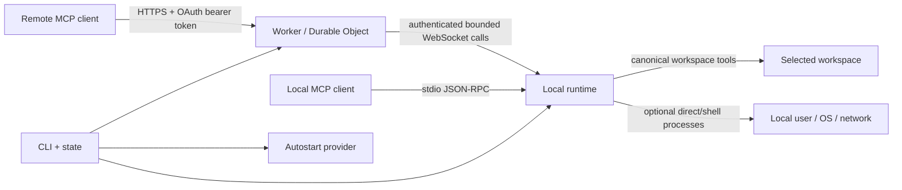

# Architecture

## Design goal

The system separates three questions that are often conflated:

1. **Who may request a tool?** Remote OAuth or local process ownership.
2. **Which tools exist?** The selected local policy profile.
3. **What authority does a tool have?** Canonical workspace boundaries for direct filesystem tools and local-user authority for processes.

No transport is treated as a sandbox. Both transports invoke the same local runtime.

## Components

### Shared protocol metadata and tool catalog

`src/shared/server-metadata.json` is the single source of truth for server identity, MCP protocol versions, and host instructions. `src/shared/tool-catalog.json` is the single source of truth for tool names, descriptions, input schemas, annotations, and policy availability. The Worker and local runtime import both directly. Catalog tests reject metadata drift, duplicate names, unknown availability classes, open schemas, missing annotations, profile drift, and second hand-maintained Worker definitions.

### CLI and state layer

The CLI canonicalizes workspaces, resolves policy profiles, maintains per-workspace state and credentials, serializes startup/deploy/rotation with locks, deploys the Worker, installs optional platform-native autostart, and starts either remote daemon or stdio mode.

A canonical workspace receives an independent profile, Worker name, secret set, daemon/startup locks, and state file. State schema version 4 records policy origin/revision in addition to the capability fields and retains removal of obsolete local API state.

### Local runtime

`LocalDaemon` is transport-independent despite its historical name. It owns:

- canonical path resolution and display-path privacy;
- file, text search, image, patch, and Git operations;
- direct and shell process execution;
- process-session buffers and stdin lifecycle;
- mutation serialization;
- child-process tracking and cancellation;
- output, traversal, concurrency, and time limits.

Remote mode attaches WebSocket connection/reconnect behavior. Stdio mode invokes the same runtime directly.

### Stdio MCP server

The stdio server implements newline-delimited JSON-RPC over stdin/stdout. It negotiates supported MCP versions, advertises policy-filtered tools, returns text plus structured content, supports native image content, maps cancellation notifications to runtime call IDs, and sends level-filtered logs only to stderr.

### Cloudflare Worker and Durable Object

All requests for a deployed Worker route to one named Durable Object. It owns:

- OAuth clients, authorization codes, hashed access-token records, and throttling metadata;
- one active authenticated daemon WebSocket plus bounded candidate sockets;
- policy/tool metadata attached to the active socket;
- a bounded in-memory map of pending daemon calls.

The Worker verifies OAuth, validates MCP envelopes and optional protocol headers, converts `tools/call` into WebSocket messages, correlates cancellation by access-token hash and JSON-RPC ID, and formats text/structured/image results. It has no local filesystem or process API.

The daemon attachment deliberately omits workspace path/name/hash and process ID. Explicit authenticated tools may return workspace metadata according to local path-display policy.

### Autostart layer

The service layer emits launchd, systemd-user, or Windows Scheduled Task definitions. Credentials are not embedded in service definitions; the daemon loads owner-only state. The exact policy is stored in owner-only state; platform service definitions contain only the workspace/state-root selectors and a `warn` log-level setting.

## Trust boundaries

Remote OAuth determines which client may call tools. Local stdio access relies on the local process and configuration boundary. Policy determines which tools are advertised. Canonical resolution limits direct filesystem tools. Processes retain local-user authority and can escape workspace constraints through their own code or system calls.

## Remote request lifecycle

1. The MCP client discovers protected-resource and authorization-server metadata.
2. It dynamically registers bounded redirect metadata.
3. The Worker validates authorization parameters before displaying a password form.
4. The user verifies client name and redirect URI and enters the connection password.
5. The Worker creates a five-minute code bound to client, redirect, resource, scope, and PKCE challenge.
6. A valid verifier exchanges the one-time code for an expiring bearer token; only its hash is stored.
7. The MCP client initializes and negotiates a supported protocol version.
8. `tools/list` is derived from the active daemon handshake; without a daemon, only `server_info` is advertised.
9. `tools/call` receives a random relay call ID and is bound to the current socket and authenticated client request key.
10. The runtime validates policy and arguments, executes the tool, and returns a bounded result.
11. The Durable Object accepts a result only from the socket that received that call.
12. A matching cancellation notification removes the pending call, tells the daemon to cancel, and terminates any child processes bound to it.

Duplicate in-flight JSON-RPC IDs for the same access token are rejected so cancellation cannot ambiguously target multiple calls.

## Stdio request lifecycle

1. The local client launches `machine-mcp stdio` with a workspace and profile.
2. The server negotiates one of the supported MCP versions.
3. Tool discovery is generated from the same catalog and policy used by remote mode.
4. Each call receives an internal random call ID used only for cancellation and process tracking.
5. Results are emitted as JSON-RPC on stdout; logs remain on stderr.
6. Duplicate in-flight request IDs are rejected.
7. Closing stdin cancels pending calls, terminates active processes, and removes the isolated runtime directory.

## Filesystem resolution and privacy

The workspace is canonicalized and compared with targets through consistent platform-native/async `realpath` representations. Existing targets must remain inside the workspace unless the active policy is unrestricted. New targets walk to the nearest existing ancestor, validate its canonical path, and reconstruct the destination below that canonical ancestor.

Path behavior is profile-dependent. The default `full` profile permits unrestricted direct filesystem paths and returns absolute paths. The `agent`, `edit`, and `review` profiles enforce canonical workspace containment and return workspace-relative paths. Error strings redact canonical and common platform-alias forms of workspace, runtime, and home paths whenever absolute path display is disabled.

Symbolic-link destinations and non-regular write targets are rejected. Recursive walkers do not follow symbolic-link directories.

## Mutation model

All bridge mutations are serialized in one runtime queue.

### Whole-file write

A same-directory temporary file is created with restrictive permissions. Existing mode is preserved when replacing a regular file. Expected hashes are rechecked immediately before commit. Create-only uses a hard-link commit that fails atomically if the destination appeared concurrently.

### Exact edit

The current UTF-8 content is hashed. The old fragment must exist and, unless `replace_all` is set, occur exactly once. The resulting file is bounded and committed only if the original hash is unchanged.

### Patch transaction

The patch parser accepts a strict Begin/End envelope with add, update, move, and delete operations. It rejects malformed hunks, absent or ambiguous context, duplicate textual paths, and different paths that resolve to the same filesystem location.

Before commit, all sources and targets are resolved and validated, updated content is computed, and temporary files are staged. Source hashes and destination absence are rechecked. Existing sources are renamed to backups, staged files are committed, and any failure rolls back committed operations in reverse order. Backups are deleted only after full success.

This is a process-level transaction, not a filesystem-wide atomic transaction across multiple directories. Sudden power loss can still interrupt a multi-file commit; retained backup/temp naming makes recovery identifiable.

## Process model

`run_process` and process sessions use argv arrays and do not invoke a shell. `exec_command` invokes the platform shell and is available only in `shell` mode. Both inherit local-user OS authority.

The default `full` profile passes the complete parent environment. Isolated environment mode, used by the narrower named profiles unless overridden, creates private runtime HOME, temporary, and cache directories and passes only a small set of path/locale/platform variables. It reduces accidental credential inheritance but cannot prevent explicit access to known filesystem paths, credential stores, network services, or other user resources.

One-shot calls have bounded output and timeouts. Process sessions retain bounded byte buffers with monotonic offsets, accept bounded stdin, support short output/exit waits, and are capped per runtime. Valid UTF-8 is returned as text; byte slices that are not valid UTF-8 also include lossless base64 data. Session IDs are random. Sessions are memory-only and are killed on runtime stop, remote disconnect, or daemon replacement.

Child processes run in a separate process group where supported. Timeout, cancellation, disconnect, and replacement send termination to the process tree, with forced escalation for timeout/disconnect paths.

## Daemon reconnect and replacement

The daemon sends heartbeats and reconnects with bounded exponential backoff and jitter. Only one socket is active. A new connection is a bounded candidate until it authenticates and completes `hello`; a Durable Object alarm enforces the deadline across hibernation. Only a completed candidate replaces the old socket.

Pending calls retain their originating socket reference. A stale socket cannot complete or cancel replacement-socket calls. Closing a socket rejects only calls assigned to it.

## Persistence

Local state and global config are owner-only, versioned, size-bounded, and written through temporary files, flushes, and atomic rename. Reads reject symbolic links and use no-follow descriptors where supported. Malformed or oversized state becomes a bounded-count `.corrupt-*` backup. Custom roots are adopted only when empty or recognizable as legacy Machine Bridge state.

Removal validates the state marker, canonical target, known contents, active locks, filesystem root/home/current/package/workspace/source exclusions, and Worker deletion outcome before recursive deletion.

OAuth metadata is pruned on access. Expired codes/tokens, old throttling records, and inactive clients without active credentials are removed. Source identities are deployment-keyed HMAC values, not stored source addresses or reversible unsalted hashes.

## Observability

Public health exposes only server identity and version. Authenticated `server_info` exposes bounded runtime status and policy origin/revision.

Foreground logging defaults to `info`; autostart uses `warn`. Routine successful calls and shortened random correlation IDs are debug-only. `info` retains deployment/connection transitions and successful calls slower than 30 seconds. Failures log tool name, duration, and coarse error class without arguments or outputs. Unexpected local and Worker errors are reduced to classes in normal logs. Messages, strings, arrays, object depth/key counts, and serialized fields are bounded.

Cloudflare sampling is size control rather than an audit log. The project intentionally does not claim complete forensic logging. See [LOGGING.md](LOGGING.md).

## Explicit non-goals

- operating-system sandboxing of arbitrary executables;
- preventing an authorized client from requesting data available to enabled tools;
- automatically deciding which local files are sensitive or overriding MCP-host/platform safety policy;
- surviving daemon restart with process sessions;
- PTY/terminal emulation;
- model-level prompt-injection prevention;
- multi-user tenancy in one Worker deployment.
