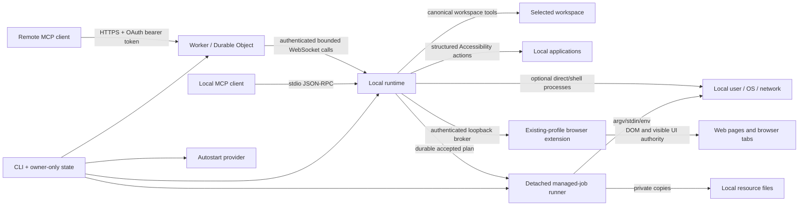

# Architecture

## Design goal

The system separates three questions that are often conflated:

1. **Who may request a tool?** Remote OAuth or local process ownership.
2. **Which tools exist?** The selected local policy profile.
3. **What authority does a tool have?** Canonical workspace boundaries for direct filesystem tools and local-user authority for processes.

No transport is treated as a sandbox. Both transports invoke the same local runtime.

## Components

### Shared protocol metadata and tool catalog

`src/shared/server-metadata.json` is the single source of truth for server identity, MCP protocol versions, and host instructions. `src/shared/tool-catalog.json` is the single source of truth for tool names, descriptions, input schemas, annotations, and policy availability. The Worker and local runtime import both directly. Catalog tests reject metadata drift, duplicate names, unknown availability classes, open schemas, missing annotations, profile drift, and second hand-maintained Worker definitions.

### CLI and state layer

The CLI canonicalizes workspaces, resolves policy profiles, maintains per-workspace state and credentials, serializes startup/deploy/rotation with process-identity locks, deploys the Worker, installs optional platform-native autostart, and starts either remote daemon or stdio mode.

A canonical workspace receives an independent profile, Worker name, secret set, resource registry, managed-job directory, daemon/startup locks, and state file. State schema version 5 records policy origin/revision and local resource metadata in addition to the capability fields. `exclusive-file.mjs` owns complete-before-visible exclusive claims and flushed atomic replacement. `process-identity.mjs` owns PID liveness, process start-time comparison, bounded command-line inspection, and PID-reuse classification. `service-lifecycle.mjs` owns the fail-closed stop-daemons-before-remove state machine shared by service removal and full uninstall.

### Local runtime

`LocalRuntime` is the transport-independent local tool engine. It owns:

- canonical path resolution and display-path privacy;
- file, text search, image, patch, and Git operations;
- direct and shell process execution;
- process-session buffers and stdin lifecycle;
- layered fixed runtime diagnostics;
- local resource aliases and detached managed-job coordination;
- session/bootstrap instruction discovery, live capability ranking, and registered-command execution coordination;
- structured local application and existing-profile browser automation coordination;
- mutation serialization;
- child-process tracking and cancellation;
- output, traversal, concurrency, and time limits.

`RelayConnection` owns remote WebSocket transport, authenticated `hello_ack` readiness, heartbeat liveness, reconnect backoff, and outage logging. Stdio mode invokes `LocalRuntime` directly without that adapter.

`daemon-process.mjs` owns workspace-daemon inspection and takeover. It distinguishes platform service state from the lock-owning Node process, validates PID and process-start identity, canonicalizes workspace/state paths before comparison, parses bounded process command lines without executing them, and sends `SIGTERM` only to a verified same-workspace `--daemon-only` process. POSIX daemons may ignore that signal and reach the bounded non-escalating timeout; Node's Windows signal mapping terminates the verified process directly. CLI orchestration never treats a missing launchd/systemd job as proof that the process exited.

### Agent context and capability resolver

`AgentContextManager` discovers the nearest Git/workspace scope, applies the user configuration and hierarchical `.machine-bridge/agent.json` files, selects built-in/user/root-to-target instructions, discovers bounded filesystem skills, and resolves registered commands. `project-package.mjs` owns no-follow package metadata parsing, package-manager selection (including fail-closed conflicting-lockfile handling), script-name normalization, bounded workflow-intent aliases, and automatic `package.*` command construction so instruction rendering and command execution do not duplicate package parsing. `default-instructions.mjs` supplies a versioned in-package working-agreement block and derives a small virtual project-context block from root filenames and bounded metadata. It reads package script names but not bodies, does not inspect dependency values or source contents, executes nothing, and writes no user/repository files. A global `model_instructions_file` is a separate user-designated session source and cannot be overridden by a project.

`session_bootstrap` is requested during both stdio and remote MCP initialization. The Worker delegates this read to the connected daemon with a short bounded timeout; failure falls back to static server instructions rather than blocking initialization indefinitely. `resolve_task_capabilities` performs a fresh deterministic scan, rebuilds automatic project facts, and ranks skill/command metadata for the current task. Application and browser capability metadata is added by `LocalRuntime`; installed application inventory uses a short bounded cache. `CapabilityObserver` records only counts, timestamps, source flags, selected metadata, match counts, recommended tool names, and a runtime-keyed task fingerprint so operators can verify routing without creating a task-content log.

The MCP catalog remains static: local skills and commands do not become dynamically named tools. This avoids stale host catalog caches and keeps Worker/stdio schema parity. Progressive disclosure separates discovery, instruction loading, and execution authority. A refresh fingerprint is descriptive rather than a cache-validity guarantee.

See [Session instructions, skills, commands, and capability discovery](AGENT_CONTEXT.md).

### Application automation manager

`AppAutomationManager` owns installed-application discovery, OS launching, and structured UI automation. macOS inspection/actions execute fixed JXA implementation code through `osascript` and expose only typed selectors/actions. The caller cannot provide script source. OS Accessibility/TCC remains an independent boundary.

### Browser extension and machine broker

`BrowserBridgeManager` owns connection orchestration for a loopback HTTP/WebSocket broker. Extension version/capability parsing lives in `browser-extension-protocol.mjs`; pairing files and local HTML/Host/Origin helpers live in `browser-pairing-store.mjs`. The first runtime for the machine-level state root becomes broker owner; additional workspaces and stdio runtimes authenticate to `/runtime` and proxy through the same extension socket. This preserves one extension pairing while allowing multiple local MCP runtimes.

The packaged Manifest V3 extension runs in the user's existing Chromium profile. Its service worker is limited to pairing, transport, acknowledged protocol readiness, cancellation, and response routing. Fixed `browser-operations.js` owns tab lifecycle, aggregate frame/source budgets, waits, screenshots, and input-backend selection; fixed `page-automation.js` is injected into selected frames for snapshot-version-2 semantics, stable refs, bounded DOM/text traversal, actionability checks, open-Shadow-DOM traversal, structured DOM operations, multi-field forms, and resource-backed file inputs. Fixed `devtools-input.js` exposes only bounded mouse, keyboard, and text sequences through the Chromium debugger API; callers cannot select CDP methods. Trusted sessions attach for one action and detach in `finally`; DOM fallback is allowed only before any DevTools Input dispatch, preventing duplicate side effects after an ambiguous command failure. Protocol 3 requires bidirectional `hello`/`hello_ack` plus exact packaged-version and capability equality; pairing state and replacement are committed only after validation, so an invalid candidate cannot displace or overwrite the working configuration. The broker validates loopback hostnames, canonical extension IDs, matching pairing/broker ports, bearer subprotocols, message sizes, concurrency, and deadlines. Pairing material is owner-only and omitted from MCP/log output.

See [Local application and browser automation](LOCAL_AUTOMATION.md).

### Managed job runner

`ManagedJobManager` persists bounded per-workspace job envelopes below the owner-only profile directory. `start_job` validates the complete plan, snapshots referenced resource metadata/hashes, writes an owner-only plan/status, and launches `job-runner.mjs` as a detached process with runner-level logs redirected to owner-only files. `stage_job` performs the same acceptance validation but writes a non-running `staged` envelope; only local `job approve` transitions it to queued and launches the runner.

The runner:

- materializes registered resources as private `0600` copies after hash verification;
- materializes bounded job-scoped temporary files;
- substitutes resource/temp/runtime/workspace placeholders;
- executes ordered argv steps with bounded output and timeout/process-tree termination;
- polls an owner-only cancellation marker, terminates the current child tree, and keeps the runner alive for finally steps;
- attempts ordered finally steps after success, failure, timeout, or cancellation;
- removes private runtime copies;
- writes bounded redacted results and terminal status;
- deletes the full execution plan and runner PID file after terminal commit.

Running managed jobs do not belong to an MCP socket or daemon call ID and snapshot the accepted environment mode/resources. Later profile changes govern new direct submissions; accepted running jobs require explicit cancellation. Staged plans launch no process and require explicit local approval. Daemon disconnect/replacement does not terminate them. Dead runner PIDs are detected on the next daemon or local job-CLI start; stale private runtime data is removed and the finally phase is retried in recovery mode. Recovery deliberately reruns all finally steps, so cleanup must be idempotent.

Local resource registrations remain in owner-only state and are reloaded for every new job. MCP-visible resource inventory includes aliases and validation status but never source paths, hashes, or contents.

### Canonical policy contracts

Policy revision 4 is loaded from one shared JSON contract by both local and Worker policy evaluators. Tool advertisement and execution authorization use catalog availability classes; managers receive the same authorizer instead of reimplementing profile conditionals. Read-only job/resource inspection is `always`, job cancellation is write-gated, and starting a persistent job requires `write+direct-exec`.

Named profiles are normalized to their complete capability sets. In particular, `full` always means write enabled, shell execution, unrestricted paths, complete parent environment, absolute-path display, and every catalog tool. CLI flags that alter an individual capability deliberately change the profile identity to `custom`. Policy revision 4 repairs stale or manually edited named-profile fields rather than allowing a misleading partially restricted `full` label, and applies compound availability requirements from the shared contract.

The full-only `generate_ssh_key_resource` operation is implemented locally. The Worker only filters and relays its shared catalog definition. Local generation uses `ssh-keygen`, verifies public/private correspondence, registers the private file through the same owner-only state transaction as the CLI, and rolls back a newly created pair if state persistence fails.

`full-test` constructs a local runtime with canonical full policy and executes real operations in disposable directories. It is an acceptance test for the local implementation, not a probe that changes remote systems or bypasses host policy.

### Stdio MCP server

The stdio server implements newline-delimited JSON-RPC over stdin/stdout. It negotiates supported MCP versions, advertises policy-filtered tools, returns text plus structured content, supports native image content, maps cancellation notifications to runtime call IDs, and sends level-filtered logs only to stderr.

### Cloudflare Worker and Durable Object

All requests for a deployed Worker route to one named Durable Object. It owns:

- OAuth clients, authorization codes, hashed access-token records, and throttling metadata;
- one active authenticated daemon WebSocket plus bounded candidate sockets;
- policy/tool metadata attached to the active socket;
- a bounded in-memory map of pending daemon calls.

The Worker verifies OAuth, validates MCP envelopes and optional protocol headers, converts `tools/call` into WebSocket messages, correlates cancellation by access-token hash and JSON-RPC ID, and formats text/structured/image results. It has no local filesystem or process API.

The current OAuth store is multi-client but not principal-aware. `client_id` identifies an MCP application/installation; it does not identify a human or service account. Every successful authorization uses the same per-workspace connection password and receives the same workspace policy ceiling. Isolated account support therefore requires explicit principals, memberships, named grants, targeted revocation, and dual Worker/local enforcement rather than treating client registrations as users. The recommended design retains one bridge-specific Durable Object and one local runtime per workspace/trust domain; see [MULTI_ACCOUNT.md](MULTI_ACCOUNT.md).

The daemon attachment deliberately omits workspace path/name/hash and process ID. Explicit authenticated tools may return workspace metadata according to local path-display policy.

### Autostart layer

The service layer emits launchd, systemd-user, or Windows Scheduled Task definitions. Credentials are not embedded in service definitions; the daemon loads owner-only state. The exact policy is stored in owner-only state. launchd/systemd definitions contain the workspace/state-root selectors, `warn` plus JSON log settings, and a sanitized absolute-only PATH captured at installation so background `full` mode can resolve the same developer tools without accepting relative PATH entries.

The platform adapters normalize launchd, systemd, and Windows Scheduled Task operations to one `{ok, provider}` result contract. Removal is not a provider-specific sequence: `service-lifecycle.mjs` first stops the provider, then every verified workspace daemon in scope, and only then removes the definition. A failed stop or unverifiable process prevents definition/state deletion.

## Trust boundaries

Remote OAuth currently determines which registered client token may call tools; it does not distinguish independently authorized human principals. Local stdio access relies on the local process and configuration boundary. Policy determines which tools the local daemon and relay advertise. A connector host can independently present a smaller tool subset to a session; this post-relay filtering is outside the protocol state visible to Machine Bridge. Canonical resolution limits direct filesystem tools. Processes retain local-user authority and can escape workspace constraints through their own code or system calls.

## Remote request lifecycle

1. The MCP client discovers protected-resource and authorization-server metadata.
2. It dynamically registers bounded redirect metadata.
3. The Worker validates authorization parameters before displaying a password form.
4. The user verifies client name and redirect URI and enters the connection password.
5. The Worker creates a five-minute code bound to client, redirect, resource, scope, and PKCE challenge.
6. A valid verifier exchanges the one-time code for an expiring bearer token; only its hash is stored.
7. The MCP client initializes and negotiates a supported protocol version. When the daemon advertises `session_bootstrap`, the Worker requests bounded local instructions and appends them to the initialization result; failure degrades to static instructions.
8. `tools/list` is derived from the active daemon handshake; without a daemon, only `server_info` is advertised.
9. `tools/call` receives a random relay call ID and is bound to the current socket and authenticated client request key.
10. The runtime validates policy and arguments, executes the tool, and returns a bounded result.
11. The Durable Object accepts a result only from the socket that received that call.
12. A matching cancellation notification removes the pending call, tells the daemon to cancel, and terminates any ordinary child processes bound to it.
13. `start_job` is different: after durable acceptance, the detached runner is no longer bound to the relay call or socket. Later cancellation uses `cancel_job` or the local CLI.

Duplicate in-flight JSON-RPC IDs for the same access token are rejected so cancellation cannot ambiguously target multiple calls.

## Stdio request lifecycle

1. The local client launches `machine-mcp stdio` with a workspace and profile.
2. The server negotiates one of the supported MCP versions and appends bounded local `session_bootstrap` instructions when available.
3. Tool discovery is generated from the same catalog and policy used by remote mode.
4. Each call receives an internal random call ID used only for cancellation and process tracking.
5. Input is parsed as incrementally bounded newline-delimited JSON-RPC, so an oversized line is discarded before unbounded buffering and the next line can still be processed. Results are emitted as JSON-RPC on stdout; logs remain on stderr.
6. Duplicate in-flight request IDs are rejected, and `tools/call` requires a non-null request ID so write or execution calls cannot run as unacknowledged JSON-RPC notifications.
7. Closing stdin cancels pending calls, terminates ordinary active processes/process sessions, and removes the transport runtime directory. Previously accepted managed jobs continue in their persistent per-workspace job directories.

## Filesystem resolution and privacy

The workspace is canonicalized and compared with targets through consistent platform-native/async `realpath` representations. Existing targets must remain inside the workspace unless the active policy is unrestricted. New targets walk to the nearest existing ancestor, validate its canonical path, and reconstruct the destination below that canonical ancestor.

Path behavior is profile-dependent. The default `full` profile permits unrestricted direct filesystem paths and returns absolute paths. The `agent`, `edit`, and `review` profiles enforce canonical workspace containment and return workspace-relative paths. Error strings redact canonical and common platform-alias forms of workspace, runtime, and home paths whenever absolute path display is disabled. Access scope and path display are independent: unrestricted access with path display disabled returns relative workspace paths and opaque external-path identifiers.

Symbolic-link destinations and non-regular write targets are rejected. Existing bounded reads add final-component `O_NOFOLLOW` where supported. Recursive walkers do not follow symbolic-link directories. Because portable Node.js lacks descriptor-relative `openat` traversal for every operation, parent-directory replacement by hostile same-user code remains an external-isolation concern.

## Mutation model

All bridge mutations are serialized in one runtime queue.

### Whole-file write

A same-directory temporary file is created with restrictive permissions. Existing mode is preserved when replacing a regular file. Expected hashes are rechecked immediately before commit. Create-only uses a hard-link commit that fails atomically if the destination appeared concurrently.

### Exact edit

The current UTF-8 content is hashed. The old fragment must exist and, unless `replace_all` is set, occur exactly once. The resulting file is bounded and committed only if the original hash is unchanged.

### Patch transaction

The patch parser accepts a strict Begin/End envelope with add, update, move, and delete operations. It rejects malformed hunks, absent or ambiguous context, duplicate textual paths, and different paths that resolve to the same filesystem location.

Before commit, all sources and targets are resolved and validated, updated content is computed, and temporary files are staged. Source hashes and destination absence are rechecked. Existing sources are renamed to backups, staged files are committed, and any failure rolls back committed operations in reverse order. Backups are deleted only after full success.

This is a process-level transaction, not a filesystem-wide atomic transaction across multiple directories. Sudden power loss can still interrupt a multi-file commit; retained backup/temp naming makes recovery identifiable.

## Process model

`run_process` and process sessions use argv arrays and do not invoke a shell. `exec_command` invokes the platform shell and is available only in `shell` mode. Both inherit local-user OS authority.

The default `full` profile passes the complete parent environment. Isolated environment mode, used by the narrower named profiles unless overridden, creates private runtime HOME, temporary, and cache directories and passes only a small set of path/locale/platform variables. It reduces accidental credential inheritance but cannot prevent explicit access to known filesystem paths, credential stores, network services, or other user resources.

One-shot calls have bounded output and timeouts. Process sessions retain bounded byte buffers with monotonic offsets, accept bounded stdin, support short output/exit waits, and are capped per runtime. Valid UTF-8 is returned as text; byte slices that are not valid UTF-8 also include lossless base64 data. Session IDs are random. Sessions are memory-only and are killed on runtime stop, remote disconnect, or daemon replacement.

Child processes run in a separate process group where supported. Timeout, cancellation, disconnect, and replacement send termination to process trees, with a referenced forced-escalation timer that remains alive even when the direct child exits before a resistant descendant. Windows uses tree-aware task termination.

Managed jobs use the same argv/environment primitives but a different lifecycle. Each job is capped at 16 main and 16 finally steps, 50 retained jobs, 64 registered resources, 8 MiB of referenced resource bytes, 512 KiB of temporary-file content, and bounded per-step output. They are non-interactive. Resource paths/stdin/environment are injected only inside the runner. Exact resource output redaction is defense in depth; discard capture is the strong option when a command may echo credentials.

## Daemon reconnect and replacement

The local `RelayConnection` treats proxy selection, transport construction, transport open, authenticated readiness, and outage recovery as separate states. `network-proxy.mjs` maps WebSocket targets to standard HTTP(S) environment-proxy resolution, honors `NO_PROXY`, rejects non-HTTP(S) proxy schemes, and creates the proxy agent without exposing its URL or credentials. Invalid proxy configuration is a fatal configuration error rather than a retryable outage.

The local `RelayConnection` otherwise treats transport construction, transport open, authenticated readiness, and outage recovery as separate states. A connection-attempt deadline terminates sockets stuck in `CONNECTING`; after WebSocket open it sends `hello` and reports readiness only after `hello_ack`. A missing acknowledgement reaches a distinct handshake deadline and the candidate is terminated. Once ready, application heartbeats require inbound activity; a silent half-open socket is terminated and reconnected. Outage reminders run on their own exponential-backoff timer rather than depending on another transport callback.

Reconnect uses bounded exponential backoff with jitter. Brief self-healing interruptions are debug-only. An unresolved outage is promoted to a rate-limited warning after a grace period, and recovery produces one summary. Raw close codes and reason strings remain debug-only.

The Worker also treats a new connection as a bounded candidate until it authenticates and completes `hello`; a Durable Object alarm enforces the deadline across hibernation. Only a completed candidate replaces the old socket. Daemon messages must be valid JSON objects, duplicate `hello` and unknown message types are rejected with explicit protocol errors, and protocol violations close with standard WebSocket status codes. Pending calls retain their originating socket reference. A stale socket cannot complete or cancel replacement-socket calls. Closing a socket rejects only calls assigned to it.

## Persistence

Local state and global config are owner-only, versioned, and size-bounded. Shared persistence primitives write a complete private temporary file, `fsync` it, and either hard-link it for an exclusive claim or atomically replace the destination. Machine-level browser pairing state is owner-only and shared across workspace runtimes through the local broker; its bearer token is not part of workspace state responses. State, managed-job manager, detached runner, browser pairing, and service definitions share the same flushed atomic-replacement primitive. Only classified transient Windows sharing failures are retried, using a bounded sixteen-attempt exponential schedule with jitter; the implementation never deletes the destination as a retry fallback, so readers are not intentionally exposed to a missing-file interval.

Process locks contain purpose, workspace, ownership token, lock time, and process start time. Stale removal rechecks device/inode/size/mtime and token so an old observer cannot delete a replacement lock. Recent malformed claims receive a grace period. Startup/state operations wait a bounded interval; daemon and runner identity remain process-lifetime locks. Managed-job transition and recovery locks use the same ownership/snapshot principles and support an atomic runner handoff.

Only successfully read but syntactically invalid JSON is moved to a bounded `.corrupt-*` backup. Permission, type, symbolic-link, size, encoding, and I/O failures propagate. A state root must be disjoint from its selected workspace. Resource paths are omitted from redacted status output. Custom roots are adopted only when empty or recognizable as legacy Machine Bridge state.

Active managed jobs persist an owner-only plan, status, runner process identity, and bounded runner diagnostics. Terminal jobs delete the full plan and retain only bounded status/redacted results for up to seven days. This balances crash cleanup with minimization of scripts, stdin, argv, environment overrides, and resource source paths.

Removal first acquires a state-root maintenance lock that blocks new profile/state claims and state-backed operations from already constructed managed-job/browser managers, then stops the platform service and all known verified workspace daemons. It then validates the state marker, canonical target, known contents, active or unreadable locks, filesystem root/home/current/package/workspace/source exclusions, managed jobs, and Worker deletion outcome before recursive deletion. Any unresolved phase retains definitions and state.

OAuth metadata is pruned on access. Expired codes/tokens, old throttling records, and inactive clients without active credentials are removed. Source identities are deployment-keyed HMAC values, not stored source addresses or reversible unsalted hashes.

## Observability

Public health exposes only server identity and version. Authenticated `server_info` exposes bounded runtime status, policy origin/revision, managed-job counts, resource alias names without paths or values, daemon/relay-advertised tool counts, relay route state without endpoint details, and privacy-preserving capability-routing evidence. It explicitly reports that the host-exposed subset is unknown to the server. `diagnose_runtime` runs fixed local probes and explicitly reports that its own request reached the daemon.

Foreground logging defaults to `info`; autostart uses `warn`. Authenticated readiness, persistent degradation, and recovery are user-visible state transitions. Brief relay interruptions, raw transport close details, retry timing, and all per-tool starts/successes/failures/cancellations/durations are debug-only. Unexpected local and Worker infrastructure errors are reduced to classes. Messages, strings, arrays, object depth/key counts, and serialized fields are bounded.

Cloudflare sampling is size control rather than an audit log. The project intentionally does not claim complete forensic logging. See [LOGGING.md](LOGGING.md).

## Release integrity

Repository-local checks are necessary but cannot prove behavior on every supported operating system. `scripts/github-release.mjs` therefore queries `.github/workflows/ci.yml` for the exact `origin/main` commit and requires the newest push-triggered run to be completed with `success` before it creates or verifies a version tag, GitHub Release, or package asset. Pull-request runs, older successful runs, pending runs, and successful runs for another SHA do not satisfy the gate. The selection policy is isolated in `scripts/release-ci.mjs` and tested independently.

Third-party workflow actions are pinned to immutable commit SHAs. Dependabot proposes reviewed SHA updates, and `architecture:test` rejects a return to movable action tags or removal of the reachable-history package-audit step.

## Explicit non-goals

- operating-system sandboxing of arbitrary executables;
- preventing an authorized client from requesting data available to enabled tools;
- automatically deciding which local files are sensitive or overriding MCP-host/platform safety policy;
- surviving daemon restart with process sessions (managed jobs are the separate durable mechanism);
- guaranteed finally cleanup across permanent power, disk, credential, network, or endpoint-security failure;
- bypassing MCP-host, connector, operating-system, or endpoint-security policy;
- PTY/terminal emulation;
- model-level prompt-injection prevention or semantic validation of browser/application actions;
- universal desktop UI automation beyond the implemented OS Accessibility backend;
- scripting browser-internal/enterprise-blocked pages or inaccessible cross-origin frames;
- isolated multi-user tenancy or per-principal authorization in one Worker deployment; multiple OAuth client registrations currently share one workspace authority.
