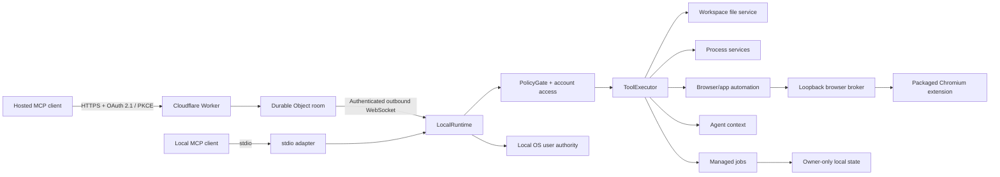

# System overview

Machine Bridge is one local authority surface with two MCP transports. The architecture is organized around three independent questions:

1. **Who may request an operation?** Remote OAuth account identity and role, or the local process identity that launched stdio.
2. **Which tools are exposed?** The shared tool catalog, policy profile, and account-role intersection.
3. **What can an exposed tool actually do?** The local runtime, workspace/path rules, operating-system user authority, and platform security controls.

Transport authentication does not create an operating-system sandbox. The local daemon executes with the authority of its OS user.

## Components

## Authority flow

### Remote transport

1. The Worker validates OAuth client, token, account state, role, resource binding, and MCP session state.
2. The Worker filters advertised tools by account role and the daemon-reported capability ceiling.
3. The Durable Object relays a bounded tool envelope over the authenticated daemon socket.
4. The local runtime revalidates account authorization, policy, call lifecycle, timeout, and cancellation.
5. The selected local service executes with the daemon OS user's authority.

The Worker never receives ambient filesystem or process authority. It receives only explicit request/result messages.

### Local stdio transport

The MCP host launches the package as a subprocess. There is no remote OAuth layer. The selected local policy still controls catalog exposure and execution, while the OS process identity supplies the underlying filesystem and process authority.

## Shared contracts

The main protocol and policy single sources of truth are:

- `src/shared/tool-catalog.json` — tool names, schemas, policy requirements, and annotations;
- `src/shared/policy-contract.json` — canonical profiles and capability composition;
- `src/shared/server-metadata.json` — server identity and protocol metadata.

Local and Worker code consume these contracts. Generated references and drift tests prevent documentation and implementation from silently diverging.

## Local runtime boundaries

`LocalRuntime` is an orchestrator, not a low-level implementation module. It composes:

- policy and account authorization;
- call registration, timeout, cancellation, and observability;
- workspace and path services;
- direct and shell process execution;
- Git operations;
- managed jobs and local resources;
- Agent context and capability resolution;
- application and browser automation;
- remote relay adaptation.

Low-level responsibilities remain in focused modules. Architecture tests enforce an acyclic local import graph, domain/adapter direction, and module-size budgets. Behavior and fault-injection tests remain authoritative; source-shape checks are supplementary.

## State and lifecycle

Each canonical workspace has independent profile state, Worker identity, credentials, locks, service metadata, and managed jobs. State mutations use owner-only files where supported, bounded reads, atomic replacement, and process-identity-aware locks.

The relay distinguishes connectivity, authentication, readiness probing, and active service. A candidate daemon must complete an end-to-end probe before replacing an incumbent. Disconnect cancels relay-owned calls and terminates associated local processes.

Managed jobs use a separate durable lifecycle. Their plans are integrity-bound, runners are process-identity checked, transitions are lock-protected, terminal plans are scrubbed, and recovery is bounded.

## Browser execution model

The local browser broker binds only to loopback and authenticates the packaged extension with local pairing state and a versioned capability handshake. Additional runtime processes may proxy through the machine-level broker rather than opening competing extension connections.

The extension controls the Chromium profile into which it is loaded. Machine Bridge does not launch, isolate, or prove the identity of that profile. Browser cookies, sessions, tabs, and page content therefore remain part of the local user's browser authority.

## Verification layers

The repository uses several complementary layers:

- unit and behavior tests for policy, parsing, state, lifecycle, and services;
- fault injection and property tests for security-sensitive boundaries;
- live stdio and Worker/OAuth/MCP integration tests;
- cross-platform service and installation tests;
- per-module critical coverage thresholds;
- architecture/import/line-budget checks;
- privacy, package, release-impact, interactive-candidate-acceptance, CodeQL, dependency, and Scorecard gates.

`npm run check:fast` is the development feedback loop. `npm run check` runs the complete release-relevant suite.

## Read next

- [Architecture](ARCHITECTURE.md) for detailed invariants and protocol flow
- [Threat model](THREAT_MODEL.md) for assets, attackers, non-goals, and residual risks
- [Security policy](../SECURITY.md) for reporting and supported security boundaries
- [Engineering](ENGINEERING.md) for implementation rules
- [Testing](TESTING.md) for verification design
